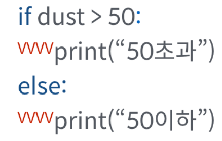
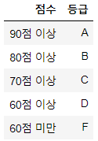

###### 210118_mon3


# 제어문(Control Statement)

> 알고리즘이라는 건 순서도(Flow Chart)를 만들어나가는 것을 의미합니다. 
>
> 그런데 순서도라는건 무조건 위에서 아래로만 동작하진 않습니다. 어떤 경우엔 A를, 또 다른 경우엔 B를 수행하기도 합니다.
>
> 즉, 특정 상황에따라 명령을 선택적으로 실행(분기)하거나 동일한 명령을 여러번 수행하기도 합니다. 이 경우 __코드 실행의 순차적인 흐름을 제어(Control Flow)__할 필요가 있습니다.
>
> 이렇게 순차적인 코드의 흐름을 제어하는 것을 __제어문__이라고 하며, 제어문은 크게 __조건문__과 __반복문__으로 나눌 수 있습니다.

:laughing:그럼 이제 우리가 원하는 알고리즘을 만들 수 있도록 제어문을 배워볼까요? 


# 1. 조건문(Conditional Statement)

> 조건문은 말 그대로 __특정 조건에서만 문장을 실행__하도록 하는 것입니다.
>
> 이러한 동작은 `if`문을 활용할 수 있습니다.

## 1.1 if 조건문의 구성

> if문은 반드시 참/거짓을 판단할 수 있는 조건과 함꼐 사용되어야 합니다.

### 활용법

```python
if <expression>:
    <code block>
else:
    <code block>
```

- `expression`에는 일반적으로 참/거짓에 대한 조건식이 들어갑니다.
- 조건이 __참__인 경우 `:`이후의 문장을 수행합니다.
- 조건이 __거짓__인 경우 `else:`이후의 문장을 수행합니다.
- 여러개의 `elif`나 `else`는 선택적입니다. (즉, if만으로 사용 가능)

### 주의사항

- __들여쓰기__*에 유의해야 합니다.
  - C언어나 자바의 `{}`와 달리 python은 __들여쓰기__로 code block를 판단합니다.
- PEP8에서 권장하는 __4spaces__를 사용하겠습니다. (4spaces가 아니라도 동일하게만 맞추면 동작)



### 예) 홀/짝 판별하기

> 조건문을 활용하여 이력된 숫자의 홀/짝 여부를 출력하세요
>
> > 입력> 3
> >
> > 출력> 3은 홀수입니다.
>
> 홀/짝은 어떻게 판단할 수 있을까요? 2로 나눈 나머지가 1이면 홀수, 0이면 짝수라고할 수 있습니다. 이를 그대로 조건문에 활용할 수 있습니다.

```python
num = int(input('숫자를 입력하세요: '))  #입력은 str이므로 int로 변환

if num % 2:  #1은 True로 판단 / num % 2 == 1도 가능
    print(f'{num}은 홀수입니다.')
else:
    print(f'{num}은 짝수입니다.')
```


## 1.2 elif 복수 조건

> 2개 이상의 조건을 활용하고 싶다면 어떻게 해야할까요?
>
> if는 이미 사용했고, `else`는 나머지 모든 케이스를 의미하기때문에 __조건식이 들어갈 수 없습니다.__
>
> 이런 경우 if문 다음에 `elif <expression>:`을 활용하면 됩니다. if와 else는 처음과 끝에 한번만 사용하지만 elif는 조건의 개수만큼 여러번 사용 가능합니다.
>
> 또한 `elif`는 특정한 조건을 거는 것이기 때문에 __반드시 조건문이 필요__합니다.
>
> 예시와 함께 살펴볼까요?

### 예) 복수 조건문

> 조건문을 통해 score에 따른 평점을 출력하세요.
>
> 
>
> > 입력> 85
> >
> > 출력> 85점은 B 입니다.
>
> 점수를 어떻게 구분할 수 있을까요? 80 <= score <90 이면 B로 표현할까요? 이것도 틀린 방법은 아닙니다. 다만 python에선 위에서 아래로 순차적으로 명령을 수행하는 프로그램이기때문에 위아래 제한을 모두 걸 필요가 없습니다.
>
> 가장 먼저 score >= 90인 조건을 둬보겠습니다. 90점 이상이라면 출력과 함꼐 프로그램이 끝날 것이고, 그렇지 않은 경우에만 다음 조건을 수행합니다.
>
> 즉, 위에서 먼저 걸러지기때문에 < 90의 조건은 필요하지 않게됩니다. 이를 위해서는 조건식의 순서가 매우 중요하겠죠?

```python
score = int(input('점수를 입력하세요: '))

if score >= 90:  #90이상은 print, 90이하만 다음 조건문을 확인합니.
    print(f'{score}점은 A입니다.')
elif score >= 80:  #90이하 중 80이상만 print, 80이하는 다음 조건문
    print(f'{score}점은 B입니다.')
elif score >= 70:
    print(f'{score}점은 C입니다.')
elif score >= 60:
    print(f'{score}점은 D입니다.')
else:  #위에서 표현되지 않은 나머지 모든 경우
    print(f'{score}점은 F입니다.')
```


## 1.3 중첩 조건문(Nested Conditional Statement)

> 조건문은 다른 조건문에 중첩될 수도 있습니다.

```python
if score >= 90:  
    print(f'{score}점은 A입니다.')
    if score >= 95:
        print('참 잘했어요')
```


## 1.4 조건 표현식(Conditional Expression)

> 조건 표현식은 __삼항 연산자(Ternary Operator)__라고도 부릅니다. (다른 언어에서는 ? :로 표현)
>
> 말 그대로 연산자이고 표현식이기 때문에 __*하나의 값을 나타냅니다.__
>
> 일반적으로 조건에 따라 값을 정할 때 사용됩니다.

### 활용법

```python
true_value if <조건식> else false_value
```

- 조건이 참이면 true_value, 거짓이면 false_value가 됩니다.

- 사용하는 이유
  - __*표현식__이기때문, if ~ else로 __하나의 값을 만들어야할 때__ 사용합니다.
  - 최소 4문장인 if ~ else를 한문장으로 표현할 수 있습니다.(간결함)

### 예) 홀/짝 판별하기

> 앞서본 예시를 조건 표현식으로 다시 표현해 봅시다.

```python
num = int(input())

result = f'{num}은 홀수입니다.' if num % 2 else f'{num}은 짝수입니다.'
print(result)
```


# 2. 반복문(Loop Statement)

> 특정 조건에서 동일한 문장을 반복 수행하는 것으로 `while`과 `for`이 있습니다.

## 2.1 while 반복문

> 조건식이 __참(True)__인 경우 indenting(들여쓰기)된 안쪽의 코드를 반복적으로 코드를 실행합니다.

### 활용법

```python
while <조건식>:
    <code block>
```

- 조건식 뒤에 `:`이 반드시 필요하며, 이후 실행될 코드 블럭은 __4spaces__로 __들여쓰기__합니다.(하나로 통일해야함)
- 반드시 __종료조건__을 설정해야 합니다.(아니면 무한반복)

### 예1) 합(Summation) 구하기

> 1부터 사용자가 입력한 양의 정수까지의 총합을 구하는 코드를 작성하세요.
>
> > 입력> 10
> >
> > 출력> 55
>
> 1부터 수를 키워가며 더하는 과정을 반복해야합니다. 이때 입력한 값 까지만 더해야 하므로 반복문의 조건은 입력한 수보가 작을때가 될 것입니다.

```python
num = int(input('양의 정수를 입력하세요: '))

n = 1  #1부터 더할 수
total = 0  #전체 합을 저장할 변수
while n <= num:
    total += n
    n += 1
print(total)
```


### 예1) 한자리 씩 출력하기

> 사용자로부터 숫자 입력 받은 양의 정수의 각 자리수를 1의 자리부터 차례로 출력하는 코드를 작성하세요
>
> > 입력> 185
> >
> > 출력>  5
> >
> > ​			8
> >
> > ​			1
>
> 숫자에서 일의 자리는 10을 나눈 나머지로, 나머지 숫자는 10으로 나눈 몫으로 분리할 수 있습니다.
>
> 가령 185의 경우 185 % 10 == 5, 185 // 10 == 18이 됩니다. 이렇게 10으로 나누는 과정을 반복하며 일의 자리를 하나씩 출력하고, 몫이 0이되면 반복을 종료합니다.

```python
num = int(input('양의 정수를 입력하세요: '))

while num != 0:  #0이 아니면 반복
    print(num % 10)  #나머지 출력
    num //= 10  #몫으로 갱신
```

- 문자열을 활용한 방법

>  이건 제가 처음에 생각한 방식입니다!
>
> input()을 사용하면 입력은 str 타입입니다. str은 시뭔스형 데이터로 인덱스를 사용한 접근이 가능합니다.
>
> len()으로 문자열의 길이를 알아낸 뒤, [len() - 1]의 마지막 인덱스 값부터 인덱스를 줄여가며 출력할 수 있습니다. 인덱스가 0보다 작아지면 반복을 종료합니다.

```python
s_num = input('양의 정수를 입력하세요: ')

idx = len(s_num)
while idx > 0:
    print(s_num[idx - 1])  #len(s_sum) - 1 부터 0까지 출력
    idx -= 1  #인덱스 감소
```


## 2.2 for 문

> 다른 언어와 달리 python에서는 __시퀀스(string, tuple, list, range)나 다른 순회가능한 객체(iterable)의 요소들을 순회__합니다.
>
> 예를 들어 li = [1, 2, 3, 4]의 요소를 하나씩 출력한다고 합시다.
>
> 다른 언어에서는 li의 전체 길이값을 가져와서 0부터 인덱스를 키우며 값에 접근합니다.
>
> ```python
> for(i = 0; i < 4; i ++){ 
>     print(li[i])   #i를 인덱스로 값을 출력
> }
> ```
>
> 그러나 python은 li의 요소 자체를 하나씩 변수에 할당하며 for문을 동작시킬 수 있습니다.
>
> ```python
> for i in li:
>     print(i)  #i에 li의 요소들이 순차적으로 할당됩니다.
> ```
>
> 이는 python만의 큰 장점으로 덕분에 값에 접근하는 것이 수월합니다.

### 활용법

```python
for <임시변수> in <순회가능한 데이터(iterable)>:
    <code block>
```

```python
for i in range(10):
    print(i)  #0 1 ~ 9
    
for char in 'apple':
    print(char)  # a p ~ e
```

- for문에서 임시 변수에 다른 값을 할당해도 반복구문에는 영향을 주지 않습니다. (다음 요소값이 재 할당되어 덮어씌워지기때문)

```python
for i in range(5):
    print(i)  #0 ~ 4
    i = 6  #range(5)의 요소가 재할당되어 영향을 주지 않음
```


## 2.3 반복제어(break, continue, for-else)


