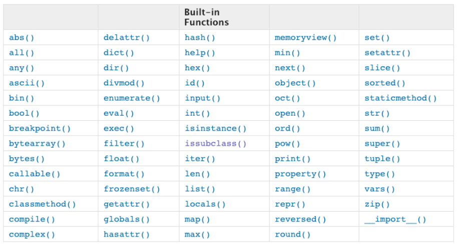
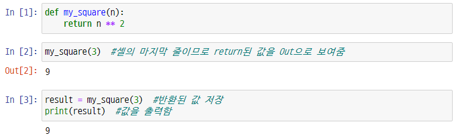

###### Jan_3weeks_Day3_210120_wed


# 함수(function)1

> 지난시간까지는 어떤 로직에 따라 변수의 값을 변화시켜봤습니다.
>
> 오늘은 __반복적인 흐름을 재사용__ 가능하도록, 로직 자체를 하나로 묶어놓은 __함수__에 대해 배워보겠습니다.


# 1. 함수(Function)

> 특정한 기능(function)을 하는 코드의 묶음입니다.

## 1.1 함수를 쓰는 이유

- 재사용성 :star: : 함수는 로직을 재사용 하는 거다!
- 높은 가독성
- 유지보수의 용의성


## 1.2 함수의 선언과 호출

<선언>

- `def`로 시작하여 `:`로 끝난 뒤, `4 spaces 들여쓰기`하여 코드 블럭을 작성합니다.
- `매개변수(parameter)`를 넘겨줄 수도 있습니다.(없어도 가능)
- 동작 후 `return`을 통해 결과값을 전달할 수도 있습니다.  
  - return 값이 없다면 `None`을 반환합니다.

<호출>

- `func()`/`func(val1, val2)`같은 형태로 호출합니다.

<활용법>

```python
def <function_name>(parameter1, parameter2):
    <code_block>
    return value
```


### Ex) 제곱 함수

> 입력 받은 수를 제곱하여 반환(return)하는 함수 `my_square()`를 만들어봅시다.

<함수 정의>

```python
def my_square(n):  #input n
    result = n ** 2
    return result  #계산 결과 반환
```

<함수 호출>

```python
my_squaer(3)  #9, 함수에 어떤 값을 넣어주어 호출합니다.
```

\> 이처럼 함수를 통해 같은 동작을 한줄에 반복할 수 있습니다. 함수의 코드가 더 길어진다면 매우 효과적이겠죠?


## 1.3 내장함수(Built-in Function)

> 파이썬 인터프리터에는 다양한 기능의 함수가 내장되어 있습니다. 가장 대표적으로 문장을 출력할 때 쓰는 print() 역시 내장함수입니다.
>
> 이처럼 추가적인 설정 없이 사용할 수 있는 함수로, 이를 잘 활용하면 아주 쉽게 원하는 동작을 수행할 수 있습니다.



:point_right: [파이썬 문서](https://docs.python.org/ko/3/library/functions.html) 에서 이를 확인하세요!

### Ex) Max값 찾기

> 두 정수를 입력받아 큰 값을 반환하는 `my_max`함수를 작성하세요

<내장함수 max()사용>

```python
max(1, 5)  #5
```

<my_max 정의>

```python
#함수 정의
def my_max(n1, n2):  #정수 2개 입력
    if n1 > n2:  #n1이 큰 경우
        return n1
    else:
        return n2
    
my_max(1, 5)  #5, 함수호출
```


# 2. 함수의 Output

## 2.1 함수의 return

> 함수의 결과를 저장하여 쓰고 싶을 때, return을 통해 값을 반환합니다. 이는 어떤 종류의 객체라도 상관없습니다.
>
> 단, __오직 하나의 객체__만 반환됩니다.
>
> 또한 함수가 return되거나 종료되면 함수를 호출한 곳으로 돌아갑니다.

<함수 return 예시>

```python
def my_sum(x, y):
    return a + b  #더한 값 반환

num_sum = my_sum(2, 4)
print(num_sum)  #6, 값을 반환받아 변수에 저장된 것을 확인할 수 있습니다.
```

- 아무것도 return하지 않으면, None이 반환됩니다.

```python
def my_sum(x, y):
    print(x + y)

num_sum = my_ddsum(2, 4)  #6, print문으로 인해 출력되지만 값은 반환되지 않습니다.
print(num_sum, type(num_sum))  #None <class 'NoneType'>
```

- print와 return을 함께 쓰면 출력과 반환이 함께 이뤄집니다.
- 여러개의 값이 반환되는 경우 : 실제는 하나의 `tuple`이 반환된 것입니다.

```python
#덧셈과 뺄셈결과를 반환하는 함수입니다.
def my_oper(x, y):
    return x + y, x - y

result_oper = my_oper(3, 5)
print(result_oper, type(result_oper))  #(8, -2) <class 'tuple'>
```

```python
#tuple의 원소를 각각 저장할 수도 있습니다.
add, sub = my_oper(3, 5)
print(add, type(add))  #8 <class 'int'>
print(sub, type(sub))  #-2 <class 'int'>
```


:bookmark: 다시 정리해볼까요?

- 함수는 return을 사용해서 오직 하나만 반환가능!
- return이 없다면? None 반환!
- 여러개를 ,(콤마)로 이어서 return => Tuple로!


## 2.2 print와 return

> 혹시 print와 return이 무슨 차이가 있는지 모르겠나요?
>
> jupyter notebook의 경우 REPL(Real-Eval-Print loop)환경으로, 개발하기 편하도록 마지막 줄의 내용을 ~~(평가하는)~~출력하는 특징이 있습니다. 
>
> 그러다보니 return도 마치 출력하는 것처럼 보일 수 있습니다. 
>
> 차이를 알아보기 위해 수의 제곱을 출력하는 my_square함수를 살펴봅시다.



\> jupyter notebook은 값을 빠르게 확인할 수 있도록 마지막 줄을 `out`으로 보여줍니다.

\> print의 경우 `출력하는 기능`으로 값을 출력하여 out표시가 없는 것을 확인할 수 있습니다.

​	(명확한 차이가 궁금하다면 다른 프로그램(VSCode, Pycharm 등)을 활용해보세요. )


<정리>

- print : 해당 __내용을 출력하는 기능__을 하는 `함수`
- return: 해당 함수의 __어떤 값을 반환__하기 위한 키워드


# 3. 함수의 입력(Input)

> 매개변수와 인자는 서로 다릅니다. 크게 중요하진 않지만 알아두면 좋겠죠?
>
> 개념적인 구분보다 함수의 작동 원리를 이해하는게 더 중요합니다:)

## 3.1 매개변수(parameter) & 인자(argument)

### 3.1.1 매개변수(parameter)

```python
#함수 정의
def func(x):  #들어오는 값을 x로 받겠다.
    return x * 3
```

- `x`는 매개변수(parameter)입니다.
- 입력을 받아 함수 내부에서 사용할 `변수`라고 생각하면 됩니다.

### 3.1.2 전달인자(argument)

```python
#함수 호출
func(2)  # 2: 전달인자 == 실제 함수 내부에 전달되는 값
```

- `2`는 (전달)인자(argument)입니다.
- 실제 함수에 전달되는 `입력값`이라고 생각하면 됩니다.


## 3.2 함수의 인자

> 함수는 입력값(input)으로 __인자(argument)__를 넘겨줄 수 있습니다. 
>
> 이때 인자가 여러개라면, 어떤 값을 어디에 저장하여 사용할지 어떻게 알 수 있을까요? 여기엔 몇가지 방법이 있습니다!
>
> 그래서 이번에는 인자를 넘겨주는 방식에 대해 학습하겠습니다!

### 3.2.1 위치 인자(Positional Arguments)

> 함수는 기본적으로 __위치__로 인자를 판단합니다.

#### Ex) 원기둥의 겉넓이

> 원기둥의 반지름(r), 높이(h)를 받아 겉넓이를 return하는 함수 `cylinder()`를 작성하세요
>
> 원기둥 겉넓이 = 옆면의 넓이(직사각형) + 두 윗면의 넓이(원) 

```python
def cylinder(r, h):
    pi = 3.14
    return 2 * pi * r * h + 2 * pi * r**2
```

```python
#인자의 순서를 바꾸면 다른 값이 나옵니다.
print(cylinder(2, 3))  #62.8
print(cylinder(3, 2))  #94.2
```

- 위치인자는 인자를 순서대로 하나씩 매개변수에 mapping해서 사용합니다.


### 3.2.2 기본 인자 값 (Default Argument Values)

> 함수가 호출될 때, 인자를 지정하지 않아도 기본 값을 설정할 수 있습니다.

<활용법>

```python
def func(p1 = v1):  #v1이라는 기본값을 설정합니다.
    return p1
```

#### Ex) 기본 인자 값 활용 

> 날씨 정보를 알려주는 함수 `weather()`을 작성하세요. '흐림'이면, '오늘의 날씨는 흐림입니다.' 정보가 없으면 '오늘의 날씨는 맑음입니다.'를 출력하세요.

```python
def weather(day = '맑음'):
    print(f'오늘의 날씨는 {day}입니다.')
```

```python
weather('흐림')  #오늘의 날씨는 흐림입니다.
weather()  #오늘의 날씨는 맑음입니다.
```

- 기본 인자 값이 설정되어 있더라도 기존 함수와 동일하게 호출 가능합니다.
- 호출 시 인자가 없으면 기본 인자가 활용됩니다.

:fire:주의:fire:

> 함수 정의 시 기본 인자값(Default Argument Value)을 가지는 인자 다음에 기본 값이 없는 인자를 사용할 수는 없습니다.

```python
def subtract(a, b = 0, c):
    return a - b + c

subtract(10, 20)  #Error, 각 값을 a, b, c중 어디에 넣어야할지 모호합니다.
```

\> 이처럼 기본인자와 위치인자를 섞어 사용하면 값의 정확한 전달을 방해하므로 python에서는 이를 허	용하지 않습니다.

\> 두가지를 모두 사용하고 싶다면, __기본인자는 마지막에만__ 사용합니다.  

​	(기본인자 전까지는 위치인자로 보장됩니다.)


### 3.2.3 키워드 인자 (Keyword Arguments)

> 직접 변수의이름으로 특정 이름을 전달할 수 있습니다.

```python
def subtract(a, b, c = 0):
    return a - b + c
#키워드 인자 예시
print(subtract(a = 10, b = 6, c = 5))  #9
print(subtract(b = 6, c = 5, a = 10))  #9
```

- 단, 키워드 인자를 활용한 다음에 위치 인자를 활용할 수는 없습니다.

```python
print(subtract(a = 10, 6, 5))  #SyntaxError
```

\> 이처럼 한 번 순서를 건드리면 원 순서로는 사용할 수 없습니다.


## 3.3 정해지지 않은 여러 개의 인자 처리

> 출력할 때 사용하는 print()는 내장함수 중 하나이며, 몇개의 값을 넣어줘도 그 기능을 수행합니다. 이것이 어떻게 가능한 걸까요?
>
> 그 내부를 살펴보면 의문을 해소할 수 있습니다.
>
> `print`(**objects*, *sep=' '*, *end='\n'*, *file=sys.stdout*, *flush=False*)   [파이썬 내장함수 - print()](https://docs.python.org/ko/3.6/library/functions.html#print)
>
> 바로 *object 라는 가변인자 리스트를 사용하여 몇개의 값을 받아도 원활히 동작할 수 있는 것입니다. 이에대해 좀더 알아볼까요?

### 3.3.1 가변(임의) 인자 리스트 (Arbitrary Argument Lists)

> print()처럼 개수가 정해지지 않은 임의의 인자를 받기 위해서는 가변 인자 리스트 `*args`를 활용합니다.
>
> 가변 인자 리스트는 `tuple`형태로 처리되며, 매개변수에 `*`로 표현합니다.

<활용법>

```python
def func(a, b, *args):
```

- `*args`
  - 임의의 개수의 위치인자를 받음을 의미합니다.
  - 보통 매개변수 목록의 마지막에 옵니다. (그 전까지는 위치 인자 사용 가능)
  - 가변인자 뒤에오는 인자는 키워드 인자를 사용합니다.

```python
def class_info(*args, class_num):
    print(f'{args}는 {class_num}반입니다.')
    
class_info('A', 'B', 1)  #TypeError, 어디까지가 가변 인자 리스트인지 확신할 수 없습니다.
class_info('A', 'B', class_num = 1) # ('A', 'B')는 1반입니다.
```


#### Ex) 가변 인자 리스트의 활용

> 정수 여러 개를 입력받아 가장 작은 값을 반환(return)하는 함수 `my_min()`을 작성하세요
>
> my_min(10, 20, 30, 50)
>
> 출력) 10

```python
def my_min(*args):
    min_num = args[0]
    for num in args:
        if min_num > num:
            min_num = num
    return min_num

print(my_min(10, 20, 30, 50))  #10
print(my_min(20, 60, 20, 100, 40))  #20
```


### 3.3.2 가변(임의) 키워드 인자 (Arbitrary Keyword Arguments)

> 정해지지 않은 키워드 인자들은 `dict`형태로 처리되며, `**`로 표현합니다.
>
> 보통 `kwargs`라는 이름을 사용하며, `**kwargs`를 통해 인자를 받아 처리할 수 있습니다.
>
> 
>
> dictionary를 만들 때 사용할 수 있는 `dict()`함수는 내장함수 중 하나로 내부를 살펴보면 다음과 같습니다. [파이썬 내장함수 - dict()](https://docs.python.org/ko/3.6/library/functions.html#func-dict)
>
> *class* `dict`(***kwarg*)
>
> *class* `dict`(*mapping*, ***kwarg*)
>
> *class* `dict`(*iterable*, ***kwarg*)

<활용법>

```python
def func(**kwargs):
```

- `**kwargs`
  - 임의의 개수의 키워드 인자를 받음을 의미합니다.

```python
#dictionary 생성 함수 (가변 키워즈 인자 활용)
dict(name = 'kim', age = 20, gen = 'Man')  #{'name': 'kim', 'age': 20, 'gender': 'Man'}
dict(name = 'lee', age = 22)  #{'name': 'lee', 'age': 22}
```


# 정리

## 함수의 기본 구조

```python
def func(para1, para2):
    return
```

## return

- 반환되는 값은 무조건 하나
- return 없으면 None
- 여러개의 값은 tuple

## input

- 인자
  - 위치 인자(기본)
  - 기본 인자 값
    - (a, b = 0)
  - 키워드 인자
- 여러개의 인자
  - 가변 인자 리스트 : *args / tuple
  - 가변 키워드 인자: **kwargs / dict


:female_detective: 함수에 대해 알아봤습니다! 다음 시간에는 함수 내부의 동작과 재귀함수에 대해 학습하겠습니다.