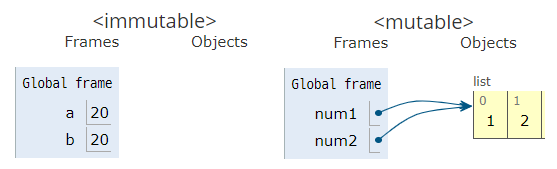
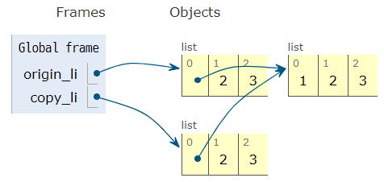

###### 210125_mon

# 오늘 배울 내용을 알아볼까요?

:question: 다음의 문장들을 보면 어떤 결과가 나올지 예상이 되나요?

```python
'Hi'.lower()  #hi, 소문자로 바꾼다
[1, 2, 3].remove(1)  #[2, 3], 1을 제거
[1, 2, 3].count(1)  #1, 1을 센다
{'바나나'}.add('수박')  #{'바나나', '수박'}, set에 요소를 더한다
{'b': 'banana'}.get('b')  #banana, 'b'의 값을 불러온다
```

이름으로 대강 유추가 가능하죠?? 오늘은 이런 구조에 대해 배울거랍니다 :wink:

> 위의 문장들은 모두 동일한 구조를 가지고 있습니다.
>
> > 데이터형식.행동()
>
> 데이터 형식에 맞춰 작동할 수 있는 행동이 다양하고, 이를 활용해서 알고리즘을 수월하게 작성할 수 있습니다. 이때 이 행동을 `메서드(method)`라고 한답니다!!


그럼 이제부터 이 구조를 자세히 배워보겠습니다!! 


# 데이터 구조(Data_structure) 1

> 데이터 구조(Data Structure)란 데이터에 편리하게 접근하고, 변경하기 위해서 데이터를 저장하거나 조작하는 방법을 말합니다.
>
> > Program = Datastructure + Algorithm
>
> - 알고리즘에 빈번히 활용되는 순서가 있는(ordered) 데이터 구조
>   - 문자열(String)
>   - 리스트(List)
> - 데이터 구조에 적용 가능한 Built-in Function
>
> 이러한 데이터 구조와 그와 관련된 메서드를 살펴보겠습니다.


본격적으로 수업에 들어가기에 앞서...

## Python이 왜 좋을까요? :thinking:

> 다른 언어보다 진입장벽이 낮습니다!! 왜 일까요?
>
> > [1, 2, 3]에서 1의 개수를 판단한다고 해봅시다.
> >
> > `for문과 if문을 활용`해서 1이 나올때마다 count를 해줘야 겠죠!!
>
> python에서는 더 쉽게?? 가능합니다!
>
> > [1, 2, 3].count(1)
>
> 겨우 한문장... 매우 간단하죠??
>
> 이처럼 python에서는 내장된 함수를 사용해서 빠르고 편하게, 또한 가독성있게 알고리즘을 작성할 수 있습니다!!!
>
> 물론 다양한 상황을 헤쳐나가려면 메서드에만 의존하면 안되는거 아시죠? 직접 구현하는 법도 당연히 익혀야합니다.
>
> 어쨌든 편한 방법임은 사실입니다.
>
> 이렇게 기본적으로 제공되는 메서드 덕분에 다른 언어보다 수월하게 진행할 수 있답니다.

그럼 이제 왜 배워햐하는지 감이 잡히시나요? 좀 더 편하기 위해!! 다양한 메서드를 배워봅시다!


:raised_hand_with_fingers_splayed:참!! 학습하면서 __데이터의 특징을 눈여겨 보세요__.

외우지 않아도 __메서드의 특징을 이해할 수 있을겁니다!__


# 1. 문자열(String)

> character들의 집합으로 다음의 특징을 가집니다.
>
> 변경할 수 없고(`immutable`), 순서가 있고(`ordered`), 순회가능한(`literable`)
>
> [문자열의 method](https://docs.python.org/ko/3/library/stdtypes.html#string-methods) :point_left: 확인해보세요(str.~~)

- 변경불가(immutable)
- 순서 있음(ordered)

```python
a = 'apple'
print(a[0])  #a, 인덱스로 접근가능 = ordered
a[0] = 'A'  #TypeError, 할당자체가 되지 않습니다 
```

- 순회 가능(literable)

```python
for char in a:  #반복문에 전달하여 사용할 수 있습니다
    print(char)
```


## 1.1 조회/탐색

### `.find(x)`

> x의 __첫 번째 위치__를 반환합니다. 없으면 `-1`을 반환합니다.

```python
a = 'apple'

a.find('a')  #0
a.find('p')  #1, p는 두개지만 그 중 첫번째 인덱스를 반환합니다.
a.find('y')  #-1
```


### `.index(x)`

> x의 __첫 번쨰 위치__를 반환합니다. 없으면 __오류__가 발생합니다.

```python
a = 'apple'

a.index('a')  #0
a.index('p')  #1
a.index('y')  #ValueError
```


### .find(x) vs .index(x)

- 둘 다  x의 __첫 번째 위치__를 반환합니다.
- 값이 없으면?
  - `.find(x)` : `-1`반환
  - `.index(x)` :  `Error`

> .index(x)도 try ~ except 구문으로 예외처리를 해줄 수 있지만... 그보다는 이미 제공하는 find(x)를 쓰는게 더 편하겠죠??


## 1.2 값 변경

### `.replace(old, new[, count])`

> 바꿀 대상 글자를 __새로운 글자로 바꿔서 반환__합니다.
>
> count를 지정하면 `해당 갯수만큼만 시행`합니다. []로 표현된 건 옵션입니다!

```python
b = 'banana'

b.replace('a', '')  #'bnn', a를 공백으로 치환
b.replace('a', '', 2)  #'bnna', a를 공백으로 2번만 치환
```

###### 원본자체가 바뀌는건 아님!! 헷갈리지 말쟈


### `.strip([chars])`

> 특정한 문자들을 지정하면, __양쪽을 제거__하거나 __왼쪽을 제거__하거나(lstrip), __오른쪽을 제거__합니다.(rstrip)
>
> 지정하지 않으면 __공백을 제거__합니다. (이거가 많이 쓰이고 유용!)

```python
hi = '\t  hi! \n'

hi.strip()  #'hi!', 양쪽
hi.lstrip()  #'hi! \n', 왼쪽
hi.rstrip()  #'\t  hi!', 오른쪽
```
- 띄어쓰기, 개행문자(escape, '\r\t\n' 등)도 공백으로 인식합니다.
- 공백제거 메서드의 중요성
```python
'홍길동 ' == '홍길동'  #False, 공백으로인해 같지 않음
```

> 홈페이지에서 회원가입을 하는데 사용자가 공백을 입력하면, 서로 다른 정보로 인식할 위험이 있겠죠? 그래서 이런 경우 일괄적으로 공백을 제거해서 사용합니다!


### `.split()`

> 문자열을 __특정한 단위로 나누어__ 리스트로 반환합니다.
>
> :star:특히 많이 쓰니까 기억해둡시다!

```python
word = 'a,b,c'
word.split(',')  #['a', 'b', 'c'], ','를 구분자로 리스트를 생성합니다.

number = '1 2 3'
number.split()  #['1', '2', '3'], default는 공백을 구분자로 합니다.
```


### `'separator'.join(literable)`

> 특정 __문자열로 만들어__ 반환합니다.
>
> __반복가능한(literable) 컨테이너의 요소__들을 `separator`를 구분자로 `합쳐(join())` 문자열로 반환합니다.

```python
word = 'wow'
'!'.join(word)  #'w!o!w', !를 구분자로 string의 요소 문자열로 반환

words = ['hi', 'hello']
','.join(words)  #'hi,hello', ,(콤마)를 구분자로 list의 요소 문자열로 반환

words = [1, 2]
','.join(words)  #TypeError, 요소가 str인 경우만 가능
```


## 1.3 문자 변형

### `.capitalize()`, `.title()`, `.upper()`

> `.capitalize()` : 앞글자를 대문자로 만들어 반환합니다.
>
> `.title()` : 어포스트로피나 공백 이후를 대문자로 만들어 반환합니다.
>
> `.upper()` : 모두 대문자로 만들어 반환합니다.

```python
a = 'hI! Everyone, I\'m kim'

a.capitalize()  #"Hi! everyone, i'm kim", 첫글자만 대문자
a.title()  #"Hi! Everyone, I'M Kim", 특정 조건에만 대문자
a.upper()  #"HI! EVERYONE, I'M KIM", 전부 대문자
```


### `.lower()`, `.swapcase()`

> `.lower()` : 모두 소문자로 만들어 반환합니다.
>
> `.swapcase()` : 대 <-> 소문자로 변경하여 반환합니다.

```python
a = 'hI! Everyone, I\'m kim'

a.lower()  #"hi! everyone, i'm kim", 전부 소문자
a.swapcase()  #"Hi! eVERYONE, i'M KIM", 대소문자 서로 변경
```


## 1.4 기타 문자열 관련 검증 메소드 : 참/거짓 반환

> .isalpha() , .isdecimal() , .isdigit() , .isnumeric() , .isspace() , .isupper() , .istitle() , .islower()
>
> 문자열 메소드를 확인합니다.

```python
##알파벳인지
'3'.isalpha()  #False
'a'.isalpha()  #True

'3.5'.isdecimal()  #False, 십진수인지
'3'.isnumeric()  #True, 숫자인지, 디짓과 유니코드 숫자 값 속성을 갖는 모든 문자를 포함
'½'.isnumeric()  #True, 
'³'.isdigit()  #True, 십진수 문자와 위 첨자 숫자 같은 특수처리 필요한 숫자인지
```


##  :pushpin:String method 

> __값을 변경하는 내용__이 주를 이룹니다! 
>
> 이때 문자열 자체를 바꾸는 것이 아닌 바뀐 문자열을 __반환하는 형태__였음을 유의하세요! (jupyter notebook에서 print없이도 값이 출력됩니다.)
>
> 아무래도 문자열이 __immutable의 특성__을 가지고 있기 때문이라고 유추할 수 있겠죠??

- 조회/탐색
  - .find()
  - .index()
- 값 변경
  - .replace()
  - .strip()
  - .spilt()
  - 'separator'.join(literable)
- 문자 변형
  - .capitalize(), .title(), .upper()
  - .lower(), .swapcase()
- 검증


# 2. 리스트(List)

> 리스트의 특징은 뭐가 있을까요?
>
> 변경 가능하고(`mutable`), 순서가 있고(`ordered`), 순회 가능(`literable`)합니다.
>
> [list method](https://docs.python.org/ko/3/tutorial/datastructures.html#more-on-lists) :point_left:list.~~를 확인해보세요! ​

- 변경 가능(mutable)
- 순서 있음(orderd)

```python
a = [0, 1]
a[0] = 2
a  # [2, 1]
```

- 순회 가능(literable)


###### :fire: 처음 등장하는 값 추가 및 삭제! 이는 문자열에서는 찾아 볼 수 없던 기능입니다!!

###### 문자열과 달리 리스트의 mutable한 특징 때문에 내용을 자유자재로 바꿀 수 있기 때문입니다!


## 2.1 값 추가 및 삭제

> 문자열에서는 찾아볼 수 없던 기능입니다!!!
>
> 이는 리스트의 변경가능한(`mitable`) 특징 때문에 활용할 수 있는 메서드 입니다.

### `.append(x)`

> 리스트에 값을 추가할 수 있습니다.

```python
coffee = ['americano', 'cappuccino']
coffee.append('latte')
print(coffee)  #['americano', 'cappuccino', 'latte']
```

- 새로운 값을 반환하는 것이 아닌 원래의 것을 변형시킨다는 것!!!

  (문자열은 메서드가 반환값을 가집니다!)


### `.extend(iterable)`

> 리스트에 literable(list, tuple, range, string**[주의]**)값을 붙일 수 있습니다.

```python
coffee.extend(['ade'])
print(coffee)  #['americano', 'cappuccino', 'latte', 'ade']

coffee.extend(['smoothie', 'espresso'])
print(coffee)  #['americano', 'cappuccino', 'latte', 'ade', 'smoothie', 'espresso']
```

- 이는 list concatenation과 동일합니다.

```python
coffee = coffee + ['mocha']
print(coffee) #['americano', 'cappuccino', 'latte', 'ade', 'smoothie', 'espresso', 'mocha']
```


### .append(x) vs .extend(literable)

- 둘 다 값을 리스트에 추가합니다.
- 차이점?
  - .append(x) : 하나의 요소를 추가합니다.
  - .expend(literable) : literable한 요소 여러개를 반복적으로 추가합니다.

```python
cafe = ['twosome']

cafe.append('startbucks')
print(cafe)  #['twosome', 'startbucks']
cafe.expend('hollys')
print(cafe)  #['twosome', 'startbucks', 'h', 'o', 'l', 'l', 'y', 's']
```

> 보이는 것처럼 문자열을 넣어주면 literable하므로, 요소가 하나씩 반복적으로 추가됩니다!!
>
> 'hollys'의 한 단어로 넣고 싶다면 리스트나 튜플등의 형태로 추가하면 됩니다!


### `.insert(i, x)`

> 정해진 위치 `i`에 값을 추가합니다.

```python
cafe.insert(0, 'hihi')
print(cafe)  #['hihi', 'twosome', 'startbucks', 'h', 'o', 'l', 'l', 'y', 's']

cafe.insert(-1, 'bye')
print(cafe)  #['hihi', 'twosome', 'startbucks', 'h', 'o', 'l', 'l', 'y', 'bye' ,'s']

cafe.insert(len(cafe), 'bbye')
print(cafe)  #['hihi', 'twosome', 'startbucks', 'h', 'o', 'l', 'l', 'y', 'bye' ,'s', 'bbye']
```

- 맨 끝에 넣고 싶은 경우! 리스트의 길이(len(cafe))를 넣어주세요!
- 리스트의 길이를 넘어서는 인덱스는 마지막에 추가됩니다.


### `.remove(x)`

> 리스트에서 값이 x인 것을 삭제합니다.

```python
numbers = [1, 2, 3, 1, 2]

numbers.remove(1)
print(numbers)  #[2, 3, 1, 2]

numbers.remove(1)
print(numbers)  #[2, 3, 2]

numbers.remove(1)
print(numbers)  #ValueError, 값이 없으면 오류가 발생합니다!
```


### `.pop(i)`

> 정해진 위치 `i`에 있는 값을 __삭제하며, 그 항목을 반환__합니다.
>
> `i`가 지정되지 않으면 마지막 항목을 삭제하고 되돌려줍니다.

```python
numbers = [1, 2, 3, 4, 5, 6]
numbers.pop()  #6
print(numbers)  #[1, 2, 3, 4, 5]
```

- 제거된 값이 반환되므로, 따로 변수에 저장해 활용할 수 있습니다.


### .remove(x) vs .pop(i)

- 리스트의 요소를 제거합니다.
- 차이점
  - .remove(x) : x값을 찾아서 제거
  - .pop(i) : 인덱스 i를 찾아서 제거 / 값이 반환


### `.clear()`

> 리스트의 모든 요소를 삭제합니다.

```python
num = [1, 2, 3]
num.clear()
print(num)  #[]
```


## 2.2 탐색 및 정렬

### `.index(x)`

> x값을 찾아 해당 인덱스를 반환합니다.

```python
num = [1, 2, 3, 4]

num.index(1)  #0
num.index(5)  #ValueError, 값이 없을 경우 에러
```


### `.count(x)`

> 원하는 값의 개수를 확인할 수 있습니다.

```python
num = [1, 2, 3, 1, 2]

num.count(1)  #2
num.count(4)  #0
```

- count를 활용해 쉽게 값 제거하기

```python
#count한 횟수만큰 반복해서 값 지움
for i in range(num.count(1)):
    num.remove(1)
1 in a  #False
```


### `.sort()`

> 정렬합니다.
>
> 내장함수 `sorted()`와 달리 __원본 list를 변형__시키고, __None__을 반환합니다.

- .sort()

```python
num = [10, 2, 3, 22, 45]
num.sort()
print(num)  #[2, 3, 10, 22, 45]
```
- sorted()
```python
num = [10, 2, 3, 22, 45]
sorted(num)  #[2, 3, 10, 22, 45]
print(num)  #[10, 2, 3, 22, 45]
```


### `.reverse()`

> 반대로 뒤집습니다. 정렬이 아닙니다! 말그대로 뒤집기만 함을 주의하세요!!

```python
fruit = ['apple', 'banana', 'lemon']

fruit.reverse()
print(fruit)  #['lemon', 'banana', 'apple']
```


## 2.3 리스트 복사 :star:

> 이전에 mutable과 immutable하면서 리스트의 복사에 대해 얘기한 것 기억하시나요?
>
> list의 경우는 mutable한 데이터로, 변수에는 리스트의 주소가 저장되기 때문에 일반 변수처럼 값을 복사해서 사용할 수 없습니다!
>
> 예시를 다시 볼까요?

- mutable 데이터의 복사

```python
origin_list = [1, 2, 3]
copy_list = origin_list
copy_list[0] = 10
print(origin_list)  #[10, 2, 3]
print(copy_list)  #[10, 2, 3]
```

- 이는 mutable한 데이터를 저장한 변수에는 실제로 데이터의 주소가  들어있기때문입니다.
- 따라서 copy_list, origin_list는 동일한 list를 가르키게 됩니다.




##### :woman_cartwheeling: 따라서!! 리스트의 복사는 다른 방식으로 이뤄져야 합니다. 

##### 그럼 어떤 방법이 있을까요?


### < 얕은 복사(`shallow copy`) >

> 1차원 리스트인경우 문제없이 리스트를 복사할 수 있습니다.

### 1) slice 연산자사용 `[:]`

- slice를 이용해 __전체를 똑같이 잘라내어 새롭게 저장__합니다.

```python
origin_list = [1, 2, 3]
copy_list = origin_list[:]
copy_list[0] = 10
print(origin_list)  #[1, 2, 3]
print(copy_list)  #[10, 2, 3]
```


### 2) `list()` 활용

- list()를 사용해서 __기존의 list를 새로운 list로 형변환__ 할 수 있습니다!

```python
origin_list = [1, 2, 3]
copy_list = list(origin_list)
copy_list[0] = 10
print(origin_list)  #[1, 2, 3]
print(copy_list)  #[10, 2, 3]
```


### <깊은 복사(`deep copy`)>

> 2차원 리스트의 경우 얕은 복사로는 부족합니다!! 

- 얕은 복사를 이용한 2차원 리스트 복사
  - origin_li의 이차원 요소가 copy_li와 동일하게 변화합니다.
  - 일차원 요소는 변하지 않습니다.

```python
origin_li = [[1, 2, 3], 2, 3]  #[주소, 2, 3]의 형태
copy_li = list(origin_li)
copy_li[0][0] = 100
copy_li[1] = 200
print(origin_li)  #[[100, 2, 3], 2, 3]
print(copy_li)  #[[100, 2, 3], 200, 3]
```

- 그림처럼 중첩된 리스트는 주소가 복사되어 같은 것을 가르키게 됩니다.



### `copy.deepcopy()`

>  내부에 있는 모든 객체까지 새롭게 값이 변경되도록 합니다.

```python
import copy

origin_li = [[1, 2, 3], 2, 3]
copy_li = copy.deepcopy(origin_li)
copy_li[0][0] = 100
print(origin_li)  #[[1, 2, 3], 2, 3]
print(copy_li)  #[[100, 2, 3], 2, 3]
```


리스트의 차원에 따라 copy의 방법이 달라진다는 것!!

두 copy의 개념을 기억하세요!


## 2.4 List Comprehension

> list comprehension은 __표현식과 제어문을 통해 리스트를 생성__하는 것으로,
>
> 여러줄의 코드를 한 줄로 줄일 수 있습니다.

### 활용법

```python
[expression for 변수 in iterable]
list(expression for 변수 in iterable)
```

### 예) 제곱이 담긴 리스트

> 1 ~ 10까지의 숫자로 만든 세제곱이 담긴 리스트를 만들어 봅시다.

```python
numbers = range(1, 11)
#for문의 number에 대해 제곱하여 리스트에 저장
square_li = [number**2 for number in numbers] 
print(square_li)  #[1, 4, 9, 16, 25, 36, 49, 64, 81, 100]
```

- for문을 여러개 사용할 수도 있습니다.

```python
#곱집합: 두 리스트의 가능한 모든 조합
girls = ['jane', 'ashley', 'mary']
boys = ['justin', 'eric', 'david']

pair = [(boy, girl) for boy in boys for girl in girls]  
#[('justin', 'jane'), ('justin', 'ashley'), ('justin', 'mary'), ('eric', 'jane'), ('eric', 'ashley'), ('eric', 'mary'), ('david', 'jane'), ('david', 'ashley'), ('david', 'mary')]
```


## 2.5 List Comprehension + 조건문

> 조건문에 참인 식으로 리스트를 생성합니다. 즉, 조건이 참인 경우에만 리스트에 값을 넣습니다.

### 활용법

```python
[expresstion for 변수 in iterable if 조건식]
[expresstion if 조건식 else 식 for 변수 in iterable]  #조건표현식
```

### 예) 홀짝에 따른 리스트

> 홀수만 가진 리스트
>
> 홀수는 양수, 짝수는 음수인 리스트를 각각 만들어봅시다.

```python
[i for i in range(1, 11) if i % 2 == 1]  #[1, 3, 5, 7, 9]
[i if i % 2 == 1 else -i for i in range(1, 11) ]  #[1, -2, 3, -4, 5, -6, 7, -8, 9, -10]
```

- 여러개의 for문이라도 if는 가장 마지막에 넣어줍니다.

```python
#주어진 조건(x < y < z < 50) 내에서 피타고라스 방정식의 해

result = [
    (x, y, z) 
    for x in range(1, 50) 
    for y in range(x+1, 50) 
    for z in range(y+1, 50) 
    if z**2 == (x**2) + (y**2)
]
#[(3, 4, 5), (5, 12, 13), (6, 8, 10), (7, 24, 25), (8, 15, 17), (9, 12, 15), (9, 40, 41), (10, 24, 26), (12, 16, 20), (12, 35, 37), (15, 20, 25), (15, 36, 39), (16, 30, 34), (18, 24, 30), (20, 21, 29), (21, 28, 35), (24, 32, 40), (27, 36, 45)]
```


### :exclamation:Tip

- for, if를 __하나정도__ 쓰는게 적당합니다.(너무 많으면 가독성이 떨어짐)

- for문의 값을 무조건 활용해야하는 것은 아닙니다.

```python
[1 for n in range(0, 9)]  #[1, 1, 1, 1, 1, 1, 1, 1, 1], 초기화시 사용가능
```

- for문을 쓴 뒤, 이와 관련해서 리스트에 들어갈 요소를 적어준 다음 조건문을 적으면 좀 더 수월합니다.
- if문을 통과하지 못한다면 리스트에 아예 저장되지 않습니다.
  - 조건에 따라 다른 값을 넣고 싶다면 __조건 표현식__을 이용하세요


##  :pushpin:List method 

> __값을 추가 및 삭제__가 주를 이룹니다! 
>
> 이는 list의 __mutable__한 특성 때문입니다!!
>

- 값 추가 및 삭제
  - .append(x)
  - .extend(iterable)
  - .insert(i, x)
  - .remove(x)
  - .pop(i)
  - .clear()
- 탐색 및 정렬
  - .index(x)
  - .count(x)
  - .sort()
  - .reverse()
- 리스트 복사
  - 얕은 복사(shallow copy) : 일차원 리스트
    - slice 연산사 [:]
    - list()
  - 깊은 복사(deep copy) : 이차원 이상
    - copy.deepcopy()
- List Comprehension
  - 표현식과 제어문을 통한 리스트 생성


# 3. 데이터 구조에 적용 가능한 Built-in Function

> 순회 가능(iterable) 데이터 구조에 적용 가능한 Built-in Function에 대해 알아볼까요?
>
> > iterable 타입 - `list`, `dict`, `set`, `str`, `bytes`, `tuple`, `range`
>
> - `map()`
> - `filter()`
> - `zip()`
> - ~~`reduce()`~~


:star: 특히 `map()`, `filter()`는 정말 많이 쓰인다고 합니다!!!


### `map(function, iterable)`

> 순회 가능한 데이터 구조(`iterable`)의 __모든 요소에 function을 적용__한 뒤 그 결과를 돌려줍니다.
>
> return은 `map_object`형태입니다.

### 특징

- iterable한 것을 다른 형태의 iterable로 바꾸기 위해 사용합니다.
  - 입력과 출력이 모두 여러개의 값을 가집니다

```python
	원본		 f수행	  결과
[o, o, o, o]	=>	 [x, x, x, x]
#이처럼 원본의 요소 o들 하나하나에 f를 적용하여(mapping) 새로운 요소 x들을 얻는 방식입니다.
```

- 모든 요소 각각에 동일한 작용을 거쳐 어떤 결과를 얻고싶을 때 사용합니다.
  -  for문 대신 더 편하게 사용할 수 있습니다.

#### 예) 문자열 만들기

> numbers = [1, 2, 3]의 요소를 문자열 '123'으로 변경하세요

<for문 활용 - list comprehension>

```python
''.join([str(i) for i in numbers])  #'123'
```

<map()활용>

```python
''.join(map(str, numbers))  #'123'
```

##### 이처럼 iterable 요소에 특정 함수를 적용한 결과가 필요한 경우 `map()`이 유용합니다.


- 입력값을 처리할 때 주로 사용합니다.

```python
#str보다 list가 처리하기 편하므로 입력값을 변환합니다
numbers = '1 2 3 4 5'
list(map(int, numbers.split(' ')))
```

- 함수를 실행(call)하지 않도록 주의하세요!
  - map이 함수를 실행할 수 있도록 이름만 적어주세요.
- map()의 결과는 __그 자체로 iterable 객체__입니다.
  - for문에 직접 사용할 수 있습니다.
  - 다만, 일회성이기때문에 여러번 사용하고자한다면 list로 변환해주세요. (관련내용 -> 0126_practice2.md의 2번)


### `filter(function, iterable)`

> 순회 가능한 데이터 구조(`iterable`)에서 반환된 결과가 `True`인 것들만 구성하여 반환합니다.
>
> return은 `filter_object`입니다.

### 특징

- `map()`과 동일하게 iterable한 것을 다른 형태의 iterable로 바꾸기 위해 사용합니다.
- 다만, __조건에 따라 요소를 걸러냅니다.__

```python
	원본		 f수행	  결과
[o, o, o, o]	=>	   [x, x]
#이처럼 원본의 요소 o들 하나하나에 f를 적용하여(mapping) 결과가 True인 것만 얻어냅니다.
```

- 함수는 `True` or `False`를 반환합니다.
  - True, False가 아닌 경우: bool( return 값 )으로 판단

```python
def my_pass(n):
    return n

original = [0, 1, 2, True, False, 'a', [], 'hello']
result = filter(my_pass, original)  #[1, 2, True, 'a', 'hello'], True인 것만 반환됩니다.
```

- return 이 `True`라면 __모든 값이 허용__됩니다.
- return이 `없다면 None을 반환`하므로 이는 `False`에 해당하며 __어떤 값도 허용되지않습니다.__


##### `map()`과 `filter()`모두 for문으로 구현가능하지만, 그 번거로움을 줄이기위한 메서드 입니다. 

##### :pushpin: 자주 사용되는 만큼 숙지합시다!


### `zip(*iterable)`

> 복수의 `iterable`객체를 인덱스가 맞는 것끼리 묶어줍니다.
>
> 결과는 튜플의 모음으로 구성된 `zip object`를 반환합니다.

### 예)

```python
girls = ['jane', 'ashley', 'mary']
boys = ['justin', 'eric', 'david']

pair = list(zip(girls, boys))
print(pair)  #[('jane', 'justin'), ('ashley', 'eric'), ('mary', 'david')]
```


##### 오늘은 python에서 제공하는 메서드에대해 배워봤습니다. 

##### 아직은 익숙하지 않아서인지 알고리즘짤때 활용하기가 매우 어렵습니다 :sob: 연습하면 나아지겠죠? 

##### 우선 진도도 빨리빨리 따라가고 문제도 많이 풀어봐야겠습니다... 

##### 아쟈아ㅏ :raised_hands: