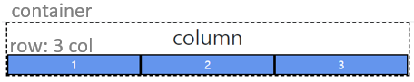
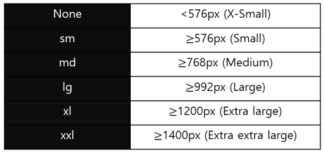

210203_wed

# CSS layout

- CSS page layout techniques
  - DIsplay
  - Position
  - Float
  - Flexbox
  - `Grid` - `Bootstrap Grid System`


# 4. Bootstrap Grid System

> 핵심 단어!!
>
> `flexbox grid` : 내부적으로 flexbox로 구현해놓음
>
> `12column` : 12개의 column을 가진다
>
> `6 default responsive tiers` : 6개의 반응형 객체 구조를 가진다
>
> 무슨말인지 알아봅시다!!

## 4.1 Grid System :star:

- Bootstrap Grid System은 __Flexbox__로 제작되었습니다.
- `container`, `row`, `column` 으로 컨텐츠를 배치하고 정렬합니다. (3단계 구조)
- __반드시 기억할 것!__
  1. 12개의 column
  2. 6개의 grid breakpoint
- 구조
  - .container > .row > col-*
  - 가장 바깥쪽에 `.container`를 작성해야 내부에 grid가 적용될 공간이 정해집니다.

```html
<div class="container">
    <div class="row">
        <div class="col"></div>
        <div class="col"></div>
        <div class="col"></div>
    </div>
</div>
```

<br>

##### 예시

```html
<div class="container base">
  <h2 class="text-center">column</h2>
  <div class="row">
    <div class="box col">1</div>
    <div class="box col">2</div>
    <div class="box col">3</div>
  </div>
</div>
```



<br>

### row/col

##### .row

- column의 wrapper입니다.
- 각 column에는 공간 사이를 제어하기 위한 좌우 padding이 있으며, 이를 `gutter`라고 합니다.
  - row의 margin과 gutter를 제거하려면 .row에 `.no-gutters` class를 사용합니다.

##### .col / col-*

- row당 가능한 12개의 column중 사용하려는 column 수를 나타냅니다.

  :question: 왜 12개일까

  - 12의 약수가 가장 많기 때문에 한 줄에 표시할 수 있는 종류가 가장 많다! 
  - 그만큼 레이아웃을 다양하게 짤 수 있다

- columns 너비는 __백분율로 설정__되므로 항상 부모 요소를 기준으로 유동적으로 크기가 조정된다.

- grid layout에서 __내용은 반드시 columns 안에__ 있어야한다!!! 

  - columns만 row의 바로 하위 자식일 수 있다

<br>

### offset

##### offset-*

- 지정한 만큼의 column 공간을 무시하고 다음 공간부터 컨텐츠를 적용합니다.
- margin-left 설정 : 적용하는 요소의 왼쪽에 마진을 주어 공백을 만드는 방식입니다.

```html
<div class="container">
  <h2 class="text-center">offset</h2>
  <div class="row">
      <div class="box col-4 offset-4">1</div>
      <div class="box col-4">2</div>
    </div>
</div>
```

<br>

### nesting

- 중첩된 그리드 시스템 : 요소안에서 다시 12칸을 나눌 수 있습니다.
- .row > .col-* >.row > .col-* 방식으로 중첨 사용 가능합니다.

```html
<div class="container">
  <h2 class="text-center">nesting</h2>
  <div class="row">
      <div class="box col-6">
        <div class="row">
            <div class="box col-3">1</div>
            <div class="box col-3">2</div>
            <div class="box col-3">3</div>
            <div class="box col-3">4</div>
        </div>
      </div>
      <div class="box col-6">2</div>
      <div class="box col-6">3</div>
      <div class="box col-6">4</div>
  </div>
</div>
```

<br>

### Grid breakpoints

- breakpoints
  - 다양한 디바이스에 적용하기 위해 특정 px 조건에 대한 지점을 정해둔 것

- 부트스트랩은 대부분의 크기를 정의하기 위해 em, rem을 사용하지만 __px는 grid breakpoint 에 사용__됩니다.
  - 이는 viexport 너비가 px단위이고, 글꼴 크기에 따라 변하지 않기 때문입니다.



```html
<div class="container">
  <h2 class="text-center">Grid breakpoints</h2>
  <div class="row">
      <div class="box col-2 col-sm-8 col-md-4">1</div>
      <div class="box col-8 col-sm-2 col-md-4">2</div>
      <div class="box col-2 col-sm-2 col-md-4">3</div>
    </div>
</div>
```

- 576px이하(xs)에서는 282이 / 576px 이상(sm)에서는 822 / 768px 이상(md)에서는 444의 비율을 가집니다.
- 개발자 도구(ctrl+shift+i)를 키면 픽셀을 확인할 수 있습니다! 화면 너비를 조정해조세요!!

```html
<div class="box col d-md-none d-lg-block"></div>
```

- display와 함께 사용하여 화면의 크기에 따라 요소가 나타나고 사라지도록 구성할 수 있습니다.

<br>

### Grid system을 이용한 배치

```html
<div class="container">
  <h2 class="text-center">alignment</h2>
  <div class="row parent justify-content-center align-items-center">
      <div class="box col-4">1</div>
    </div>
</div>
```

- row가 flex역할을 수행합니다!!
  - 여기에 12칸의 배율을 이용하면 원하는 위치에 배치하는 것이 쉬워집니다!

```html
<div class="container">
  <h2 class="text-center">alignment: self</h2>
  <div class="row parent">
      <div class="box col-4 align-self-center">1</div>
    </div>
</div>
```

##### :heavy_check_mark: grid를 이용하여 안정적인 배치를 할 수 있습니다!!!

<br>

<hr>

여기까지 grid system에 대해 배웠습니다!

이때 주의할 것은 __gird system 에만 의존하면 안된다__는 것입니다!

flexbox와 grid system을 상황에 따라 적절히 사용할 수 있어야합니다.

<br>

또한!

bootstrap이 있다고 CSS를 몰라도 되는 것은 아닙니다!

bootstrap은 CSS를 기본으로 만들어진 것이고, 만능은 아니기때문에 base가 되는 __CSS를 이해하는 것은 필수__입니다!!!

<br>

이 점에 유의해서 뭐든 열심히 배워봅시다!!

