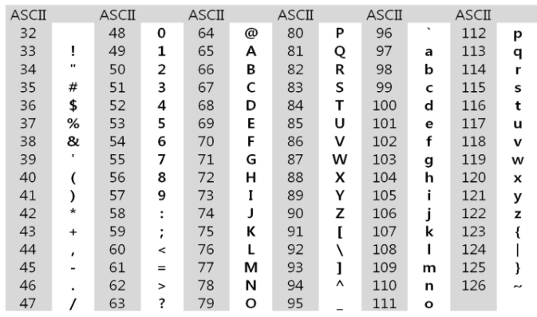

210217_wed

# APS 3

> 벌써 APS 3차시... 난 그동안 뭐했지...뭘배운거지ㅣ 아아악

 

# 문자열(string)

> 오늘은 알고리즘에서 많이 활용되는 문자열을 활용해봅시다!
>
> 패턴매칭 3가지! 암호화와 압축은 참고 정도로 알아봅시다!

- 문자열
- 패턴 매칭
- 문자열 암호화
- 문자열 압축

 

 

## 1. Intro - 문자의 표현

> 컴퓨터에서는 문자가 어떻게 표현될까요?

### 1.1 컴퓨터에서의 문자표현

- 글자 A를 메모리에 저장하는 방법이 무엇일까요?
  - 우리가 보는 글자를 그대로 저장할까요?? 메모리에 글자를 새길까요?
- __메모리는 숫자만 저장__할 수 있습니다!
  - 따라서 각 __문자에 대응되는 숫자__를 정해놓고, 이것을 메모리에 저장하는 방법을 사용합니다!

- 영어는 대소문자 합쳐서 52개 : 6bit(26 = 64)로 모두 표현할 수 있습니다
  - 000000 => 'a' 이런식으로 약속한 코드체계를 사용

 

### 1.2 코드체계

> 코드체계가 처음부터 하나는 아니었겠죠?

- 네트워크 발전되기 전
  - 지역별로 소통이 안돼서 __자신들만의 코드 체계__를 사용했다
- 네트워크(인터넷: 미국에서 발전) 발전
  - 서로간에 통신할 때 약속이 다르다보니 데이터를 잘못 해석할 여지가 존재!
  - 그래서 __표준안__을 정하게됐다!

#### ASCII

> 혼동을 피하기위해 만들어진 표준안이 바로 __ASCII (American Standard Code for Information Interchange)__ 이다!!

- 1967년 미국에서 제정된 문자 인코딩 표준
- 7bit 인코딩으로 128(27)문자를 표현
  - (52개 알파벳 + 공백, 괄호, 숫자 등) 95개의 출력 가능한 문자 + 33개 출력 불가능한 제어문자
- 출력가능한 아스키 문자
  - 외울 필요는 없지만 A와 a는 많이들 알고 있다
  - python에서는 `ord()`, `chr()`을 사용해서 아스키 값과 해당 값의 아스키 문자를 알 수 있다

#### 확장 아스키

#### 유니코드

 

 

## 2. 문자열