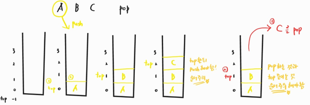

210222_mon

# APS 4

> 오늘 컨디션 무엇...ㅜ 벌써 4차시다아!!!

<br>

# Stack1

> `스택`자료구조에대해 배워봅시다!

- `스택`
- 재귀호출
- Memoization
- DP
- DFS

<br>

<br>

# 1. 스택(Stack)

## 1.1 특성

- 물건을 쌓아 올리듯 __자료를 쌓아 올린 형태의 자료구조__

- 스택에 저장된 자료는 __선형 구조__를 갖는다

  - 선형구조 : 자료간의 관계가 `1대1`의 관계 갖음
  - 비선형구조: 자료간의 관계가 `1대N`의 관계를 갖음(예) 트리)

  

- 스택에 자료를 삽입(push)하거나 스택에서 자료를 꺼낼(pop) 수 있다

- 후입선출(__LIFO__, Last In First Out) :star:
  
  - 마지막에 삽입한 자료를 가장 먼저 꺼낸다
- 스택의 예
  
  - 탄창, 프링글스, 인터넷 브라우저 뒤로가기, ctrl + z

<br>

## 1.2 스택의 구현

> 구현을 위해 필요한 자료구조와 연산을 알아봅시다

- 자료구조 : 자료를 선형적으로 저장할 저장소

  - C언어 : 배열 사용 (크기 미리 지정)
  - 저장소 자체를 스택이라 부르기도 함
  - 스택에서 마지막에 삽입된 원소의 위치를 __top__이라 부름

- 연산

  - `push` : 삽입, 저장소에 __자료저장__
  - `pop` : 삭제, 저장소에서 삽입한 자료의 역순으로 __자료를 꺼낸다__
  - `isEmpty` : 스택이 __공백인지 아닌지 확인__

  - `peek` : 스택의 __top에 있는 item(원소)을 반환__하는 연산

<br>

### 스택의 삽입/삭제 과정

- 빈 스택에 원소 A, B, C를 차례로 삽입한 수 한번 삭제하는 연산과정
  - 가장 처음 top = -1
  - push : top를 1 증가시킨 뒤, 해당 위치에 값 저장
  - pop : top의 원소 반환한 뒤, top를 1 감소



<br>

##### 스택의 구현은 리스트를 사용한 방법, 배열을 사용한 방법 2가지로 구현할 수 있습니다

### 스택의 push 알고리즘

- 리스트를 이용한 방법
  - append 메소드를 통해 리스트의 마지막에 데이터를 삽입
  - 길이가 가변적이기 때문에 단순히 사용 가능

```python
def push(item):
    #스택 리스트(s)에 item 삽입
    s.append(item)
```

- 배열을 이용한 방법
  - __top으로 스택의 마지막 위치를 지정__한 뒤, 값을 삽입
  - 크기가 정해져 있으므로, __값을 넣을 수 있는지 확인__해야함
  - 애초에 값을 못넣는 일이 발생하지 않도록 배열의 크기를 충분히 크게함

```python
def push(item):
    #지역변수로 선언된 top 사용
    global top
    #자리가 없는 경우 삽입 불가를 알림
    if top == stack_size - 1:
        return
    #증가시킨 뒤 삽입
    top += 1
    s[top] = item
```

<br>

### 스택의 pop 알고리즘

- 리스트를 이용한 방법
  - 값이 있는 경우 pop을 통해 데이터를 삭제하고 반환
  - pop() / pop(-1) / pop(len(s) - 1) 모두 가능함

```python
def pop():
    #리스트에 값이 없으면 pop사용 불가하므로 확인
    if len(s) == 0:
        #underflow
        return
    #마지막값을 제거하여 반환
    return s.pop()
```

- 배열을 이용한 방법
  - 실제로 값을 제거하진 않지만, top을 이용해 위치를 지정하고 다음에 새로운 값으로 덮여지기 때문에 상관없음

```python
def pop():
    global top
    #스택의 마지막 값을 반환
    ret = s[top]
    #top 감소시켜 다음 마지막 위치를 가리킴
    top -= 1
    return ret
```

<br>

### 스택을 구현하자

> 스택을 구현하고, 3개의 데이터를 스택에 저장한 뒤 3번 꺼내서 출력해보자

- 고려사항
  - 1차원 배열을 사용하여 구현할 경우 구현은 용이하지만, 크기를 변경하기 어렵다
    - 즉, 크기를 결정하면 접근은 빠르지만 변경이 번거롭다
  - 리스트로 구형 할 경우 길이 변경이 쉽다
  - 동적 연결리스트를 이용해 구현하는 방법도 있지만, 이는 어려워서 생략하도록 한다
    - 저장소를 동적으로 할당하여 스택을 구현하는 방법
    - 구현이 복잡하지만, 메모리를 효율적으로 사용한다는 장점이 있다

#### 리스트

- 주요 동작을 함수로 정의하여 사용하자
- 굳이 함수를 쓸 이유는 없지만, 주요 용어를 맞추기 위해서라도 구현해보자

```python
def push(item):
    #스택에 item 삽입
    s.append(item)
  
def pop():
    #pop으로 삭제 및 반환
    return s.pop()

def isEmpty():
    #길이가 0인지 아닌지 반환
    return len(s) == 0

s = []

#데이터 삽입
push(1); push(2); push(3)
print(s)
#pop()을 수행하기 전, isEmpty로 스택의 데이터 유무판단
while not isEmpty():
    print(pop())
print(s)
```

- 결과 출력

```python
[1, 2, 3]  #push
3  #pop, 후입선출
2
1
[]
```

<br>

#### 배열

- 객체지향언어에서는 자료구조를 class로 작성하는 것이 가장 좋다
- 함수와 class 두 방식을 모두 이용해 보자

```python
##함수 활용
#메모리 미리 생성
stack_size = 3
s = [0] * stack_size
#top, 스택의 마지막 위치
top = -1

def push(item):
    global top
    #위치 설정 후 삽입
    top += 1
    s[top] = item
    
def pop():
    global top
    ret = s[top]  #반환
    top -= 1
    return ret

def isEmpty():
    #top이 -1인지 아닌지를 통해 스택에 값이 있는지 확인
    return top == -1

push(1); push(2); push(3)
print(s)
while not isEmpty():
    print(pop())
print(s)
```

- 결과

```python
[1, 2, 3]
3
2
1
[1, 2, 3]  #값은 남아있으나, top을 사용하여 후에 push하면 덮어짐
```


```python
##클래스

```


<br>

<br>

## 1.3 스택의 응용

### 1.3.1 괄호검사

- 괄호 종류 : 대괄호('[', ']'), 중괄호('{', '}'), 소괄호('(', ')')
- 조건
  1. 왼쪽 괄호의 개수와 오른쪽 괄호의 개수가 같아야 한다
     - 열린 것의 개수 == 닫힌 것의 개수
  2. 같은 괄호에서 왼쪽괄호는 오른쪽 괄호보다 먼저 나와야 한다
     - )( 이런 식의 구성은 NO
  3. 괄호 사이에는 포함관계만 존재한다
     - ({)} 이런건 NO
- 잘못된 사용 예
  - (a(b) - 1
  - (a)b) - 2 / 1
  - a([b{c]d}) - 3

그림을...그려 넣을까..?

#### 알고리즘 개요

- 문자열에 있는 괄호를 차례대로 조사하면서 왼쪽 괄호를 만나면 스택에 삽입, 오른쪽 괄호를 만나면 스택에서 top괄호를 삭제한 후 오른쪽 괄호와 짝이 맞는지 검사
- 이때, 스택이 비어 있으면 조건 1, 2에 위배 / 짝이 맞지 않으면 3위배
- 마지막 괄호까지 조사한 후에도 스택에 괄호가 남아있으면 조건 1 위배

#### 구현 - [SWEA 4866] 괄호검사

```python
for tc in range(1, int(input()) + 1):
    text = input()
    s = []

    result = 0
    for te in text:
        #여는 괄호인 경우 삽입
        if te == '(' or te == '{':
            s.append(te)
        #닫는 괄호인 경우
        elif te == ')':
            #스택이 있으면 pop과 비교
            if len(s):
                ret = s.pop()
                #여는 괄호 아니면 종료
                if ret != '(':
                    break
            #닫는 괄호가 먼저 나오는 경우 종료
            else:
                break
        elif te == '}':
            #스택있는 경우
            if len(s):
                ret = s.pop()
                #pop한 값이 여는 괄호 아니면 종료
                if ret != '{':
                    break
            #닫는괄호가 먼저 나온경우
            else:
                break
    #종료없이 통과, 스택에 남은에 없으면 짝 맞음
    else:
        if not len(s):
            result = 1


    print('#{} {}'.format(tc, result))
```


### 1.3.2 function call

- 프로그램에서 함수 호출과 복귀에 따른 수행 순서를 관리
  - 가장 __마지막에 호출된 함수__가 가장 __먼저 실행__을 완료하고 복귀하는 후입선출 구조
  - 함수 호출이 발생하면 호출한 함수 수행에 필요한 지역변수, 매개변수 및 수행 후 복귀할 주소 등의 정보를 __스택 프레임(stack frame)에 저장__하여 시스템 스택에 삽입
  - 함수 실행이 끝나면 시스템 스택의 top원소(스택 프레임)을 삭제(pop)하면서 프레임에 저장되어있던 복귀 주소를 확인하고 복귀
  - 함수 호출과 복귀에 따라 이과정을 반복, 전체 프로그램 수행이 종료되면 시스템 스택은 공백 스택이 된다

그림....은 일단 나중에...ㅎㅎㅎㅎ

