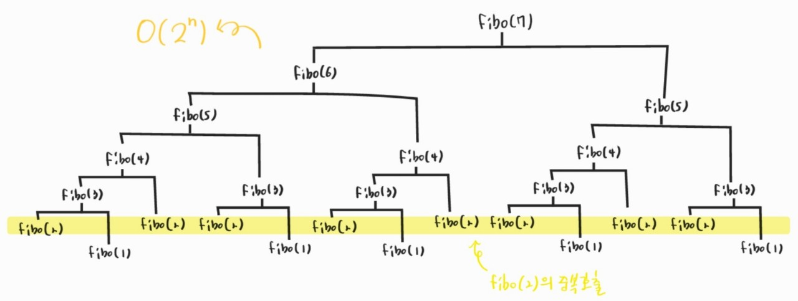

210222_mon

# APS 4

> 후.... 난 글렀어

<br>

# Stack1

> `스택`자료구조

- 스택
- `재귀호출`
- Memoization
- DP
- DFS*

<br>

<br>

# 2. 재귀호출

- __자기 자신을 호출__하여 순환 수행되는 것
- 함수에서 실행해야 하는 작업의 특성에 따라 일반적인 호출방식보다 재귀호출방식을 사용하여 함수를 만들면 프로그램의 크기를 줄이고 간단하게 작성 가능
  - 똑같은 동작을 여러번 수행해야한다면, 한수를 여러개 만드는 것보다 나 자신을 호출해서 간단하게 만들 수 있습니다!

## 2.1 구조

- base case : 재귀를 종료하고 값을 반환 (종료 조건)
- reculsive case : 재귀 수행 (순환 구조)

### 예1) Factorial

> n! = 1 x 2 x --- x (n - 1) x n : 1부터 n까지 모든 자연수를 곱하여 구하는 연산

- factoridal 의 구조를 살펴보면 다음과 같습니다

```python
n! = n x (n - 1)!
(n - 1)! = (n - 1) x (n - 2)!
(n - 2)! = (n - 2) x (n - 3)!
...
2! = 2 x 1!
1! = 1
```

- __마지막에 구한 하위 값__을 이용하여 __상위 값을 구하는 작업을 반복__
  - 이런 구조를 가비면 재귀로 짰을 때 동작이 간단해집니다

그림....은 일단 생략ㅋㅋㅋㅋㅋㅋ

#### 구현

```python
def factorial(n):
    if n == 1:  #종료조건
        return n
    return n * factorial(n - 1)  #재귀
```

<br>

### 예2) 피보나치수열

- 0과 1로 시작하고, 이전의 두 수의 합을 다음 항으로 하는 수열
  - fibo<sub>i</sub> = fibo<sub>i - 1</sub> + fibo<sub>i - 2</sub>

```python
0, 1, 1, 2, 3, 5, 8, 13, 21, ...  #애초부터 1, 1로 시작하기도 함
```

#### 구현

```python
def fibo(n):
    if n < 2:  #종료조건
        return n  #0, 1인경우 0, 1을 반환
    return fibo(n - 1) + fibo(n - 2)  #재귀
```

#### 위와 같은 재귀함수 구현의 문제점

- __엄청난 중복 호출__이 존재한다는 것!!!
  - fibo(7)에서 fibo(2)의 중복호출



- fibo(20)만 확인해봐도 결과 나오는 시간이 확 늘어났음을 확인할 수 있음!!

#### 어떻게 줄일 수 있을까?

- 이전에 구한 것을 __기록해두자!!__

<br>

<br>

# 3. Memoization

> 중복을 줄이기 위한 방법!!! 기록을 해두고 쓰자

- 컴퓨터 프로그램을 실행할 때, __이전에 계산한 값을 메모리에 저장__해서 매번 다시 계산하지 않도록 하여 전체적인 실행 속도를 빠르게 하는 기술
- 동적 계획법(DP)의 핵심이 되는 기술이다

- 글자 그대로 해석하면 '메모리에 넣기(to put in memory)' 라는 의미이며, '기억되어야 할 것'이라는 뜻의 라틴어 memorandum에서 파생

## 3.1 피보나치수열

- fibo(n)을 계산하자마자 저장하면(memoize), 실행시간을 O(n)으로 줄일 수있다
  - 즉, 선형시간만에 답을 구하도록 줄일 수 있음
- 처음에 한번만 쭉 동작하면, 그 다음부터는 값이 저장되어 있으므로 따로 분기할 필요가 없다

### 구현

- 기존 fibo(n)에서도 n < 2인경우 n 값을 반환해줬기 때문에, 현재의 경우에서도 값을 반환할 수 있도록 미리 배열에 저장해둡니다
- 처음 시작하여 들어갈 때, 모든 경우를 계산하여 memo에 저장하게 되고 이후부터는 값을 불러와 바로 사용합니다
- 이 경우 n = 40을 줘도 값이 바로 출력됩니다

#### 리스트로 구현

```python
def fibo_memo(n):
    global memo
    #n이 2 이상이고, 아직 memo에 n이 추가되지 않은 경우
    if n >= 2 and len(memo) <= n:
        #memo에 값 추가
        memo.append(fibo_memo(n -1 ) + fibo_memo(n - 2))
    #값이 있으면 반환
    return memo[n]

#n = 0, 1인 경우의 값
meno = [0, 1]
#함수호출
fibo_memo(40)
```

#### 배열로 구현

```python
memo2 = [-1] * 21  #대충 내가 쓸 값보다 크게 잡아주고, -1로 없음을 표시함
#0, 1인경우 초기화
memo2[0] = 0
memo2[1] = 1

def fibo_memo2(n):
    #아직 값이 없는 경우 이므로 추가
    if memo2[n] == -1:
        memo2[n] = fibo_memo2(n - 1) + fibo_memo2(n - 2)
    #아니면 값을 반환
    return meno2[n]

fibo_memo2(10)
```

<br>

<br>

# 4. DP(Dynamic Programming)

> 우리말로는 동적계획(Dynamic Programming) 알고리즘 이라고 합니다

- 그리디 알고리즘과 같이 __최적화 문제__ 를 해결하는 알고리즘 입니다
- 먼저 입력 크기가 __작은 부분 문제들을 모두 해결__한 후에 그 해들을 이용하여 보다 __큰 크기의 부분 문제들을 해결__하여, 최종덕으로 원래 주어진 입력의 문제를 해결하는 알고리즘입니다

##### 작은 문제를 해결함으로써 큰 문제를 해결할 수 있다는 게 동적계획법 이라고 할 수 있습니다!

<br>

## 4.1 피보나치 수열에 DP적용하기

- 피보나치 수열의 경우, __부분 문제의 답으로부터 본 문제의 값을 얻을 수 있__으므로 `최적 부분 구조`로 이뤄져 있습니다

1. 문제를 부분 문제로 분할합니다

   > 부분 문제 구조임을 파악하는 단계입니다

   - FIbonacci(n) = FIbonacci(n - 1) + Fibonacci(n - 2)
   - Fibonacci(n - 1) = Fibonacci(n - 2) + Fibonacci(n - 3)
   - Fibonacci(2) = Fibonacci(1) + Fibonacci(0)
   - 따라서 Fibonacci(n) 은 Fibonacci(n - 1), Fibonacci(n - 2) ... , Fibonacci(1), Fibonacci(0) 의 부분집합으로 나뉩니다

2. 가장 작은 부분 문제부터 해를 구합니다

3. 그 결과는 테이블에 저장하고, 테이블에 저장된 부분 문제의 해를 이용하여 상위 문제의 해를 구합니다

표그림....넣을까...?

### 구현

- 메모이제이션을 이용한 다양한 구현 방식 중 하나
- bottom-up 방식을 이용한 구현

```python
def fibonacci(n):
    fibo = [0, 1]
    
    #수열의 값을 모두 더해서 리스트에 저장함
    for i in range(2, n + 1):
        fibo.append(fibo(i - 1) + fibo(i - 2))
        
    return fibo[n]
```

<br>

## 4.2 DP의 구현 방식

- 두가지 구현방식
  - recursive 방식 : fibo_memo()
  - iterative 방식 : fibonacci()
- memoization을 재귀적 구조에 사용하는 것보다 반복적 구조로 DP를 구현한 것이 성능 면에서 보다 효율적
- 재귀적 구조는 내부에 시스템 호출 스택을 사용하는 오버헤드가 발생하기 때문 (시스탬 스택을 이용해 파고 들어가서 파고 나오는 형태, 저장하고 처리하는)

- 그러나 반복문이 무조건 최고라고 할 수는 없음(상황에 따라 다름)