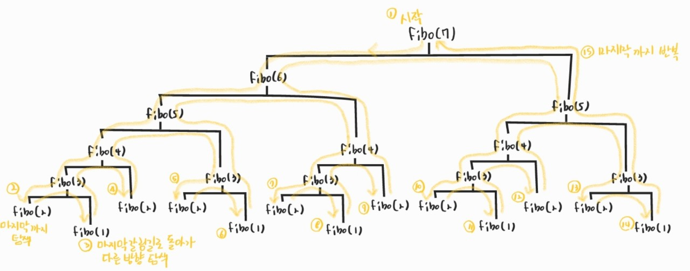
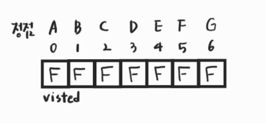
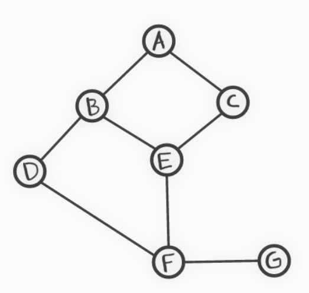
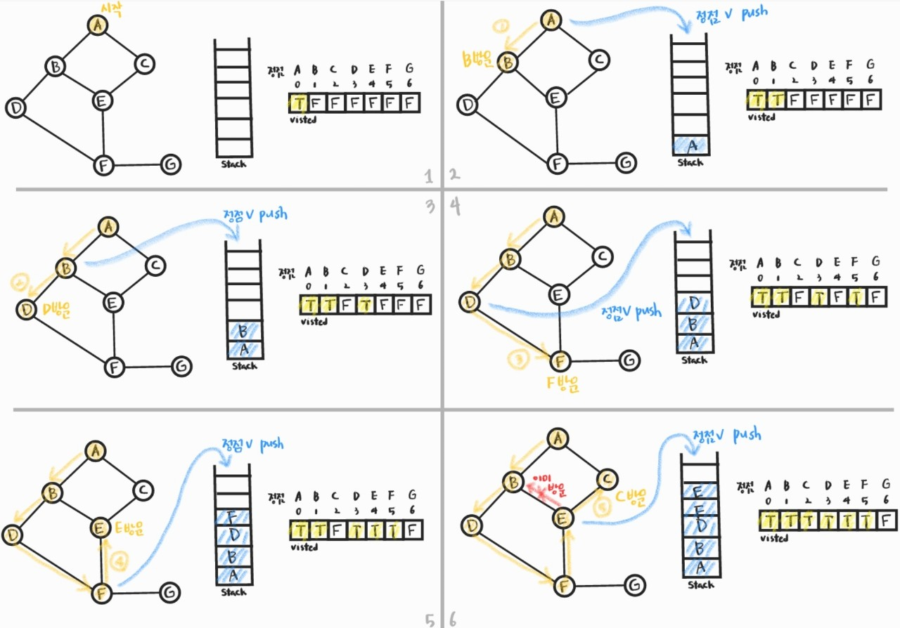
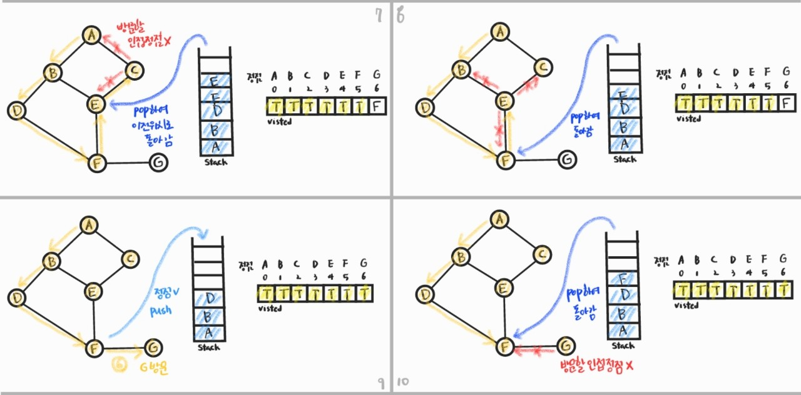
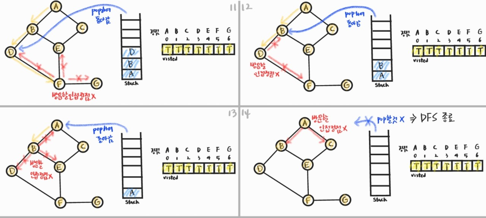
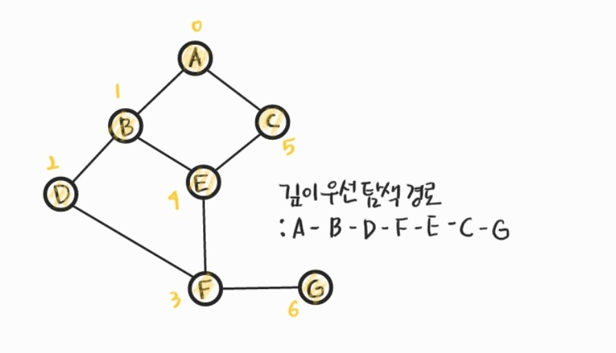

210222_mon

# APS 4

> 중요한 DFS에 대해 알아봅시다!

<br>

# Stack1

> `스택`자료구조

- 스택
- 재귀호출
- Memoization
- DP
- `DFS`:star:

<br>

<br>

# 5. DFS(깊이우선탐색)

> 그래프 구조의 탐색 방법 중 하나인 DFS를 배우고 활용해봅시다!

## 5.1 그래프 구조의 탐색

- 비선형구조인 그래프 구조는 __그래프로 표현된 모든 자료를 빠짐없이 검색하는 것__이 중요

- 두 가지 방법
  - 깊이 우선 탐색(Depth First Search, DFS)
  - 너비 우선 탐색(Breadth First Search, BFS) - Queue와 함께 배울 것!

- DFS 방식

  - 시작 정점의 한 방향으로 __갈 수 있는 경로가 있는 곳까지 깊이 탐색__해 가다가 더 이상 갈 곳이 없게 되면, __가장 마지막에 만났던 갈림길 간선이 있는 정점__으로 되돌아와서 __다른 방향의 정점으로 탐색__을 계속 반복하여 결국 모든 정점을 방문하는 순회 방법

    

  - 후입선출 구조의 스택 사용

    - 가장 마지막에 만났던 갈림길의 정점으로 되돌아가서 다시 깊이 우선 탐색을 반복해야 하기 때문

<br>

## 5.2 DFS 알고리즘

1. 시작 정점 v를 결정하여 방문한다

2. 정점 v에 인접한 정점 중에서

   1) 방문하지 않은 정점 w가 있으면, __정점 v를 스택에 push__(나중에 돌아오기 위함)하고 __정점 w를 방문__한다

   2) 방문하지 않은 정점이 없으면, 탐색의 방향을 바꾸기 위해서 __스택을 pop__하여 받은 __가장 마지막 방문 정점을 v__로 하여 2를 다시 반복한다

3. 스택이 공백이 될 때까지 2를 반복한다

### 그림으로 확인하기

- visited : 해당 정점을 방문했는지 여부를 저장 (동일한 곳 다시 방문 X 위함)

  

- stack : 정점 v를 push, pop하기 위함

- 탐색할 그래프 형태

  

- 갈림길을 만나면 알파벳 순으로 방문한다고 하자(구현 방식에 따라 어딜 먼저 방문할 지 달라짐)







- 최종 탐색 경로



<br>

## 5.3 인접리스트와 인접행렬

> 위의 알고리즘을 구현하기 위해서는 인접한 점들의 정보를 알고 있어야합니다. 
>
> 이때 인접한 점들을 어떻게 처리하는지에 따라 인접리스트와 인접행렬 두가지가 있습니다!
>
> 우선 전체적인 알고리즘 이해를 위해 그래프부터 찬찬히 집어봅시다!!

### 그래프

> 트리와 그래프는 `일대일 자료구조`로, 자료간의 관계가 중요합니다!!

- 그래프는 아이템(사물 또는 추상적 개념)들과 이들 사이의 관계를 표현합니다
- __정점(Vertex)__들의 집합과 이들을 연결하는 __간선(Edge)__들의 집합으로 구성된 자료구조
- 선형 자료구조나 트리 자료구조로 표현하기 어려운 __N : N 관계__를 가지는 원소를 표현하기에 용이합니다

#### 선형 자료구조??

- 순서의 관계를 가지고 있습니다 (관계의 개념이 순서의 개념을 가짐)
  - 따라서 배열같은 구조가 선형 자료구조를 표현하기에 적합합니다
- __일대일__ 구조
  - 현재 데이터를 읽고 다음 데이터를 읽기가 어렵지 않습니다
  - 메모리에 띄엄띄엄 데이터를 저장한 경우, 앞선 자료를 읽어야만 다음에 오는 데이터가 무엇인지 알 수 있습니다

#### 비선형 자료구조?

- __일대다__ 구조
  - 어떤 데이터를 읽으면 다음으로 읽을 수 있는 데이터가 여러개입니다
- 일을 시킬 때, 순서를 정해줘야 읽을 수 있습니다
- 중복없이 관계를 따라가며 읽는게 의미가 있습니다(체계적으로 읽는 방법)
  - 관계 : 어떤 데이터를 읽었을 때, 그 다음에 읽을 데이터가 보이는 것
- 선형보다 복잡하며, 선형과 다르게 다른 메모리를 또 저장해야합니다

#### 그래프!!

- 현실 세계를 추상화 할 때 제일 많이 쓰이는 도구
  - 눈에 보이는 어떤 것, 개념 등 이들의 관계를 표현할 때 사용하는 도구!
- 구성
  - 정점 : 표현하고 싶던 __어떤 객체__를 표현
  - 간선 : 정점 사이의 __관계__ 표현
- 그래프 형태
  - 유향그래프 : 관계의 방향성을 가진다
    - 동등하지 않은 관계(한쪽으로만 이동 가능)
  - 무향그래프 :  방향성이 없는 동등한 관계
    - 양방향 이동 가능

- 메모리 저장 방법(저장해야 사용 가능)
  - 인접 행렬 : 배열을 이용해서 저장
  - 인접 리스트 : 데이터를 띄엄띄엄 저장

<br>

##### 이제 본격적으로 인접 행렬, 인접 리스트를 알아봅시다!

### 5.3.1 입접 정점

- 입접해있다 = 두 점정 사이에 관계가 있다 = __간선이 있다__
- 그래프 형태에 따른 인접 정점
  - 2 -> 1 (유향그래프) : 2번의 인접 정점은 1번 (1번의 인접 정점은 2번 X)
    - 이 경우, 인접 정점에 대한 데이터를 한번만 저장해야함
  - 2 - 1 (무향그래프) : 1, 2번은 서로의 인접 정점
    - 두 정점에 모두 데이터를 저장해야함
- 각 정점마다 __인접 정점을 저장__해야합니다!!!

<br>

### 5.3.2 인접 행렬

- N x N 배열
  - N개의 최대 N - 1개의 인접한 정점을 가질 수 있습니다!
  - 배열은 메모리 크기를 고정해야하므로, 정점의 개수는 알고 간선은 모른다고 하면 최대 개수를 저장할 공간을 만들어야 합니다
  - 따라서 N개의 정점을 가지는 경우 N x N 크기의 배열을 만듭니다
- 저장하는 방법
  - 1번 행에는 1번 정점의 인접 정점 저장(1이면 정점, 0이면 아님)
  - 2번에는 2번의 ... N번에는 N번의 인접 정점을 저장

그림을...넣자!

- 이는 직관적이지만 안쓰는 메모리 공간이 너무 많고, 인접 정점을 찾을 때 너무 많은 데이터를 뒤져야 한다는 단점이 있습니다

<br>

### 5.3.3 인접 리스트

- 필요할 때 공간을 만들어서 사용
  - 처음에 각 정점에 해당하는 빈 리스트를 만들고, 간선의 정보가 들어올 때마다 리스트를 채웁니다
  - 실제 정점 번호를 저장하여 각 정점에 해당하는 데이터를 파악합니다
- 그래프가 커질수록 인접리스트가 더 효과적입니다

그림....!

<br>

### 5.3.4 구현

#### 인접 행렬

- 입력
  - 정점수, 간선수
  - 1 2 1 3 --- 2개의 숫자 쌍으로 이뤄진 정점 정보

```python
V, E = map(int, input().split())  #정점수, 간선 수
#인접 행렬
G = [[0] * (V + 1) for _ in range(V + 1)]
#정점 정보 저장
arr = list(map(int, input().split()))

for i in range(0, E * 2, 2):  #숫자 쌍의 앞의 위치만 사용하기 위해 E * 2까지 2간격으로 반복
    #두 정점의 위치
    u = arr[i]
    v = arr[i + 1]
    #무향이므로 두 정점에 대해 모두 저장
    G[u][v] = 1
    G[v][u] = 1
    
#인접 행렬 출력
for li in G[1:]:
    print(*li[1:])
    
#5번 정점의 인접 정점을 출력한다
for i in range(1, v + 1):
    if G[5][i] == 1:  #5번 행을 보고 1인 5의 인접정점
        print(i)  #인덱스 번호가 정점의 번호가 됨
```

- 출력

```python
#인접 행렬
0 1 1 0 0 0 0
1 0 0 1 1 0 0
1 0 0 0 0 0 1
0 1 0 0 0 1 0
0 1 0 0 0 1 0
0 0 0 1 1 0 1
0 0 1 0 0 1 0
#5번의 인접 정점
2
6
```

<br>

#### 인접 리스트

```python
#정점 수, 간선 수
V, E = map(int, input().split())
#정점 정보
arr = list(map(int, input().split()))
#인접 리스트 생성(1번부터 사용)
G = [[] for _ in range(V + 1)]

for i in range(0, E * 2, 2):
    u = arr[i]
    v = arr[i + 1]
    G[u].append(v)  #u번 인접 정점으로 v번 저장
    G[v].append(u)  #v번 인접 정점으로 u번 저장
    
#인접 리스트 출력    
for i in range(1, V + 1):
    print(i, '-->', G[i])
    
#5번의 인접 정점 출력
for i in G[5]:
    print(i)
```

- 출력

```python
#인접 리스트
1 --> [2, 3]
2 --> [1, 4, 5]
3 --> [1, 7]
4 --> [2, 6]
5 --> [2, 6]
6 --> [4, 5, 7]
7 --> [6, 3]
#5번의 인접 정점
2
6
```

<br>

<br>

## 5.4 DFS 구현

> DFS 구현은 재귀와 반복을 이용할 수 있습니다!
>
> `보통은 재귀`로 구현한다고 합니다!! 그렇지만 둘다 구현할 수는 있어야겠죠?? 

#### dfs_input.txt

- 정점수(V)와 간선수(E)가 첫줄에 주어집니다
- 다음줄부터 총 E줄에 정점의 관계(간선의 정보)가 주어집니다

```python
7 8
1 2
1 3
2 4
2 5
4 6
5 6
6 7
3 7
```

### 5.4.1 재귀

- 정점 v을 방문하면 __visited[v]에 True__로 표시한다
- v의 인접 정점을 차례로 확인하여 __방문하지 않은 정점이 있으면 방문__함
- 방문할 정점이 더이상 없다면 함수를 종료하고 원래 위치로 돌아감

```python
import sys; sys.stdin = open('dfs_input.txt', 'r')

def DFS_recursive(v):
    #방문 표시
    visited[v] = True
    print(v, end = ' ')  #방문한 순서대로 인접 정점 출력

    #인접 정점 확인
    for w in G[v]:
        if not visited[w]: #방문하지 않은 경우
            DFS_recursive(w)  #방문하여 인접정점 확인
    #방문하지 않은것이 없는경우 더이상 실행할 코드가 없어 함수 호출 위치로 돌아감

V, E = map(int, input().split())  # 정점수, 간선 수
G = [[] for _ in range(V + 1)]  # 인접 리스트 사용
visited = [False for _ in range(V + 1)]  #방문 여부 기록

for i in range(E):
    u, v = map(int, input().split())  #관계 있는 두 정점
    G[u].append(v)
    G[v].append(u)

#인접 리스트 출력
for li in G:
    print(li)

DFS_recursive(1)  #1을 시작으로 그래프 탐색
```

- 출력

```python
#인접 리스트 출력
[]
[2, 3]
[1, 4, 5]
[1, 7]
[2, 6]
[2, 6]
[4, 5, 7]
[6, 3]
#DFS 경로
1 2 4 6 5 7 3
```

<br>

### 5.4.2 반복

- 정점 v에 방문하면 __visited[v]에 True__로 표시한다
- 방문하지 않은 인접 정점 w가 있으면 stack에 정점 v를 push하고 w를 방문한다
- 방문할 인접 정점이 없으면 pop하여 마지막 위치로 돌아간 뒤 반복한다
- 스택이 완전히 빌때까지 탐색을 계속한다

```python
import sys; sys.stdin = open('dfs_input.txt', 'r')

def DFS_iterate(v):
    #방문 표시
    visited[v] = True
    print(v, end = ' ')  #방문한 순서대로 인접 정점 출력
    S.append(v)  #스택이 비지 않은 경우만 반복할 것이므로 처음 위치를 넣어줌

    while len(S) > 0:  #스택이 빌때까지 반복
        for w in G[v]:  #인접 정점 확인
            if not visited[w]:  #방문하지 않은 경우
                S.append(v)  #정점을 push
                v = w  #인접 정점을 반문함
                visited[v] = True  #반문 표시
                print(v, end = ' ')  #DFS path 차례로 출력
                break  #새로운 v의 인접 정점을 탐색함
        else:  #break를 만나지 않은 경우 == 방문할 인접 정점이 없는 경우
            v = S.pop()  #가장 마지막 정점으로 돌아감

V, E = map(int, input().split())  # 정점수, 간선 수
S = []  #스택
G = [[] for _ in range(V + 1)]  # 인접 리스트 사용
visited = [False for _ in range(V + 1)]  #방문 여부 기록

for i in range(E):
    u, v = map(int, input().split())  #관계 있는 두 정점
    G[u].append(v)
    G[v].append(u)

#인접 리스트 출력
for li in G:
    print(li)

DFS_iterate(1)  #1을 시작으로 그래프 탐색
```

- 출력

```python
#인접 리스트
[]
[2, 3]
[1, 4, 5]
[1, 7]
[2, 6]
[2, 6]
[4, 5, 7]
[6, 3]
#DFS 경로
1 2 4 6 5 7 3 
```

<br>

<br>

이것으로 stack 1의 학습을 마치겠습니다!!!

많이 활용되는 것들이니 제대로 학습합시다!!!


