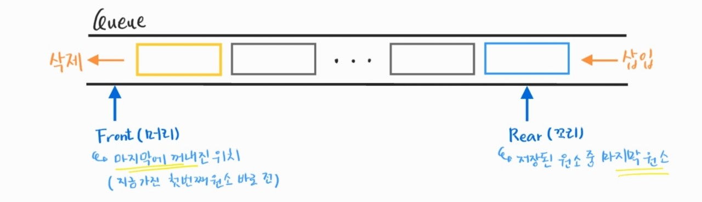

210303_wed

# APS 6

> 이제 기초는 마지막입니다ㅜㅜㅜ

 

# 큐(Queue)

> 중요한 자료구조에대해 배워보겠습니다!!

- 큐
- 우선순위 큐
- BFS :star:

 

 

# 1. 큐(Queue)

> 스택과 비슷하지만 약간의 차이를 가진 자료구조입니다!

#### 스택

- 선형자료구조

- 후입선출구조(LIFO, Last In First Out)

- 구현

  - 고정된 크기의 배열 + top(가장 위, 마지막에 들어온 제이터 가리킴)

  - 리스트

 

##### 어떤 점에서 스택과 큐가 다른지 생각하면서! 큐를 알아봅시다

 

## 1.1 특성

- 스택과 마찬가지로 __삽입과 삭제의 위치__가 __제한적__인 자료구조
  - 삽입 : 큐의 귀
  - 삭제 : 큐의 앞
- 선입선출구조(FIFO, First In First Out)
  - 삽입된 순서대로 원소가 저장
  - 가장 먼저 삽입된 원소는 가장 먼저 삭제된다
  - 예 : 터널, 대기줄

 

## 1.2 큐의 구조 및 기본연산

> 스택은 top을 사용한 것처럼 큐는 front, rear을 사용합니다!

#### 선입선출구조

- Front
  - 마지막에 꺼내진 위치
  - Queue의 앞에서 값을 꺼낼때 사용
- Rear
  - 저장된 원소 중 마지막 원소
  - Queue의 위에서 값을 추가할 때 사용

#### 큐의 기본 연산

- 삽입 : enQueue
- 삭제 : deQueue

 

## 1.3 주요연산

> 일반적으로 이런 이름을 사용합니다만 필수는 아닙니다!

- __enQueue(item)__ : 큐의 뒤쪽(rear 다음)에 item을 삽입하는 연산
  - rear을 한 칸 옮긴 뒤, 그 자리에 값을 넣음
- __deQueue()__ : 큐의 앞쪽(front 다음)에서 원소를 삭제하고 반환하는 연산
  - front를 하나 증가시킨 뒤 값을 반환
  - front앞의 값은 사용하지 않으므로 반드시 삭제해야하는 것은 아님
- __createQueue()__ : 공백 상태인 큐를 생성하는 연산
  - Q = []
  - Q = [0] * 100
- __isEmpty()__ : 큐가 공백상태인지 확인하는 연산
  - 리스트 Q : 길이가 0이면 빈 것
  - 배열 Q : front == rear이면 빈 것
  - isEmpty()를 정의하지 않고, while의 조건문에 Q가 빈 조건을 바로 넣어줘도 됨
- __isFull()__ : 큐가 포화상태인지 확인하는 연산
  - 포화상태이면 값을 넣을 수 없으므로, 삽입하기전 포화 여부를 확인해야한다
  - 포화하면 크기가 더 큰 큐를 만들던지, 버리는 작업을 해야함
  - 리스트로 큐를 사용할 경우, 가득 찰 일이 없음
- __Qpeek()__ : 큐의 앞쪽(front)에서 원소를 삭제 없이 반환하는 연산
  - front + 1해서 값을 반환만 함

각 동작에 대한 그림을...그릴까말까....하...그림 넘나 귀찮은데 필요는해

 

## 1.4 큐의 구현

### 1.4.1 선형큐

- 1차원 배열을 이용한 큐
  - 큐의 크기 == 배열의 크기
  - __front__ : 마지막에 꺼내진 원소의 인덱스 (가진 첫번째 원소보다 하나 전)
  - __rear__ : 저장된 원소의 마지막 인덱스
- 상태 표현
  - 초기상태 : front = rear = -1
  - 공백상태 : front = rear
  - 포화상테 : rear = n - 1 (배열의 크기 n)

 

### 1.4.2 원형 큐

 

### 1.4.3 연결 큐 

 

### 1.4.4 우선순위 큐

