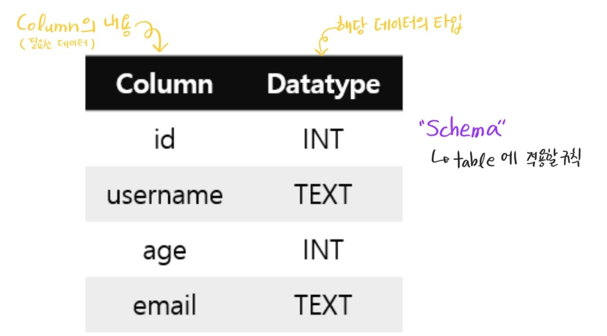
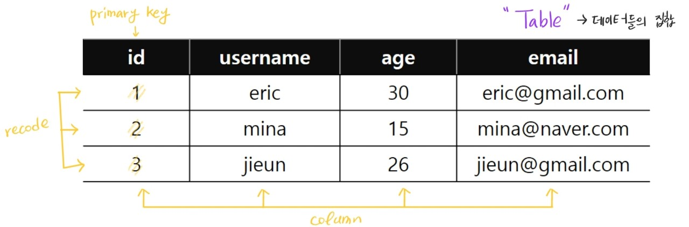

###### 210325_thu

##### DataBase 2

<br>

# SQL

> 오늘은 SQL을 배우겠습니다!

### :thinking: 왜 배울까?

- ORM으로는 모든걸 할 수는 없습니다
- 서버개발자라면 SQL은 기본적으로 알아야합니다!!!
- 특히 백엔드라면 더 중요하겠죠??

##### 따라서 오늘은 필요한 경우 사용할 수 있도록 기초를 학습하겠습니다

<br>

<br>

#### 설치하기

1. sqlite [공홈](https://www.sqlite.org/download.html)

2. Precompiled Binarues for Windows

   - dll-win64 / tools-win32 다운로드

3. C 드라이브에 qulite 폴더 생성

4. [시스템환경변수 편집] - [환경변수]

5. 시스템변수 - path 편집

   - C:\sqlite 등록

6. git-bash

   - 기존 vscode, git bash 모두 종료 후 실행!

   ```bash
   $ winpty sqlite3
   sqlite>		#이렇게 바뀌면 성공
   ```

<br>

<br>

###### 본격내용!

# 데이터베이스(DB)

> 체계화된 데이터의 모임
>
> 여러 사람이 공유하고 사용할 목적으로 통합 관리되는 정보의 집합

- 몇 개의 자료 파일을 **조직적으로 통합**하여 자료 항목의 **중복을 없애**고, **자료를 구조화**하여 기억시켜 놓은 자료의 집합체

### DB로 얻는 장점

> 동시에 접근이 가능하고, 효율적인 검색이 가능합니다!!
>
> 이런것들이 있다....정도로 넘어가도 될 듯합니다

- 데이터 `중복 최소화`
- 데이터 `무결성`
  - 정확한 정보를 보장
- 데이터 `일관성`
- 데이터 `독립성`
- 데이터 표준화
- 데이터 보안유지

<br>

# RDBMS 

> 관계형 데이터베이스 관리 시스템(Relational DataBase Management System)

- `관계형 모델`의 데이터베이스를 관리하는 시스템입니다
- 줄여서 RDB라고 합니다

### 대표적인 DB-Engine

- 오픈소스 RDBMS
  - MySQL
  - SQLite  :heavy_check_mark: 우리가 사용하는 것, 실험용
  - PostgreSQL
- ORACLE
- MS SQL

### SQLite??

- 서버가 아닌 응용 프로그램에 넣어 사용하는 **비교적 가벼운 데이터베이스**!!
- 로컬에서 간단한 DB 구성을 할 수 있고, 오픈세스 프로젝트이기 때문에 자유롭게 사용할 수 있습니다!

<br>

# 관계형 데이터베이스

> Relational DB

- **관계(Relation)를 표현**하기 위하여 2차원의 **표(table)**를 사용합니다!!
- 또한 table은 **키(key)**와 **값(value)의 관계**를 나타냅니다!
- `데이터의 종속성을 관계(relationship)로 표현`하는 것이 특징!!

##### :facepunch: 구조를 알아봐야겠죠??

### 스키마(Schema)

> 우리가 model을 작성하는 이유가 이거죠!!! 스키마생성할라구!!!
>
> 명세에서 모델 관계를 표현한 간단한 표를 생각하면 됩니다

- 데이터베이스에서 자료의 구조, 표현방법, 자료간의 **관계를 정의한 구조**

- DB의 구조와 제약 조건에 관련한 `전반적인 명세`를 기술한 것

  

### 테이블(Table)

> 스키마의 규칙이 적용된 것!!
>
> 데이터가 생성되면 이러한 테이블에 차곡차곡 저장됩니다

- **column(= field, item)**과 **row(= recode, tuple)**의 모델을 사용해 조직된 데이터 요소들의 집합

- 하나의 row(행)이 여러개의 column(열)을 가지는 구조입니다

  

- 용어
  - 컬럼(column) : 고유한 데이터 형식이 지정되는 열
  - 레코드(recode) : 단일 구조 데이터 항목을 가르키는 행
  - 기본키(PK, primary key) : 각 행의 고유값 (데이터를 구분하는 역할)

<br>

<br>

##### 본격적으로 배워봅시다!!

# SQL

> SQL(Structured Query Language)는 관계형 데이터베이스 관리시스템(RDBMS, Relational DataBase Management System)의 데이터를 관리하기 위해 설계된 특수 목적의 프로그래밍 언어입니다

#### SQL 문법의 3가지 종류

> 이번에 사용할 건 DDL과 DML 되시겠습니다!

- **DDL** : 데이터 정의 언어 :heavy_check_mark:
  - CREATE
  - DROP
  - ALTER
- **DML** : 데이터 조작 언어 :heavy_check_mark:
  - INSERT
  - UPDATE
  - DELETE
  - SELECT
- **DCL** : 데이터 제어 언어
  - GRANT
  - REVOKE
  - COMMIT
  - ROLLBACK

<br>

##### KeyWord

- INSERT
  - 테이블에 데이터 삽입 (새로운 행 추가)
- DELETE
  - 테이블 삭제 (행 제거)
- UPDATE
  - 데이터 갱신
- SELECT
  - 데이터 검색

<br>

##### 명령어 주의사항 :warning:

- `.`으로 시작하는 명령어는 **sqlite3의 명령어** (sqlite3 프로그램의 기능을 실행하는 명령어)로 SQL문법에 속하지 않습니다
- **SQL 명령어**는 **대문자**로 작성됩니다
  - 소문자도 가능하지만, 구분을 위해 대문자를 권장합니다!!
- 명령어 끝에 `;` 필수!!

<br>

## 1. Database 생성

> 해당하는 데이터베이스 파일이 있는 경우 해당 DB를 콘솔로 연다
>
> 해당하는 파일이 없으면 새로 생성한 뒤, 해당 DB를 콘솔로 열어줍니다

```sql
-- DB열기
$ sqlite3 db.sqlite3  -- sqlite3 <DB 이름>.sqlite3

-- DB 목록 확인
sqlite> .database
```

<br>

#### CSV 파일 불러오기

```sql
-- csv 파일 읽기
sqlite> .mode csv  --mode변경 : 데이터 출력이 `,`로 구분

-- csv 파일 불러오기
sqlite> .import users.csv users_user  -- .import <파일명>.csv <내가 사용할 테이블명>
```

<br>

<br>

## 2. 테이블 생성 및 삭제

- 데이터 타입
  - `INTEGER`, `TEXT`, `REAL`, `NUMERIC`, `BLOB`
  - 추가적인건 [SQLite3 공식문서](https://sqlite.org/datatype3.html) 참고!!

### 테이블 생성 (CREATE)

```sql
-- 규칙
CREATE TABLE <table_name> (
  column1 datatype PRIMARY KEY,
  column2 datatype,
  ...
);
-- 예시
CREATE TABLE classmates (
  id INTEGER PRIMARY KEY,  -- rowid 대체, 반드시 INTEGER로 작성
  username TEXT NOT NULL,  -- NOT NULL 조건(뺄수도 있음)
  age INT NOT NULL,		   -- 이런건 INT로 사용 가능
  email TEXT
);
```

##### `INTEGER PRIMARY KEY`

- rowid를 대체할 수 있는 유일한 컬럼 구조 (INTEGER 타입으로 PRIMARY KEY 생성)
- 자동 생성해주는 rowid를 사용하는게 좋습니다

##### AUTOINCREMENT

- 이전에 삭제된 데이터의 `pk를 재사용하지 않음`
  - SQLite는 특정 요구사항이 없다면 이를 사용하지 않습니다
  - Django에서는 기본적인 속성으로 사용합니다

<br>

#### 테이블 조회

```sql
sqlite> .table  -- 테이블 목록 조회
sqlite> .schema <table_name>  -- 해당 테이블의 스키마 조회
```

<br>

### 테이블 제거(DROP)

``` sql
sqlite> DROP TABLE <table_name>;
```

<br>

<br>

## 3. 데이터 추가, 읽기, 수정 및 삭제

### 추가 (INSERT)

```sql
-- 단일 데이터 추가
INSERT INTO <table_name> (column1, column2) VALUES (value1, value2);

-- 다중 데이터 추가
INSERT INTO <table_name> (column1, column2) VALUES (value1, value2), (value1, value2), (value1, value2);
```

<br>

##### id 스키마를 직접 작성한 경우의 데이터 추가

```sql
-- 1. column을 명시하는 경우
-- 이렇게하면 id는 작성되지 않는다
INSERT INTO <table_name> (column1, column2) VALUES (value1, value2)

-- 2. column을 명시하지 않는 경우
-- id를 입력해야합니다 (모든 col을 작성해야합니다)
INSERT INTO <table_name> VALUES (2, value1, value2)
```

<br>

##### :memo: 예시로 확인하기

> 위의 classmates를 활용해보자
>
> column : id, username(NOT NULL), age(NOT NULL), email

```sql
-- 1.
-- column을 명시해주면 순서에 맞게 작성하면 됩니다 (대신 NOT NULL은 반드시 포함)
INSERT INTO classmates (username, age) VALUES ('eric', '30');

-- 2.
-- column을 명시하지 않은 경우
INSERT INTO classmates VALUES(2, 'mina', 15, 'mina@naver.com');  

-- 3.
-- 소문자도 가능, column 순서 섞는 것 가능
insert into classmates (age, username) values (26, 'jieun');

-- 4. ERROR
-- value에 직접 column을 지정해주는 것은 불가능
insert into classmates values(id=5, username='blue', email='blue@naver.com', age='7');

-- 5. 주의!!
-- 이경우 값은 저장되지만, age와 email이 쓰인 순서대로 작성됩니다
-- (email과 7모두 TEXT로 age, email 칼럼에 저장됩니다)
insert into classmates values(5, 'blue', 'blue@naver.com', 7);
```

<br>

### 조회 (SELECT)

> SQL은 세미콜론(;)을 만나기 전까지는 절대 실행되지 않는다는 사실!!!
>
> 따라서 보기 좋게 줄을 바꿔쓸 수 있습니다(들여쓰기 자유롭)

###### :snowman: sql

```sql
-- 모든 칼럼 가져오기
SELECT * FROM <table_name>;

-- 특정 칼럼 가져오기
SELECT column1, column2 FROM <table_name>;
```

###### :orange: django orm

```python
# 모든 칼럼 가져오기
<모델명>.objects.all().values()  #values를 붙이지 않으면 queryset으로 보임

#특정 칼럼 가져오기
<모델명>.objects.all().values('column1', 'column2')
```

##### LIMIT 

- 원하는 개수(num)만큼 가져오기

###### :snowman: sql

```sql
SELECT column1, column2
FROM <table_name>
LIMIT 개수;
```

###### :orange: django orm

```python
# slicing 사용
<모델명>.objects.all()[:개수].values()
```

##### OFFSET

- 특정 위치부터 가져오기

###### :snowman: sql

```sql
-- 맨 위부터 번호 만큼 떨어진 값부터 가져옵니다
-- 1인경우 두번째 값부터 가져오겠죠??
SELECT column1, column2 FROM <table_name> LIMIT 개수 OFFSET 번호;
```

###### :orange: django orm

```python
# slicing 사용 - 마지막 값의 위치는 포함 X
<모델명>.objects.all()[번호:번호+개수].values()
```

##### WHERE

- 조건을 통해 값 가져오기

###### :snowman: sql

```sql
SELECT column1, column2 FROM <table_name> WHERE column=value;

-- 예시
SELECT * FROM classmates WHERE username='mina';  --username이 mina인 모든 행의 전체 정보
SELECT age FROM classmates WHERE username='mina';  -- username이 mina인 모든 행의 age 정보
```

###### :orange: django orm

```python
# filter 사용
<모델명>.objects.filter(column=value).values()
```

##### DISTINCT

- 중복 없이 가져오기

```sql
-- 중복되는 값을 제외한 해당 column의 모든 값을 출력합니다 
-- 하나의 칼럼씩만 사용합니다
SELECT DISTINCT column FROM <table_name>;  
```

<br>

### 삭제 (DELETE)

###### :snowman: sql

```sql
DELETE FROM <table_name> WHERE condition;  -- contition이 필수입니다

-- 예시
DELETE FROM classmates WHERE username='mina';  -- mina라는 이름을 가진 행을 모두 삭제
```

###### :orange: django orm

```python
# get의 경우 하나의 값만 받아올 수 있습니다
instance_name = <model_name>_objects.get(id=원하는 id)
<instance_name>.delete()
```

<br>

### 수정 (UPDATE)

###### :snowman: sql

```sql
UPDATE <table_name>
SET column1=value1, column2=value2, ...
WHERE contition;

-- 예시
-- username이 blue인 행의 정보에 username='green', age='42'이렇게 수정하겠다
UPDATE classmates
SET username='green', age='42'
WHERE username='blue';
```

###### :orange: django orm

```python
# 
```

<br>

### WHERE 심화 (READ)

> 다양한 조건을 줘봅시다!
>
> table : users
>
> column : id, first_name, last_name, age, country, phone, balance

- age가 30이상인 사람만 가져오기

##### :snowman: sql

```sql
SELECT * FROM users WHERE age >= 30;
```

##### :orange: Django ORM

```sql

```


- age가 30이상인 사람의 이름만 가져오기
- age가 30이상이고, 성이 김인 사람의 성과 나이만 가져오기