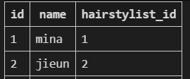
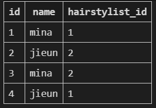
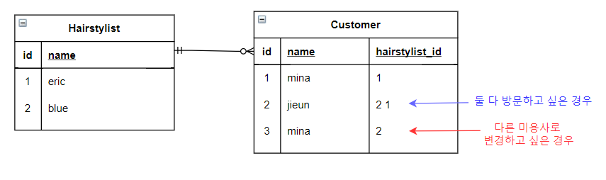
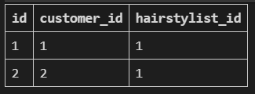
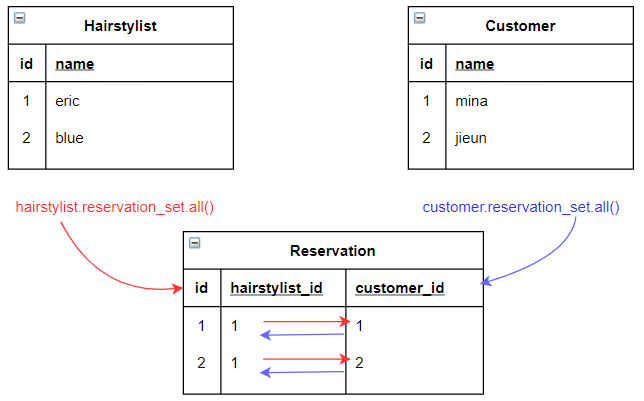
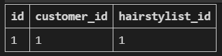
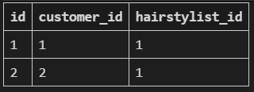
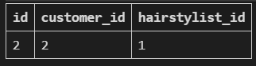
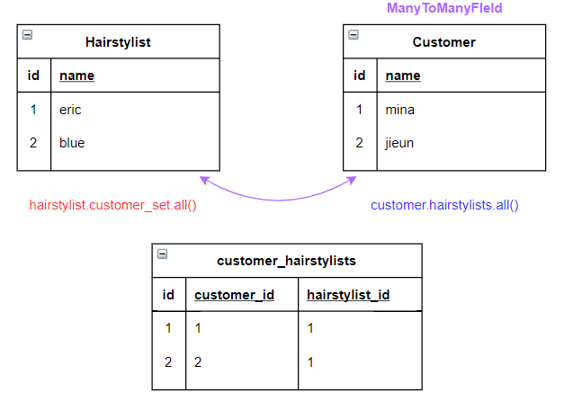

###### 210331_wed

##### Model Relationship 3

# N:M Modeling

> 실제 예시를 토재로 직접 모델링을 해봅시다

## 미용실 예약 시스템 구상(Modeling)

- `미용실 방문 손님`과 `미용사`의 예약 시스템을 구축합시다

- 우리 일상에 가까운 예시를 통해 DB를 설계하고, 내부에서 일어나는 데이터의 흐름을 어떻게 제어할 수 있을 지 고민해보는 것!!

#### 가장 핵심이 되는 모델??

- 미용사 : Hairstylist
- 손님 : Customer

<br>

<br>

# Modeling

> 210331_wed - modeling

#### 기본 설정

- 프로젝트 생성

```shell
$ django-admin startproject modeling
```

- 가상환경

```shell
$ python -m venv venv
$ source venv/Scripts/activate
```

- 설치
  - django
  - django-extensions
  - ipython

- app생성

```shell
$ python manage.py startapp salon
```

- setting.py

```python
INSTALLED_APPS = [
    'salon',
    'django_extensions',
    ...
]
```

<br>

## 1:N Modeling

> 기준을 `미용사(1) : 손님(N)` 으로 잡아보자

### models.py

- 미용사와 손님의 모델 작성
- ForeignKey
  - N에 해당하는 손님이 미용사를 참조

```python
from django.db import models

class Hairstylist(models.Model):
    name = models.TextField()

    def __str__(self):
        return f'{self.pk}번 미용사 {self.name}'
    

class Customer(models.Model):
    name = models.TextField()
    hairstylist = models.ForeignKey(Hairstylist, on_delete=models.CASCADE)

    def __str__(self):
        return f'{self.pk}번 손님 {self.name}'
```

- migration

```shell
$ python manage.py makemigrations
$ python manage.py migrate
```

### shell_plus

> shell_plus로 확인해봅시다!

- 시작

```shell
$ python manage.py shell_plus
```

#### instance 생성

- 손님이 미용사의 외래키를 가지고 있음!

```shell
#미용사
hairstylist1 = Hairstylist.objects.create(name='eric')
hairstylist2 = Hairstylist.objects.create(name='blue')
#손님 - 미용사 정보도 포함
customer1 = Customer.objects.create(name='mina', hairstylist=hairstylist1)
customer2 = Customer.objects.create(name='jieun', hairstylist=hairstylist2)
```

- DB : salon_customer



#### 미용사를 바꾸는 경우?

> 1번 손님이 2번 미용사로 예약을 바꾸려고 함

- 기존 손님의 정보를 삭제하지않고는 다시 할 수 없음
- 따라서 `새로운 인스턴스`를 만들어야함

```shell
customer3 = Customer.objects.create(name='mina', hairstylist=hairstylist2)
```

#### 두 미용사 모두에게 방문하는 경우?

> 2번 손님이 두명에게 머리손질을 받고 싶음

- 새로운 인스턴스를 만드는 방법밖에 없음

```shell
customer4 = Customer.objects.create(name='jieun', hairstylist=hairstylist1)
```

- DB - salon_customer

  

<br>

### 1 : N relationship의 한계



- 예약 변경 / 여러 예약을 하고 싶은 경우
  - 원하는 대로 구현하기가 어려움
- 어떻게 해야할까??
  - **2개의 정보를 가지고 예약된 정보를 저장할 새로운 테이블을 만들어보자!**

<br>

<br>

## 중개모델

> 예약된 정보만을 저장하는 새로운 테이블을 만들자

### model

- 미용사, 손님과 각각 1 : N 관계인 중개 테이블

```python
from django.db import models

class Hairstylist(models.Model):
    name = models.TextField()

    def __str__(self):
        return f'{self.pk}번 미용사 {self.name}'
    

class Customer(models.Model):
    name = models.TextField()

    def __str__(self):
        return f'{self.pk}번 손님 {self.name}'
    
# 중개테이블
class Reservation(models.Model):
    hairstylist = models.ForeignKey(Hairstylist, on_delete=models.CASCADE)
    customer = models.ForeignKey(Customer, on_delete=models.CASCADE)

    def __str__(self):
        return f'{self.hairstylist_id}번 미용사의 {self.customer_id}번 손님'
```

- DB 초기화 및 migration
  - migration & db 삭제 후 migration

### shell_plus

#### instance 생성

- 1번 미용사와 1번 손님 생성

```shell
hairstylist1 = Hairstylist.objects.create(name='eric')
customer1 = Customer.objects.create(name='mina')
```

- 예약 생성

```shell
Reservation.objects.create(hairstylist=hairstylist1, customer=customer1)  #<Reservation: 1번 미용사의 1번 손님>
```

#### 예약조회

-  미용사의 예약조회
  - 미용사가 맡을 손님 체크 : 1에서 N 참조 (**역참조**)
  - model manager : <model_name>_set

```shell
hairstylist1.reservation_set.all()  #<QuerySet [<Reservation: 1번 미용사의 1번 손님>]>
```

- 손님의 예약조회(**역참조**)

```shell
customer1.reservation_set.all()  #<QuerySet [<Reservation: 1번 미용사의 1번 손님>]>
```

<br>

#### 새로운 손님 instance 생성

- 손님 2의 예약

```shell
customer2 = Customer.objects.create(name='jieun')
Reservation.objects.create(hairstylist=hairstylist1, customer=customer2)  #<Reservation: 1번 미용사의 2번 손님>
```

#### 예약조회

- 미용사의 예약 조회

```shell
hairstylist1.reservation_set.all()  #<QuerySet [<Reservation: 1번 미용사의 1번 손님>, <Reservation: 1번 미용사의 2번 손님>]>

## 반복문 사용 가능
for reservation in hairstylist1.reservation_set.all():
    print(reservation.customer.name)
#mina
#jieun
```

- 손님의 예약조회

```shell
customer2.reservation_set.all()  #<QuerySet [<Reservation: 1번 미용사의 2번 손님>]>
```

#### 예약 테이블 (salon_reservation)



<br>

### M : N 관계

- 중개테이블을 이용하여 N : M 관계 형성 가능



<br>

<br>

## Using django's Model Field

> django에서 N : M모델을 위해 지원하는 ManyToManyField를 사용해봅시다

### ManyToManyField

- 두 모델 중 어디에 둬도 상관없다! (내가 생각하기 편한대로 두자)
- 현재는 손님에게 두겠습니다!!

### model

```python
from django.db import models

class Hairstylist(models.Model):
    name = models.TextField()

    def __str__(self):
        return f'{self.pk}번 미용사 {self.name}'
    

class Customer(models.Model):
    name = models.TextField()
    hairstylists = models.ManyToManyField(Hairstylist)  #이름은 복수형!!

    def __str__(self):
        return f'{self.pk}번 손님 {self.name}'
```

- DB 삭제 & migration

#### DB확인 - 3개의 테이블

- salon_hairstylist
- salon_customer
- salon_customer_hairstylists (중개모델)
  - reservation과 동일한 테이블 생성
  - <app_name>\_<MTMField 작성된 model_name>\_<MTMField의 instance name>

### shell_plus

> 이번에는 모델간의 `직접 참조`가 가능합니다!!!

#### instance 생성

```shell
hairstylist1 = Hairstylist.objects.create(name='eric')
hairstylist2 = Hairstylist.objects.create(name='blue')
customer1 = Customer.objects.create(name='mina')
customer2 = Customer.objects.create(name='jieun')
```

#### 손님의 예약 생성

> `직접 참조`를 통한 예약 진행

- 손님1이 1번 미용사에게 스타일을 받고 싶음
- **new model manager** : `<instance_name>.add() `

```shell
customer1.hairstylists.add(hairstylist1)
```

##### DB확인



##### 예약 확인

- 손님의 예약 확인
  - 필드가 물리적으로 손님에게 존재하기때문에 `hairstylists` 사용 가능

```shell
customer1.hairstylists.all()  #<QuerySet [<Hairstylist: 1번 미용사 eric>]>
```

- 미용사의 예약 확인
  - 미용사가 손님 참조 (역참조 : 자신을 참조하는 필드를 가진 애를 참조하는 것)
  - customer_set
    - <나를 참조하는 model name>_set

```shell
hairstylist1.customer_set.all()  #<QuerySet [<Customer: 1번 손님 mina>]>
```

##### :heavy_check_mark: 필드는 어디에 있든 상관 없으며, 위치에따라 참조/역참조의 관계만 변화

<br>

#### 미용사의 예약생성

- 1번 미용사가 2번 손님을 예약
- 추가 메서드 `add`는 동일, model manager만 변화

```shell
hairstylist1.customer_set.add(customer2)
```

##### DB확인



##### 예약확인

- 미용사의 예약확인

```shell
hairstylist1.customer_set.all()  #<QuerySet [<Customer: 1번 손님 mina>, <Customer: 2번 손님 jieun>]>
```

- 환자의 예약 확인

```shell
customer2.hairstylists.all()  #<QuerySet [<Hairstylist: 1번 미용사 eric>]>
```

<br>

#### 미용사의 예약 삭제

- 1번 미용사의 사정으로 1번 손님의 예약을 취소한다
  - `remove` : 관계를 끊는다

```shell
hairstylist1.customer_set.remove(customer1)
```

##### DB 확인



##### 미용사의 예약확인

```shell
hairstylist1.customer_set.all()  #<QuerySet [<Customer: 2번 손님 jieun>]>
```

#### 손님의 예약 삭제

```shell
customer2.hairstylists.remove(hairstylist1)
```

##### DB확인

- 비어있습니다

<br>

### ManyToManyField

- 중개테이블을 스스로 만들어줍니다



#### 직접 중개테이블을 사용해야하는 경우?

- `추가적인 데이터`를 사용해야하는 경우
  - 예약 날짜, 취소 시간 등
- `though` 옵션
  - ManyToManyField의 옵션으로 사용해야합니다

```python
## 예시
class Reservation(models.Model):
    date = models.DateTimeField(auto_now_add=True)
    hairstylist = models.ForeignKey(Hairstylist, on_delete=models.CASCADE)
    customer = models.ForeignKey(Customer, on_delete=models.CASCADE)
    
class Hairstylist(models.Model):
    name = models.TextField()

class Customer(models.Model):
    name = models.TextField()
    hairstylists = models.ManyToManyField(Hairstylist, through=Reservation)
```

<br>

<br>

## Model Manager 같은 형식으로 변경

> hairstylist의 모델 매니저 이름을 변경하여 같은 형식으로 맞춰보자

### Model

- `related_name`을 사용하여, 같은 형식의 이름 `customers`로 역참조 모델 매니저 이름을 변경하자

```python
from django.db import models

class Hairstylist(models.Model):
    name = models.TextField()

    def __str__(self):
        return f'{self.pk}번 미용사 {self.name}'
    

class Customer(models.Model):
    name = models.TextField()
    hairstylists = models.ManyToManyField(Hairstylist, related_name='customers')

    def __str__(self):
        return f'{self.pk}번 손님 {self.name}'
```

- migration
  - 모델을 변경하면 makemigrations / migrate를 수행합니다

### shell_plus

- 기존 미용사 데이터를 가져옵니다

```shell
hairstylist1 = Hairstylist.objects.get(pk=1)
hairstylist1  #<Hairstylist: 1번 미용사 eric>
```

#### model manager

- 기존 모델 매니저 : `customer_set`

```shell
hairstylist1.customer_set.all()  #AttributeError: 'Hairstylist' object has no attribute 'customer_set'
```

- 새로운 모델 매니저 : `customers`

```shell
hairstylist.customers.all()  #<QuerySet []>, 현재는 예약이 없어서 빈 쿼리셋
```

##### :heavy_check_mark: 이렇게 직접 참조하는 느낌을 줍니다

<br>

<br>

## 종속관계

### 1 : N

- 완전히 종속되는 관계
  - 1번 게시글(1)에 달린 댓글(N) :ok_hand:
  - 1번 댓글이 달린 게시글...? :no_entry_sign:

### N : M

- 종속되지 않음!!
  - 미용사에게 스타일링 받는 손님 :ok_hand:
  - 손님을 스타일링하는 미용사 :ok_hand:

##### 따라서 관계를 잘 생각하고 모델링을 하도록 합시다!