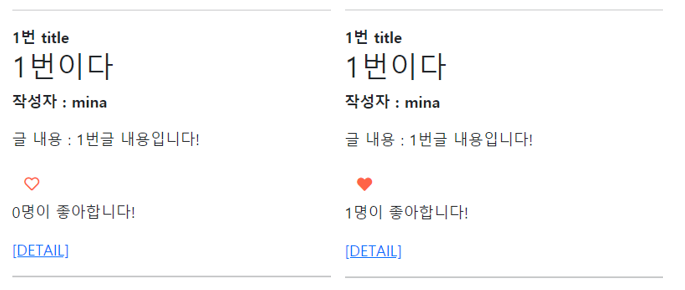

###### 210331_wed

##### Model Relationship 3

# LIKE

> 좋아요 기능을 구현합시다!!!!!
>
> 파일은 210331_wed/08_se_practice 입니다

#### Article과 User의 관계 (M : N)

- Article : 여러개의 user의 좋아요가 생성될 수 있다
- User : 여러 article의 좋아요를 누를 수 있다

##### :heavy_check_mark: 현재 Article이 FK를 가지고 있으므로, Article이 MTM을 갖는 방향으로 작성하겠습니다!

<br>

#### 초기설정

- 가상환경

```shell
$ python -m venv venv
$ source venv/Scrips/activate
```

- 프로그램 설치

```shell
$ pip install -r requirements.txt
```

<br>

## Model

> 인스턴스 이름은 알아보기 쉽도록!!
>
> user자체는 권장하지 않습니다!

- articles/models.py
  - ManyToManyField
  - instance_name
    - like_users
    - 복수형 (관계형 데이터가 많아졌을 때 구분 가능)

```python
from django.db import models
from django.conf import settings

class Article(models.Model):
    user = models.ForeignKey(settings.AUTH_USER_MODEL, on_delete=models.CASCADE)
    #### MTM으로 유저 참조
    like_users = models.ManyToManyField(settings.AUTH_USER_MODEL)
    ####
    title = models.CharField(max_length=10)
    content = models.TextField()
    created_at = models.DateTimeField(auto_now_add=True)
    updated_at = models.DateTimeField(auto_now=True)

    def __str__(self):
        return self.title
```

- migrations

```shell
$ python manage.py makemigrations
```

#### :fire: Error 

##### 기존 역참조와 충돌

> ERRORS:
> articles.Article.like_users: (fields.E304) `Reverse accessor` for 'Article.like_users' `clashes` with reverse accessor for 'Article.user'.
>      HINT: Add or change a related_name argument to the definition for 'Article.like_users' or 'Article.user'.
> articles.Article.user: (fields.E304) Reverse accessor for 'Article.user' clashes 
> with reverse accessor for 'Article.like_users'.
>      HINT: Add or change a related_name argument to the definition for 'Article.user' or 'Article.like_users'.

#### :mag_right: Why?

##### 기존 user(1) : article(N)

- 참조 : `article.user.`
- 역참조 : `user.article_set.` :heavy_check_mark: user가 작성한 모든 게시글

##### 새로운 like_users(M) : article(N)

- 참조 : `article.like_users.`
- 역참조 : `like_users.article_set.` :heavy_check_mark: user가 좋아요 누른 모든 게시글

#### :point_right: 역할은 다른데 역참조시 related_name이 동일!! 따라서 변경 필수!!!

<br>

### 수정하자

- FK는 related_name을 잘 사용하지 않습니다!!!
- MTM에 알아보기 쉬운 이름으로 설정합니다
  - 좋아요를 누른 게시글 : `like_articles`

```python
like_users = models.ManyToManyField(settings.AUTH_USER_MODEL, related_name='like_articles')
```

- migration은 잊지말고 해줍시다!

#### DB확인 -`articles_article_like_users`

- 이름생성 규칙
  - <app\_name>\_<model\_name>\_<instance\_name>
- column
  - article_id
  - user_id

<br>

<br>

## Like 구현

> 어느 app에 만드는게 좋을까??
>
> 보통 `게시글`에 `좋아요`를 누름
>
> field 자체도 article에 작성했으므로, article에 구현하겠습니다!!!
>
> (accounts는 유저의 인증에대한 기능으로 남겨둡시다)

### articles/urls.py

- `몇번 글에 좋아요`를 누르는지에대한 정보가 필요!!

```python
app_name = 'articles'
urlpatterns = [
    ...
    path('<int:article_pk>/likes/', views.likes, name='likes'),
]
```

### articles/views.py

- 로그인 한 유저만 가능하도록 합니다
- 좋아요 누르고, 취소하는 조건 : `request.user in article.like_users.all()`
  - 좋아요누른 유저 목록에 있으면 좋아요 취소(remove)
  - 없으면 좋아요를 표시(add)하도록 합니다

```python
def likes(request, article_pk):
    #로그인 한 유저만 좋아요 누를 수 있음
    if request.user.is_authenticated:
        #게시글 정보
        article = get_object_or_404(Article, pk=article_pk)

        #내가 좋아요한 목록에 있는경우
        if request.user in article.like_users.all():
            # 좋아요 취소
            article.like_users.remove(request.user)
        #목록에 없는경우
        else:
            article.like_users.add(request.user)
        #인덱스 페이지에서 좋아요 표시할 것
        return redirect('articles:index')
    #로그인안한경우 로그인 페이지로
    return redirect('accouts:login')
```

#### :cherries: 다른 API method를 활용한 조건주기

> all()은 전체 쿼리셋을 확인하여 있는지 없는지를 판단합니다
>
> 현재는 전체값은 필요없이 `적어도 하나가 있는지 없는지만` 확인하면 됩니다!!
>
> 공식문서 django QuerySet API 확인해보세용

- `exists()`

  - QuerySet이 어떤 결과라도 포함라고 있으면 True, 없으면 False를 반환

  ##### :question: 왜 쓰나요

  - 더 **빠른**데 동일한 쿼리를 수행합니다!!!
  - 특히 **큰 쿼리셋**에서 특정값이 존재하는지 **검사**할 때 유용합니다!!!

  ##### :question: 왜 빠르죠

  - if문 사용 : `평가` => DB로 쿼리가 날아갑니다

  - 이때 쿼리셋을 메모리 어딘가에 저장합니다(`캐시`, 나중에 같은게 있으면 활용하기 위함)

  - **in**의 문제

    - 쿼리셋 전체를 메모리에 다 쓴 뒤, 평가진행

    - 느릴수밖에 없습니다

  - **exists**

    - 캐시에 저장하지 않습니다
    - 평가한 뒤, 특정 부분만 쿼리로 DB에 보냅니다
    - 따라서 **전체결과가 필요하지 않은 경우** / **쿼리가 매우 큰** 경우 사용합니다

#### exists 사용

- article.like_users : user 모델의 정보입니다
- filter 사용 : user 모델이므로 user의 pk를 활용하여 해당 유저가 있는지 확인합니다

```python
if article.like_users.filter(pk=request.user.pk).exists():
    # 좋아요 취소
    article.like_users.remove(request.user)
#목록에 없는경우
else:
    article.like_users.add(request.user)
    #인덱스 페이지에서 좋아요 표시할 것
return redirect('articles:index')
```

<br>

### templates/articles/index.html

- `font-awsome`을 사용해서 좋아요를 표시합니다
- 좋아요 버튼 토글
  - 좋아요를 누른 경우 꽉찬 하트를, 아닌경우 빈 하트를 보여줍니다

```html
<!-- 좋아요 버튼, POST -->
<form action="" method="POST">
    
    
    	<button class="btn" style="color: Tomato"><i class="fas fa-heart"></i></button>
    
    	<button class="btn" style="color: Tomato"><i class="far fa-heart"></i></button>
    
</form>
```

- 좋아요 누른 사람 수

```html
<p>{{ article.like_users.all|length }}명이 좋아합니다!</p>
```



