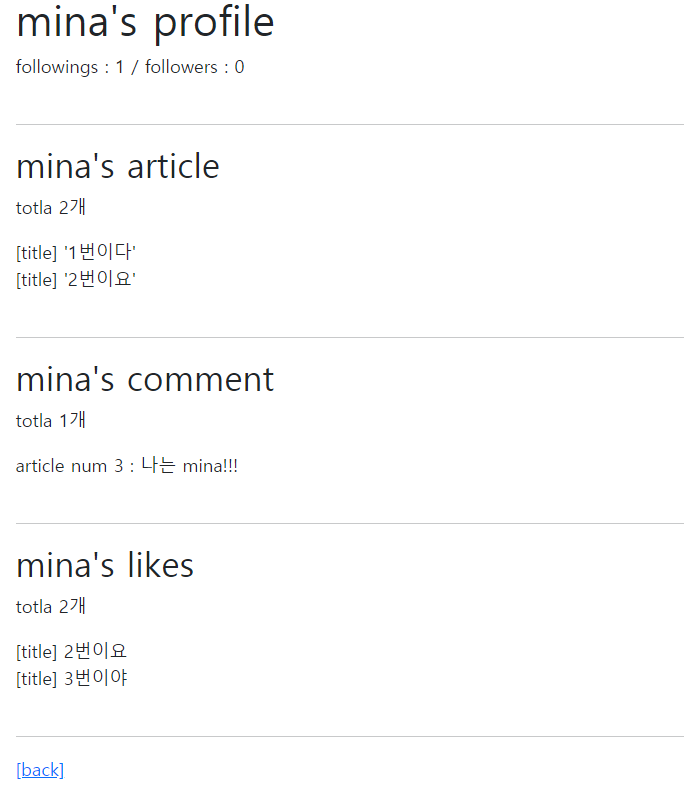

###### 210331_wed

##### Model Relationship 3

# FOLLOW

> 누가 누구를 팔로우하는지, 누가 팔로잉하는지!
>
> 보통 유저정보 옆에 있죠??
>
> 유저의 프로필 먼저 만들어봅시다!!

<br>

# profile

> user의 정보입니다!!
>
> 게시글과 연관된 것은 아니죠??
>
> accounts에 만들어봅시다!

### accounts/urls.py

- 보통 url에 유저 아이디(**username**)이 붙습니다!

```python
app_name = 'accounts'
urlpatterns = [
    ...
    #str이 기본입니다
    path('<username>/', views.profile, name='profile'),
]
```

### acounts/views.py - profile

```python
from django.shortcuts import get_object_or_404
from django.contrib.auth import get_user_model

def profile(request, username):
    #username에 해당하는 유저의 정보를 가져옵니다
    person = get_object_or_404(get_user_model(), username=username)

    context = {
        'person': person,
    }
    return render(request, 'accounts/profile.html', context)
```

### templates

- accounts/profile.html
  - 유저이름 / 유저가 작성한 게시글 / 유저의 댓글 / 유저가 좋아요한 게시글이 표시됩니다

```html



<h1>{{ person.username }}'s profile</h1>

<br>
<hr>
<h2>{{ person.username }}'s article</h2>
<!-- 유저(1) : 게시글(N) -->
<p>totla {{ person.article_set.all|length }}개</p>

  <div>[title] '{{ article.title }}'</div>

<br>
<hr>
<h2>{{ person.username }}'s comment</h2>
<!-- 유저(1) : 댓글(N) -->
<p>totla {{ person.comment_set.all|length }}개</p>

  <div>article num {{ comment.article.pk }} : {{ comment.content }}</div>

<br>
<hr>
<h2>{{ person.username }}'s likes</h2>
<!-- 유저 좋아요(M) : 게시글(N) -->
<p>totla {{ person.like_articles.all|length }}개</p>

  <div>[title] {{ article.title }}</div>

<br>
<hr>
<a href="">[back]</a>

```

- base.html
  - 내 프로필로갈 수 있는 버튼을 추가합니다

```html

      <a href="">[My profile]</a>
      ...

      ...

```

- articles/index.html
  - 게시글의 작성자를 누르면 해당 유저의 프로필로 이동합니다

```html
<p>
    <b>작성자 : <a href="">{{ article.user }}</a></b>
</p>
```

<br>

<br>

# Follow

> M : N 관계 & 재귀적으로 작성되어야 합니다!!
>
> 또한 user와 user의 관계입니다!!
>
> 따라서 accounts에 작성해봅시다!!!

#### 팔로워와 팔로잉?

- 1이 2를 팔로잉 (1 => 2)
  - 2의 팔로워: 1 / 2의 팔로잉 : 0
  - 1의 팔로워: 0 / 1의 팔로잉 : 1

- symmetric=False
  - 맞팔하지 않습니다!
  - 이때 related_name이 필요합니다

## model

- user와 user이므로 `self`를 참조합니다!

```python
from django.db import models
from django.contrib.auth.models import AbstractUser

class User(AbstractUser):
    #내가 다른 유저를 팔로잉합니다
    followings = models.ManyToManyField('self', symmetrical=False, related_name='followers')
```

- migration 잊지 말기!!

#### DB - `accounts_user_followings`

> from, to 로 참조의 방향을 알 수 있도록 작성됩니다

- column
  - id
  - from_user_id
  - to_user_id

<br>

## follow 구현

### accounts/urls.py

- user_pk를 url로 받아줍시다(username도 유일한 값이므로 사용할 수 있습니다)

```python
app_name = 'accounts'
urlpatterns = [
    ...
    path('<int:user_pk>/follow/', views.follow, name='follow'),
]
```

### accounts/views.py

```python
@require_POST
def follow(request, user_pk):
    #로그인된 경우만 가능합니다
    if request.user.is_authenticated:
        #팔로잉하고싶은 유저 정보를 가져옵니다
        person = get_object_or_404(get_user_model(), pk=user_pk)

        #내가 아닌 사람만 팔로잉할 수 있습니다
        if request.user != person:
            #person의 팔로워목록에 있는경우
            if person.followers.filter(pk=request.user.pk).exists():
                #팔로워목록에서 삭제
                person.followers.remove(request.user)
            else:
                #팔로워목록에 추가
                person.followers.add(request.user)
        return redirect('accounts:profile', person.username)
    return redirect('accounts:login')
```

### templates

- accounts/profile.html

```html



<h1>{{ person.username }}'s profile</h1>

<!-- 전체 팔로잉 / 팔로워 수 -->
<div>
  followings : {{ person.followings.all|length }} / followers : {{ person.followers.all|length }}
</div>

<!-- 팔로워, 팔로잉 버튼 -->

  <div>
    <form action="" method="POST">
      
      
        <button>UnFollow</button>
      
        <button>Follow</button>
      
    </form>
  </div>

...

```

#### 결과



