###### 210405_mon

##### APS 기본

<hr>

###### 오늘의 수업 목차!

### 트리

- 트리
- 이진 트리
- 이진탐색 트리
- 힙

<hr>

<br>

# 1. 트리

> 트리는 `실생활에 정말 많이 쓰이는 구조`라고 합니다!!
>
> 한줄로 쭉 표현됐던 선형구조와 다른 트리에대해 알아봅시다!!!

### 트리의 개념

- `비선형` 구조
- 원소들 간에 1 : N 관계를 가지는 자료구조
- 원소들 간에 계층 관계를 가지는 계층형 자료구조(부모 - 자식)
- 상위원소에서 하위 원소로 내려가면서 확장되는 트리모양의 구조

## 1.1 정의

- 한 개 이상의 노드로 이루어진 유한집합
- 다음 조건을 만족한다
  - 노드 중 최상위 노드 = `루트(root)`
  - 나머지 노드들은 n(>= 0)개의 분리집합 T1, ..., TN으로 분리될 수 있다
- `subtree` : 각각 하나의 트리가 되는 T1, ..., TN / (재귀적 정의)루트의 subtree라 함

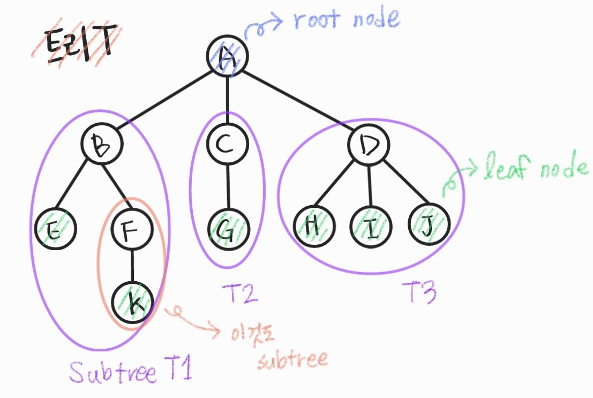

<br>

## 1.2 용어 정리

- **노드(node)** : 트리의 원소
- **간선(edge)** : 노드를 연결하는 선 (부모노드와 자식노드 연결)
  - 위쪽에 있는게 부모, 그 아래에 있으면 자식
- **루트 노드(root node)** : 트리의 시작 노드
  - `부모가 없는 노드`

  - 출발하는 노드 X

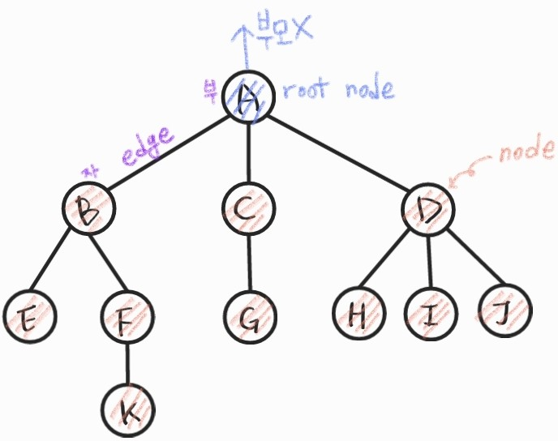

- **형제 노드(sibling node)** : 같은 부무 노드의 자식 노드들
- **조상노드** : 간선을 따라 루트 노드까지 이르는 경로에 있는 모든 노드들
  - 트리는 언젠가 만나기때문에 `공콩 조상`을 묻는 문제도 나옵니다
- **서브 트리(subtree)** : 부모 노드와 연결된 간선을 끊었을 때 생성되는 트리
  - 각각의 노드가 모두 서브트리가 될 수 있습니다
- **자손 노드** : 서브 트리에 있는 하위 레벨의 노드들
  - 자손이 없을 때까지 찾아가면서 만나는 모든 노드
  - B를 root로 하는 subtree에서 B를 제외한 나머지 모드

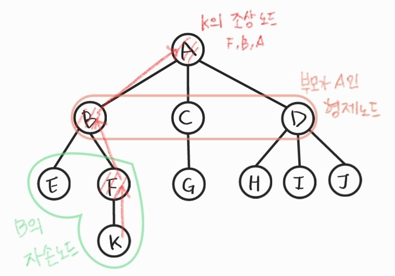

- **차수(degree)**
  - 노드의 차수 : 노드에 연결괸 자식 노드의 수
  - 트리의 차수 :  트리에 있는 노드의 차수 중 가장 큰 값
  - `리프 노드 (leaf node, 단말노드)` : 차수가 0인 노드, 자식 노드가 없는 노드
- **높이**
  - 노드의 높이 : 루트에서 노드에 이르는 간선의 수 (노드의 레벨)
  - 트리의 높이 : 트리에 있는 노드의 높이 중 가장 큰 값, 최대 레벨

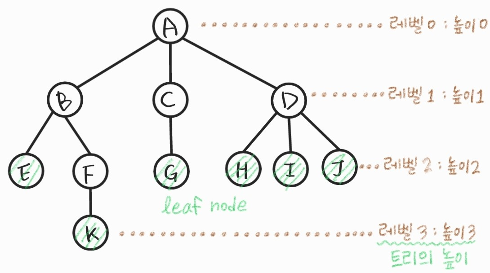

<br>

<br>

# 2. 이진트리 

> 1 : N은 너무 어렵잖아요... 1 : 2부터 시작합시다!
>
> 이진 탐색에 활용하는 이진트리!!!
>
> 자식이 2개 이상 되지 않도록 이미 구조가 나뉘어있기 때문에 매우 파워풀한 구조입니다!!

- 모든 노드들이 `2개의 서브트리`를 갖는 특별한 형태의 트리
- 각 노드가 `자식노드를 최대한 2개` 까지만 가질 수 있는 트리 
  - 왼쪽 자식 노드 (left child node)
  - 오른쪽 자식 노드(right child node)
- 기준이 없는 이진트리라면 왼쪽, 오른쪽 어디에 붙든 상관없습니다 (기준이 있다면 구분해야겠죠??)

예시 그림

<br>

## 2.1 특성

- 레벨 i에서의 노드의 최대 개수는 2<sup>i</sup> 개
- 높이가 h인 이진트리가 가질수 있는 노드
  - 최소 개수 : h + 1 개
  - 최대 개수 : (2<sup>h+1</sup>-1) 개

##### 최대개수 구하기??

- 등비수열로부터 나온 결과
- 2진수로 생각하면 더 쉽다
  - 레벨 0, 1, 2, 3의 각각 개수

그림넣기!!!

<br>

## 2.2 종류

### 포화 이진 트리 (Full Binary Tree)

> 이진트리가 꽉 차있다???
>
> 모든 레벨이 포화상태다 == 최대 노드 개수가 다 차있다

- `모든 레벨에 노드가 포화상태`로 차 있는 이진 트리
- 높이가 h일 때, **최대의 노드 개수인 (2<sup>h+1</sup>-1)의 노드를 가진 이진트리**

- 루트를 1번으로 하여 2<sup>h+1</sup>-1 까지 정해진 위치에 대한 노드 번호를 가짐

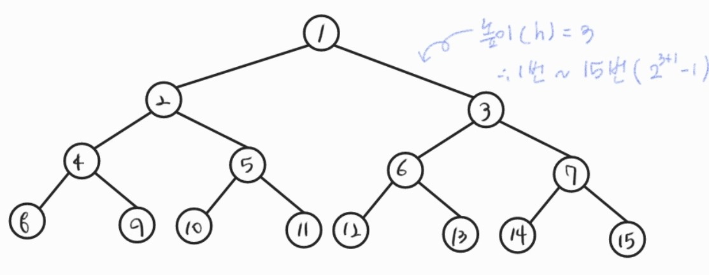

<br>

### 완전 이진 트리 (Complete Binary Tree)

> 노드가 빠질수는 있다!!!
>
> 그렇지만 포화 이진 트리를 기준으로 1 ~ 특정 번호 까지 꽉 차있다.

- 높이가 h이고 노드수가 n일 때 (단, h + 1 <= n < 2<sup>h+1</sup>-1),  포화 이진 트리의 **노드 번호 1부터 n번까지 빈 자리가 없는 이진트리**
- 연속된 번호의 중간에 빈 번호가 생기면 안됩니다!

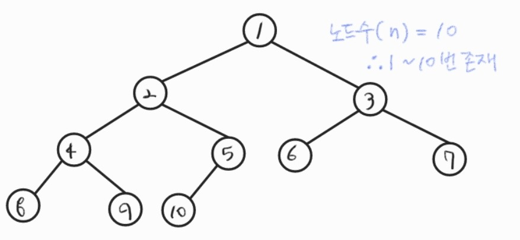

<br>

### 편향 이진 트리 (Skewed Binary Tree)

> 한 줄로만 만들어지는 경우입니다!

- 높이 h에 대한 **최소 개수의 노드**를 가지면서, **한쪽 방향의 자식 노드만 가진** 이진트리
  - 왼쪽 편향 이진 트리
  - 오른쪽 편향 이진 트리
- 비선형의 장점을 잃은 (선형과 동일한) 구조

그림

<br>:sign

<br>

# 3. 순회(traversal)

- 트리의 각 노드를 **중복되지 않게 전부 방문(visit)**하는 것을 말함

- 트리는 비 선형 구조이기 때문에 선형구조에서와 같이 선후 연결 관계를 알 수 없습니다

  ##### :cherry_blossom: 그래서 사용할 3가지 특별한 방법

  - 전위 순회
  - 중위 순회
  - 후위 순회

<br>

## 3.1 개념

#### 순회 (traversal)

- 트리의 노드들을 **체계적으로 방문**하는 것

그림

#### 3가지 기본적인 순회방법

1. 전위 순회 (preorder traversal) : VLR
   - **부모노드 방문** 후, 자식노드를 **좌,우** 순서로 방문한다
2. 중위순회 (inorder traversal) : LVR
   - **왼쪽** 자식노드, **부모**노드, **오른쪽** 자식노드 순으로 방문한다
3. 후위순회 (postorder traversal) : LRV
   - 자식노드를 **좌우** 순서로 방문한 수, **부모**노드로 방문한다

<br>

##### :heavy_check_mark: 방문??

- 뭔가 필요한 동작(연산, 출력, 삽입 등)을 하는 것
- 그냥 지나가는 경우는 방문이라고 하지 않습니다!

<br>

## 3.2 순회 방식 :family_woman_girl_girl:

> 트리의 순회는 보통 `재귀`를 사용한다는 점!!
>
> 일반적으로 `부모에서 자식방향`으로 순회한다! (필요에따라 반대로 가기도 한다)

### 전위 순회(preorder traversal)

- 수행방법
  1.  `현재 노드` n을 `방문`하여 처리한다 => V 
  2. 현재 노드 n의 `왼쪽 서브트리`로 이동 => L
  3. 현재 노드 n의 `오른쪽 서브트리`로 이동 => R

- 알고리즘

  ```python
  def preorder(n):  #현재 노드 n
      if n:  # n이 유효한 노드인 경우(정의하기 나름)
          visit(n)  # 필요한 처리 (꺼내거나 집어넣는 등)
          preorder(n.left)  #왼쪽 자식으로 이동
          preorder(n.right)  #오른쪽 자식으로 이동
  ```

#### :facepunch: 예시

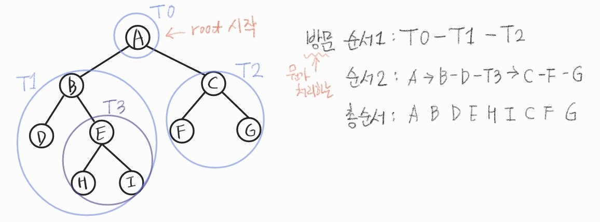

<br>

### 중위(inorder traversal)

- 수행방법
  1.  현재 노드 n의 `왼쪽 서브트리`로 이동 => L
  2. `현재 노드` n을 `방문`하여 처리한다 => V 
  3. 현재 노드 n의 `오른쪽 서브트리`로 이동 => R

- 알고리즘

  ```python
  def inorder(n):  #현재 노드 n
      if n:  # n이 유효한 노드인 경우(정의하기 나름)
          preorder(n.left)  #왼쪽 자식으로 이동
          visit(n)  # 필요한 처리 (꺼내거나 집어넣는 등)
          preorder(n.right)  #오른쪽 자식으로 이동
  ```

#### :facepunch: 예시

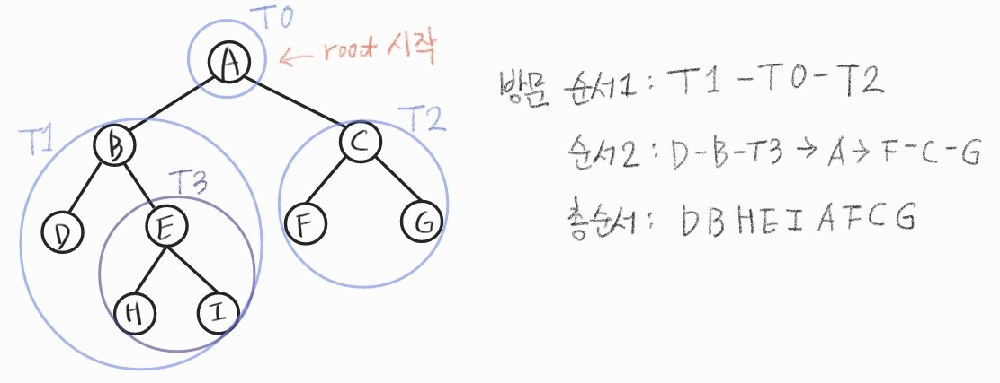

<br>

### 후위(postorder traversal)

- 수행방법
  1.  현재 노드 n의 `왼쪽 서브트리`로 이동 => L
  2. 현재 노드 n의 `오른쪽 서브트리`로 이동 => R
  3. `현재 노드` n을 `방문`하여 처리한다 => V 

- 알고리즘

  ```python
  def postorder(n):  #현재 노드 n
      if n:  # n이 유효한 노드인 경우(정의하기 나름)
          preorder(n.left)  #왼쪽 자식으로 이동
          preorder(n.right)  #오른쪽 자식으로 이동
          visit(n)  # 필요한 처리 (꺼내거나 집어넣는 등)
  ```

#### :facepunch: 예시

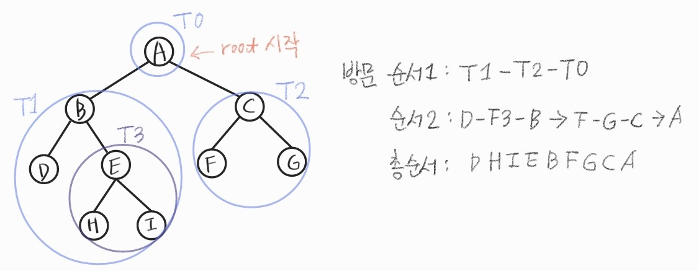

<br>

<br>

# 4. 이진트리의 표현

- **실제 메모리에 저장**하는 것에대한 이야기
- **부모와 자식 사이의 관계, 간선 정보**를 저장하는 것!
  - 어떤 노드 번호가 주어졌을 때, 자식의 번호가 뭔지 알 수 있으면 된다
- 일반적인 트리 : N개 노드에 대해 최대 자식 N - 1개(나를 제외한 나머지)
- **이진트리** : 자식 2개로 정해짐 (최대 **2개 저장할 공간**만 만들면 됨)

<br>

#### :cherries: 일반적인 트리순회에 대하여 :cherries:

- 부모에서 자식방향!! (유향그래프처럼)
  - 필요에 의해 자식에서 부모로 갈 수도 있음
  - 각 노드에 대해 `자식 유무`, `부모` 누구인지 정보를 저장해 놓음!
- 트리순회에서 방문표시?? **놉!!**
  - `한 방향으로만 순회`하기때문에, 부모와 자식이 뒤바뀌어 저장되지 않음!!!
- 트리는 사이클(ex. B의 자식 D, E가 연결된 경우 형성)이 없다
  - 따라서 한 번 방문한 곳을 또 방문할 일 없음!
- `단말노드(리프노드)`에 도착한 경우???
  - 지금 보는 노드가 **단말노드인지 아닌지 **돌아가야함!!
  - 단말 노드에 공백 노드(NULL)을 붙여준다 :heavy_check_mark: 보통 이렇게 한다

<br>

#### 배열을 이용한 이진 트리의 표현 (완전 이진 트리)

> 배열을 이용해서 이진 트리를 저장하는 방법을 알아보자!!

- 이진 트리에 각 노드 번호를 다음과 같이 부여
  - 루트 번호 : 1
  - 레벨 n에 있는 노드에 대하여, 왼쪽부터 오른쪽으로 2<sup>n</sup>부터 2<sup>n+1</sup>-1까지 번호를 차례대로 부여
- 즉, `포화 이진 트리` or `완전 이진 트리`의 노드번호를 따라 저장하는 경우 이와같은 형식으로 사용하면 된다!

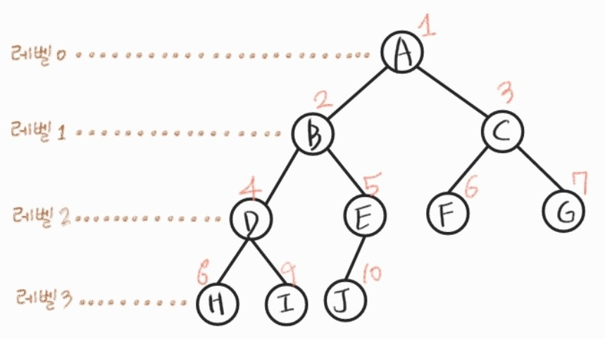

<br>

## 4.1 배열

> 배열을 이용해 이진트리를 표현하자

### 노드 번호의 성질

> 현재 노드 번호 `i`

- `자식 노드` 번호 계산
  - 왼쪽 자식 :  `i * 2`
  - 오른쪽 자식 : `i * 2 + 1`
- `부모 노드` 번호 계산 : `i // 2` (⌊i/2⌋, int(i / 2)) 

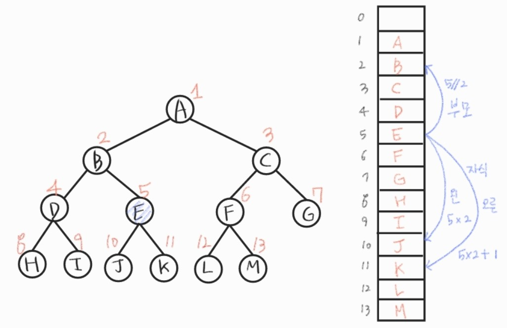

#### 배열을 이용한 트리 표현의 단점!!!

> 편향이진트리 같은 경우!!!

- 메모리 공간 낭비가 너무 심함!
- 새로운 노드를 삽입하거나 내용을 바꿔야한다거나 하면 사용하기 불편
- 완진히 노드가 고정된 경우에만 사용하는 것이 좋다!!

<br>

<br>

## 4.2 연결리스트

> 배열을 이용한 이진 트리 표현의 단점을 보완하기 위해 연결리스트를 이용하여 트리를 표현할 수 있다!!!
>
> :cry: 이부분은 어렵다고 보고만 넘어가긴했는데... 나중에라도 공부해보자!!

- 연결 자료구조를 이용한 이진트리의 표현
  - 이진 트리의 모든 노드는 최대 2개의 자식 노드를 가지므로 일정한 구조의 단순 연결 리스트 노드를 사용하여 구현

- 완전 이진 트리의 연결 리스트 표현

<그림>

<br>

<br>

## 4.3 문제 풀어보기

### :penguin: 문제

- 첫 줄에는 트리의 정점의 총 수 V가 주어진다. (정점개수 = 간선 + 1)
- 다음 줄에는 V-1개의 간선이 나열된다
- 간선은 항상 `부모 자식`순서로 표기된다
- 부모 정점 번호가 작은 것부터 나열되고, 부모 정점이 동일하다면 자식 정점 번호가 작은 것부터 나열된다

##### :male_detective: 이진 트리 표현에 대하여 전위 순회하여 정점의 번호를 출력하시오. :male_detective: 

#### 입력 / 출력

```python
## 입력
13  #정점의 개수
1 2 1 3 2 4 3 5 3 6 4 7 5 8 5 9 6 10 6 11 7 12 11 13

## 출력
1 2 4 7 12 3 5 8 9 6 10 11 13 
```

<br>

### :icecream: 답변

```python
def preorder(v):
    if v == 0: return  #자식이 없는경우
    
    print(v, end=' ')  #방문 노드 출력
    preorder(L[v])  #왼쪽 자식으로
    preorder(R[v])  #오른쪽 자식으로

V, E = map(int, input().split())  #V = E - 1
arr = input().split()

#자식 노드의 정보 저장할 배열
#이진트리이므로, 왼쪽, 오른쪽만 있으면 OK
L = [0] * (V + 1)
R = [0] * (V + 1)

for i in range(0, len(arr), 2):
    #부모, 자식 노드정보
    p, c = arr[i], arr[i + 1]
    
    if L[p] == 0:  #왼쪽자식이 비었다면 넣어줌
        L[p] = c
    else:
        R[p] = c  #있으면 오른쪽
        
preorder(1)  #root=1
```
##### 그림으로 확인하기

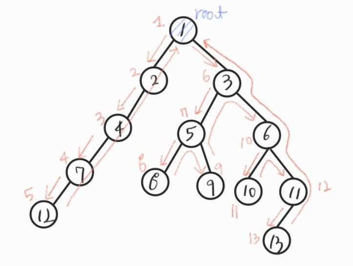

<br><br>

## 4.4 수식트리

> 수식을 표현하는 이진트리입니다!!

- 수식 이진 트리(Expression Binary Tree)라고 부르기도 한다
- **연산자**는 `루트` 노드이거나 `가지` 노드(중간에 있는 것들!)
- **피연산자**는 모두 `잎` 노드(leaf node)

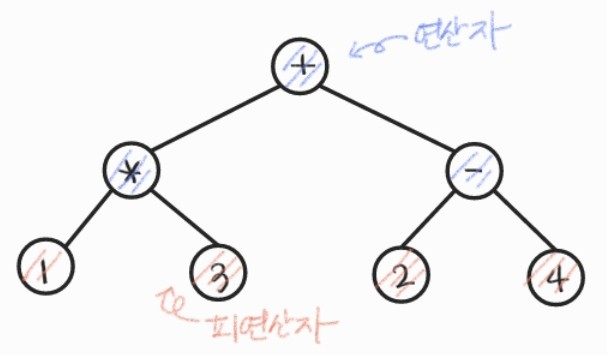

### 수식 트리의 순회

- 사람이 보는 표현은 중위 순회로!
- 컴퓨터 연산을 위해서라면 후위순회로!!

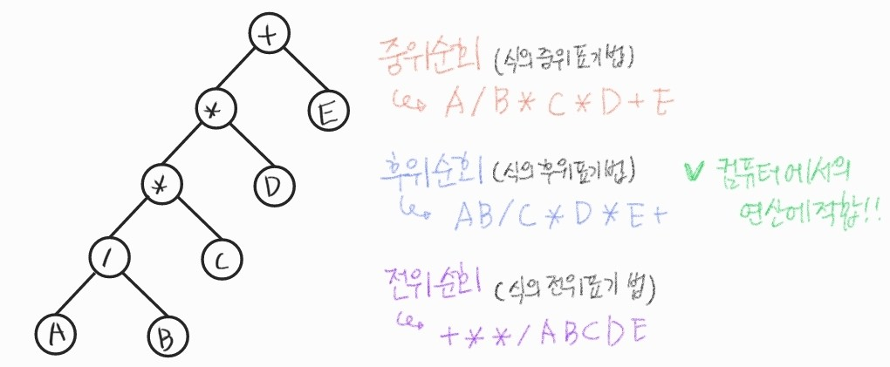

<br>

### 코드를 짠다면??

> 나는 이렇게 짰지만... 더 좋은 방법이 있을 수도!!!

```python
#이진트리이므로
# L, R에는 부모노드를 기준으로한 왼, 오른쪽 자식 노드 정보
# contents에는 각 노드의 정보를 저장해둔다

def formula_postorder(v):
    if v == 0: return 0 #노드가 빈 경우 반환(NULL)
    
    #왼, 오른쪽 자식의 값 읽어옴
    left = formula_postorder(L[v])
    right = formula_postorder(R[v])
    
    #방문처리
    here = content[v]
    #연산자인경우, 연산결과 반환
    if here == '-':
        return left - right
    elif here == '+':
        return left + right
    elif here == '*':
        return left * right
    elif here == '/':
        return left / right
    
    #숫자인 경우 값 반환
    return here
```

### 관련 문제에 대한 교수님의 코드

> leaf node(단말 노드)에만 숫자가 존재!
>
> 따라서 더 밑으로 내려갈 필요가 없다 (자식이 없으면 단말노드이므로 값을 반환하면 된다!!)

```python
for calc(v):
    #단말노드
    if L[v] == 0:  #왼쪽 자식만 있는 경우는 없다
        return content[v]
    else:
        l = calc(L[v])
        r = calc(R[v])
        
        ret = 0
        if content[v] == '+': ret = l + r
        elif content[v] == '-': ret = l - r
        elif content[v] == '*': ret = l * r
        else: ret = int(l / r)  #음수가 나올 수 있는 경우는 /를 써서 버림하자!
        return ret
```

<br>

<br>

# 5. 이진 탐색 트리

- 탐색작업을 효율적으로 하기 위한 자료구조
- 모든 원소는 **서로 다른 유일한 키**를 갖는다
- `key(왼쪽 서브트리) < key(루트 노드) < key(오른쪽 서브트리)` :star:
- 왼쪽 서브트리와 오른쪽 서브트리도 이진 탐색 트리입니다
  - 따라서 키의대소관계가 동일하게 유지됩니다!!
- **중위 순회**하면 **오름차순으로 정렬된** 값을 얻을 수 있습니다
- 이러한 형식의 트리를 구성하면 빠른 속도로 탐색하거나, 추가, 삭제하는게 가능합니다!!!

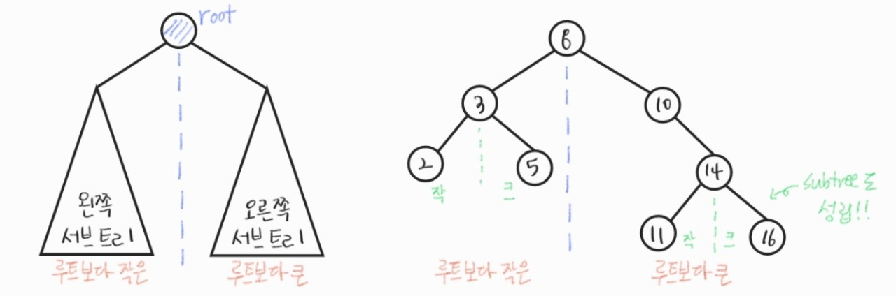

<br>

## 5.1 연산

### 탐색(Searching) :male_detective:

- **루트**에서 **시작**
- **탐색할 키 값 x**를 루트 노드의 키 값과 비교한다
  - `키 값 x = 루트노드 키 값` : 원하는 원소를 찾았으므로 탐색 **성공**
  - `키 값 x < 루트노드 키 값`  : 루트노드의 **왼쪽** 서브트리에 대해서 탐색연산 수행
  - `키 값 x > 루트노드 키 값` : 루트노드의 **오른쪽** 서브트리에 대해서 탐색연산 수행
- 서브트리에 대해서 순환적으로 탐색 연산을 반복한다!!

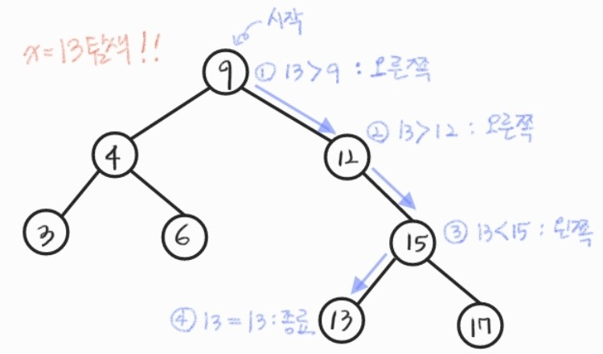

##### :four_leaf_clover: 장점

- 탐색 횟수(깊이, 시간)을 줄일 수 있다
  - 같은 경우를 `선형`으로 탐색
    - 탐색 순서 : 3 - 4 - 6 - 9 - 12 - 13 - 15 - 17 (중위순회)
    - **6번째**에 찾음!!
  - `이진 탐색`
    - **4번째**에 찾음

##### :boom: 단점

- 편향되게 저장된 경우, 끝까지 확인해야하므로 선형과 차이가 없다

:heavy_check_mark: 따라서 **균형있게** 구성하는게 중요@@@

<br>

### 삽입(Insertion) :inbox_tray:

1. 먼저 탐색 연산을 수행한다
   - 삽입할 원소와 같은 원소가 트리에 있으면 삽입 X, 같은게 있는지 탐색하여 확인한다
   - 탐색에서 **탐색 실패가 결정되는 위치**:star: 가 삽입 위치가 된다!!
2. 탐색 실패한 위치에 원소를 삽입한다

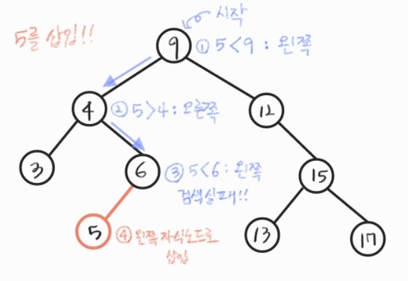

<br>

### 삭제(Deletion) :put_litter_in_its_place:


<br>

### 성능 (탐색에 초점)

- 탐색, 삽입, 삭제 시간은 트리의 높이 만큼 걸립니다
  
  - O(h) : h = BST의 깊이(height)
- **평균**의 경우
  - 이진 트리가 균형적으로 생성되어 있는 경우
  - O(log n)
    - 어느쪽으로 갈 지가 정해지므로! 모든 경우에 선택지가 1/2가 됩니다
    - 그래서 n * (1/2)<sup>k</sup> = 1, k = log n 이 성립합니다
  - 레드-블랙 트리(Red-Black Tree) 가 대표적입니다
- **최악**의 경우
  - 한쪽으로 치우친 경사 이진 트리의 경우
  - O(n)
    - n까지의 모든 노드를 확인하게 됩니다
  - 순차탐색과 시간복잡도가 같습니다

- **검색 알고리즘의 비교**

  - 배열에서의 순차 검색 : O(N)

  - 정렬된 배열에서의 순차 검색 : O(N)

  - 정렬된 배열에서의 이진탐색 : O(logN)

    - 고정된 배열 크기와 삽입, 삭제 시 추가 연산 필요

  - 이진 탐색트리에서의 평균 : O(logN)

    - 최악의 경우 : O(N)

    - 완전 이진 트리 또는 균형트리로 바꿀 수 있다면 최악의 경우를 없앨 수 있습니다

      새로운 원소를 삽입할 때, 삽입 시간을 줄인다

      평균과 최악의 시간이 O(logN)으로 같다

  - 해쉬 검색 : O(1)

    - 상수시간 : 시간이 늘어나지 않음 (index로 배열의 값 찾는 경우 처럼)
    - 추가 저장 공간이 필요

<br>

<br>

# 6. 이진 힙(heap)

> 힙에는 피보나치힙 같은 다른 종류들이 많지만, 우리는 이진 힙 정도만 공부하겠습니다

- 완전 이진 트리에 있는 노드 중에서 키값이 **가장 큰 노드**나 키값이 **가장 작은 노드**를 찾기 위해서 만든 자료구조
- 시간 효율성 때문에 사용
  - 현실에서 값은 항상 추가되고 삭제될 수 있음
  - 최대 최소를 찾으려면 숫자가 정렬된 상태여야함
  - 따라서 추가된 값이 정렬된 채 저장되도록 함

#### 최대 힙(max heap)

- 키 값이 **가장 큰** 노드를 찾기 위한 **완전 이진 트리**

- `부모노드의 키 값 > 자식노드의  키값` :star:

- `루트`노드 : 키 값이 **가장 큰** 노드

#### 최소 힙(min heap)

- 키값이 **가장 작은** 노드를 찾기 위한 **완전 이진 트리**
- `부모노드의 키 값 < 자식노드의 키값` :star:

- `루트`노드 : 키값이 **가장 작은** 노드

#### 예시

그림을 넣자


<br>

## 6.1 힙 연산

### 삽입

- 노드 추가시 완전 이진 트리 여야함
- 방법
  - 노드 확장 : last(마지막을 가르키는 인덱스) + 1이런 식으로 마지막 노드에서 값을 증가시켜 마지막 노드 확장
  - 부모와 비교
    - 최대힙 : `부모 > 자식` 
    - 최소힙 : `부모 < 자식`
  - 맞다면 삽입, 아니면 자리 바꿈!
    - 조건이 맞을 때까지 부모와 확인하는 작업을 반복한다(루트에 도달할 때까지)

그림

#### 코드

```python
data = [69, 10, 30, 2, 16, 8, 31, 22]
H = [0] * 100  #힙, 충분히 크게 만들어둠
hsize = 0  #마지막에 저장된 값의 위치 (힙의 크기를 의미)

def push(v):  
    global hsize
    hsize += 1  #1증가시킨 뒤
    H[hsize] = v  #마지막에 값을 넣음, 스택과 동일한 방식
    
    #비교
    #자식 : hsize, 부모 = c // 2
    #초기값 설정
    c = hsize
    p = hsize // 2
    
    while p:  #p가 0일때 까지
        if H[p] < H[c]:
            H[p], H[c] = H[c], H[p]
            
            #재설정
            c = p
            p = c // 2
        else:
            break  #아니면 종료
        
    ## 다른 버전
    #while p and H[p] < H[c]:
    #    H[p], H[c] = H[c], H[p]
        
    #    c = p
    #    p = c // 2


#Main
for v in data:
    push(v)
```

<br>

### 삭제

- 루트 노드의 원소만 삭제 가능
  - 최대 힙이면 최대값, 최소힙이면 최소값이 튀어나옴
- 힙에 넣었다 꺼내면 숫자의 순서가 정렬됨

- 방법
  - 루트 노드 삭제
  - 마지막 노드의 값을 root로 복사
  - 자식과 비교
    - 자식이 더 크거나(최대) 작으면(최소) 자리 교환함
  - 종료
    - 자식보다 더 큰 경우
    - 자식이 없는 경우

#### 코드

```python
def pop():
    global hsize
    ret = H[1]  #미리 값을 받아놓음
    H[1] = H[hsize]  #마지막 값 복사
    hsize -= 1  #마지막 위치 변화
    
    #초기값
    p = 1  #부모는 루트노드
    c = p * 2  #왼쪽 자식
    
    while c <= hsize:  #자식이 hsize내에 있는 경우(즉, 왼쪽 자식이 있는 경우)
        if c + 1 <= hsize and H[c] < H[c + 1]:  #오른쪽 자식과 비교해 큰값 선정
            c += 1  #오른쪽 자식의 값이 더 큰 경우
            
        if H[p] < H[c]:  #부모가 더 작은 경우 교환
            H[p], H[c] = H[c], H[p]
            
            p = c
            c = p * 2
        else:
            break
    
    return ret
            

#main
while hsize:  #순서대로 빼줌
    print(pop(), end=' ')
```

<br>

<br>

## 라이브러리

### heapq

```python
from heapq import heapify, heappush, heappop
```


### priorityQueue

```python
from queue import PrioriQueu
```

