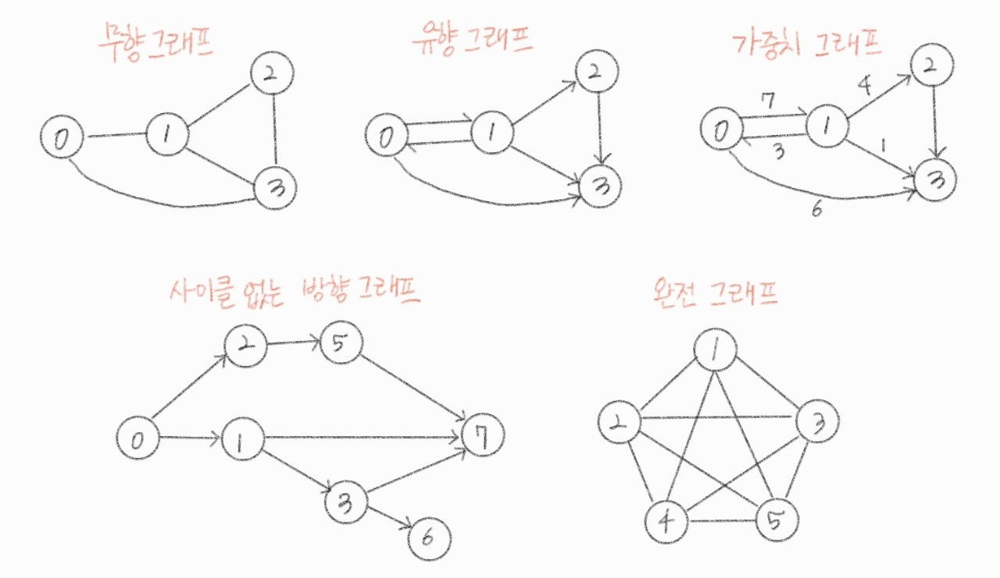
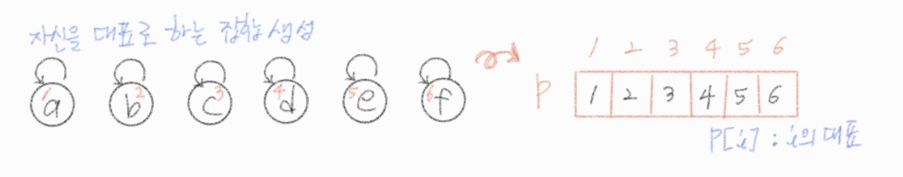
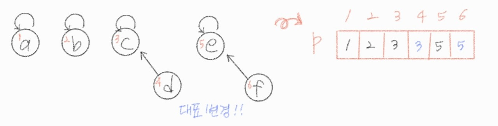
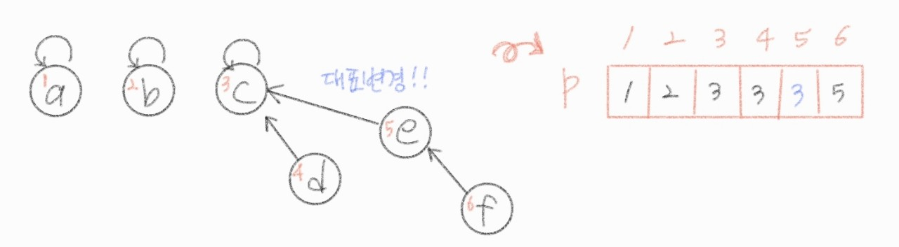
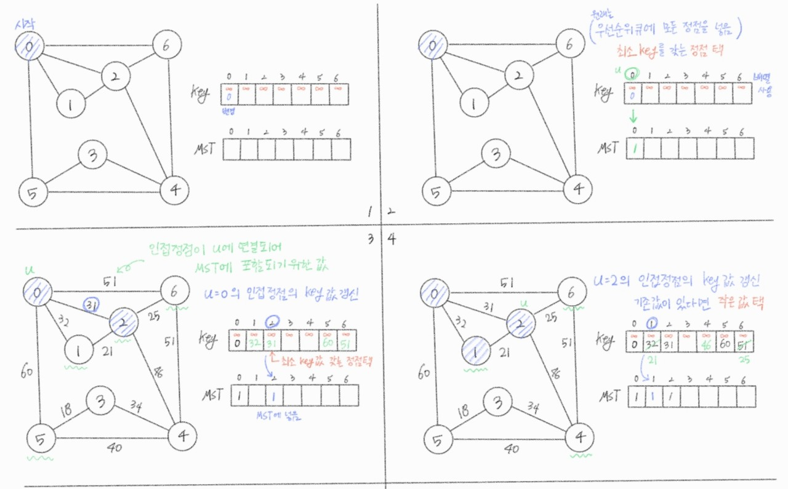
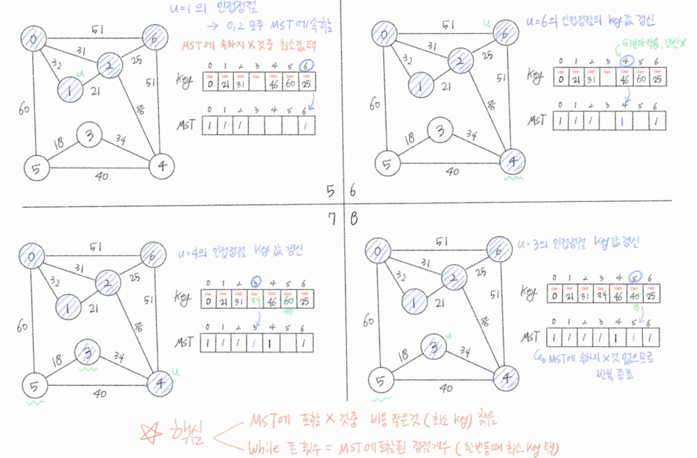

###### 210421_wed

##### APS 응용

<hr>
###### 오늘의 수업 목차 :ferris_wheel:

### 그래프

- 그래프 기본
- 그래프 탐색
- 서로소 집합들(Disjoint-Sets)
- 최소신장트리(MST) :star:
- 최단 경로 :star:

<hr>
<br>

# 1. 그래프 기본(Graph Basic)

## 1.1 그래프 :chart_with_upwards_trend:

- 아이템(사물 또는 추상적 개념)들과 이들 사이의 연결 관계를 표현
- **정점(Vertex)**들의 집합과 이들을 연결하는 **간선(Edge)**들의 집합으로 구성된 자료구조
  - |V| : 정점의 개수
  - |E| : 그래프에 포함된 간선의 개수
  - |V|개의 정점을 가지는 그래프는 최대 |V|* (|V| - 1) / 2개 간선 가능
  - 예) 4개의 정점
    - 하나는 최대 3개(|V| - 1 )
    - 최대 간선 수 = 3 + 2 + 1 = 4 * 3 / 2
- 선형 자료구조(배열)나 트리 자료구조(1:N)로 표현하기 어려운 **N : N 관계**를 가지는 원소들을 표현하기에 용이

<br>

### 그래프 유형

> 종류가 아주 많습니다!
>
> 뭐가 뭔지는 알아야겠죠?

- 무향 그래프 (Undirected Graph)
  - 방향이 없는, 정점에서 서로 이동 가능한
- 유향 그래프 (Directed Graph)
  - 방향이 있는, 화살표 방향으로만 이동 가능
- 가중치 그래프 (Weighted Graph)
  - 정점을 연결하는 간선에 weight 있는
  - 이동하는 비용
- 사이클 없는 방향 그래프 (DAG, Directed Acyclic Graph)
  - 사이클이 없는 (사이클 : 출발한 경로로 되돌아오는)
  - DAG조건



- 완전 그래프
  - 정점들에 대해 가능한 모든 간선들을 가진 그래프
  - 한 정점에서 다른 모든 것들과 연결 가능
- 부분 그래프
  - 원래 그래프에서 일부의 정점이나 간선을 제외한 그래프 (일부만 떼어낸 것)

<br>

### :family: 인접 정점

- 인접 (Adjacency)
  - 두 개의 정점(Vertex)에 **간선(Edge)이 존재**하는(연결된) 경우
  - 완전 그래프에 속한 임의의 두 정점들은 모두 인접해 있다
  - 실질적으로 **구현에 필요한 정보**!!! 

<br>

### 그래프 경로

- 간선들을 순서대로 나열한 것
  - **간선들**의 연결 : (0, 2), (2, 4), (4, 6)
  - **정점들**의 연결 : 0 - 2 - 4 - 6
- 단순 경로
  - 경로 중 한 정점을 `최대 한번`만 지나는 경로
  - 예) 0 - 2 - 4 - 6 / 0 - 1 - 6
- **사이클(Cycle)**
  - 시작한 정점에서 끝나는 경로
  - 예) 1 - 3 - 5 - 1

<br>

## 1.2 그래프 표현 :pencil:

> 그래프를 어떻게 나타낼 것인가?? 에 대한 문제

- 간선의 정보를 저장하는 방식
- 메모리나 성능을 고려하여 결정한다

#### 종류

- **인접 행렬** (Adjacent matrix)
  - |V| x |V| 크기의 `2차원 배열`을 이용하여 간선 정보 저장
  - 배열의 배열 (포인터 배열, C기준)
- **인접 리스트** (Adjacent List)
  - 각 `정점마다` 해당 정점으로 나가는 간선의 정보를 저장
- 간선의 배열
  - 간선(시작 정점, 끝 정점)을 배열에 연속적으로 저장

<br>

##### :cherries: 두 가지 방법을 적절히 활용합시다! :cherries:

<br>

### 인접 행렬 (Adjacent matrix)

- 두 정점을 연결하는 **간선의 유무**를 **행렬**로 표현
  - |V| x |V| 정방 행렬 (squar matrix)
  - **행 번호**와 **열 번호**는 그래프의 **정점에 대응**
  - 인접하면 1, 아니면 0으로 표현
- `무향` 그래프
  - *i*번째 행의 합 = *i*번째 열의 합 = V<sub>i</sub>의 차수 (차수 : 연결이 몇개나 있는지)
  - 간선 정보를 두 정점에 대해 모두 저장해야함
- `유향` 그래프
  - (보통) 행 : 출발 => 열 : 도착
  - 간선 정보를 한 방향(나가는)에 대해서만 저장
  - 행 *i*의 합 = V<sub>i</sub>의 진출 차수 (나가는 간선 개수)
  - 열 *i*의 합 = V<sub>i</sub>의 진입 차수 (들어오는 간선 개수)

그림 넣기

#### 단점 & 장점

- 빈 공간이 많다!!
  - 임의로 edge 지정해서 저장하면 빈 공간을 줄일 수 있다
- 단순하게 사용하기는 좋다

<br>

### 인접 리스트 (Adjacent List)

> 파이썬의 List와 구조적으로 유사합니다!!
>
> `행의 크기가 다른 모양이 될 수 있다`는 점에서 연결 리스트의 구조와 유사하기 때문에 사용할 수 있습니다!

- 각 정점에 대한 인접 정점들을 **순차적으로 표현**
- 하나의 정점에 대한 인접 정점들을 각각 노드로 하는 **연결 리스트로 저장**
- `무향` 그래프
  - 노드 수 = 간선 수 * 2 (양쪽에 연결되기때문)
  - 각 정점의 노드 수 = 정점의 차수
- `유향` 그래프
  - 노드 수 = 간선 수
  - 각 정점의 노드 수 = 정점의 진출 차수

그림

#### 장점?

- 행렬보다 저장 공간을 덜 사용한다!
- 1000짜리 배열(노드)까지 만들어서 사용한다고 합니다 

<br>

### 그래프 표현하기 :computer:


<br>

<br>

# 2. 그래프 탐색


<br>

<br>

# 3. 서로소 집합들 (Disjoint-sets)

> 이 부분은 뒤에서 다룰 최소신장트리에서 사용하게될거라 중요한 부분입니다!!

- 서로소 또는 상호배타 집합들은 **서로 중복 포함된 원소가 없는 집합들**이다
- 대표자 (**대표원소**, representative)
  - 집합에 속한 하나의 특정 멤버를 통해 **각 집합을 구분**
- 상호배타 집합을 **표현하는 방법**!!!
  - 연결 리스트
  - 트리 :heavy_check_mark: 
- 상호배타 `집합 연산`
  - Make-Set(x) : 만드는 것
  - Find-Set(x) : 대표원소 찾는 것
  - Union(x, y) : 합치는 것

#### 상호배타 집합 예

!!!!!!!!!!!!!!!!!!!!!!!!!그림이랑 채워넣기!!!!!!!!!!!!!!!!!!!!!!!!

- Make-Set(x) / Make-Set(y) / Make-set(a) / Make-Set(b)
  - 각각이 대표원소인 집합을 만든다
- Union(x, y) / Union(a, b)
  - 앞의 원소를 대표원소로 집합을 합친다
- Find-Set(y) => return x (representative)
  - 대표원소를 찾는다
- Find-Set(b) => return a (representative)
- Union(x, a)

<br>

## 3.1 상호배타 집합 표현 - 트리

- **하나의 집합**(a disjoint set)을 **하나의 트리**로 표현!!
  - 하나의 집합 : 서로 연결되어있는 것
- 자식 노드가 부모노드를 가르키며(아래에서 위로), `루트 노드가 대표원소`가 된다

### 연산 예

- Make-Set(a) ~ Make-Set(f)

  - 자기 자신이 대표원소인 집합 만듦

    

- Union(c, d), Union(e, f)

  - 각각의 대표원소를 찾고, d의 대표원소를 c의 대표원소로 바꿈

  - 대표원소가 같은 것은 같은 집합에 속함

    

- Union(d, f)

  - f의 대표원소인 **e의 대표원소**를 d의 대표원소인 **c의 대표원소**로 바꿈

    

- Find-Set(d) => return c
- FInd-Set(e) => return c

#### 상호배타 집합을 표현한 트리의 배열을 이용한 저장된 모습

그림....

<br>

### 상호배타 집합에 대한 연산

- Make-Set(x)
- Find-Set(x)
- Union(x, y)


<br>

<br>

# 4. 최소신장트리 (MST) :sparkles:

> 오늘 중요한 내용 중 하나!!

- 그래프에서 최소 비용 문제
  1. 모든 정점을 연결하는 간선들의 **가중치의 합이 최소**가 되는 트리
  2. 두 정점 사이의 **최소 비용의 경로** 찾기

### 신장트리

- n개의 정점으로 이루어진 `무방향 그래프`에서 **n개의 정점**과 **n - 1개의 간선**으로 이루어진 트리

- :cherry_blossom: 정점은 모두 있으면서, **정점을 트리로 만드는 간선만 남긴 것** :cherry_blossom:

  - 예) 신장 트리를 찾아보자

    그림
    
    - 모든 정점을 연결된 상태로 만들기 위해서 필요한 최소한의 간선의 개수 == 트리(= 사이클 없)를 구성하는 간선의 개수
    - 즉, n개의 정점에 대해 n - 1개의 간선 필요

### 최소 신장 트리 (Minimum Spanning Tree)

- 무방향 가중치 그래프에서 신장 트리를 구성하는 **간선들의 가중치의 합**이 **최소인 신장 트리**

- 하나의 그래프에서 2개 이상의 트리가 나올 수 있다

- 문제에서는 보통 가중치의 합만 출력하도록 한다 (아니면 하나만 찾도록)

  ##### :thinking: 어디에 쓸까?

  - 모든 도시(=정점)간에 전기 공급을 위한 전선(=간선)을 설치할 때 최소한의 비용으로 연결하는 방법
  - 최단거리 찾기
  - 실세계에서 많이 사용되는 자료구조입니다!

<br>

## 4.1 MST 표현

### 인접 행렬

- 연결되어있는 부분에 가중치를 적는다

### 인접 리스트

- [[(정점1, 가중치1), (정점2, 가중치2), ... ]...] 형태로 묶어서 인접 정보를 저장한다

<br>

##### :cherries: MST를 구하는 두 가지 방법을 알아봅시다!

## 4.2 Prim 알고리즘

> 탐욕을 적용한 대표적인 방법입니다!
>
> 결국은 모든 정점이 MST에 포함될 것이기 때문에, 어떤 정점에서 사용해도 상관 없습니다

- 하나의 정점에서 **연결된 간선들 중에 하나씩 선택**하면서 MST를 만들어 가는 방식
  1. **임의 정점을 하나 택**해서 시작
  2. 선택한 정점과 인접한 정점들 중의 **최소 비용의 간선**이 존재하는 **정점을 선택**
  3. **모든 정점이 선택**될 때 까지 1, 2 과정 **반복**

- 서로소인 2개의 집합(2 disjoint-sets) 정보 유지

  - 트리 정점들(tree vertices) - MST를 만들기 위해 선택된 정점들
  - 비트리 정점들(nontree vertices) - 선택 되지 않은 정점들

  ##### :heavy_check_mark: Prim은 비트리 정점을 트리 정점으로 옮겨가는 과정입니다!

### 그림과 함께하는 예시





### 코드 구현

- 우선순위 큐를 사용하지 않고 구현해봅시다!

```python
#입력
2 3		#정점2번까지, 간선 개수
0 1 1	#연결된 두 정점, 가중치
0 2 1
1 2 6
```

```python
V, E = map(int, input().split())
G = [[] for _ in range(V + 1)]

for _ in range(E):
    v, u, w = map(int, input().split())
    G[v].append((u, w))
    G[u].append((v, w))
    
key = [0xffffff] * (V + 1)  #가중치 값, 큰 값으로 초기화(아직 연결되는 경우를 찾지 못함을 의미)
pi = [0] * (V + 1)  #부모정보
MST = [0] * (V + 1)  #트리에 포함되면 1, 아니면 0

ans = 0  #최소 가중치를 구함
key[0] = 0  #초기 정점 초기화
for _ in range(V + 1):  #모든 정점에 대해 반복
    v, min_key = 0, 0xffffff
    for i in range(V + 1):
        if not MST[i] and key[i] < min_key:  #아직 트리 포함 X and key 최소인 정점택
            v, min_key = i, key[i]
    
    MST[v] = 1
    ans += key[v]
    
    for u, w in G[v]:
        if not MST[u] and key[u] > w:  #트리 속하지X and key가 가중치보다 작음
            key[u] = w  #작은 것으로 가중치 갱신
            pi[u] = v  #부모정점 표시
    
```

#### 단점

- 정점 수 많아지면 표현 불가!
- 우선순위 큐 없으면 느림


## 4.3 KRUSKAL 알고리즘

- **간선을 하나씩 택**해서 MST를 찾는 알고리즘
  1. 최초, 모든 간선을 가중치에 따라 **오름차순으로 정렬**
  2. **가중치가 `가장 낮은` 간선부터 선택**하면서 트리를 증가시킴
     - 사이클이 존재하면 다음으로 가중치가 낮은 간선 택
  3.  n - 1개의 간선이 선택될 때 까지 2 반복

<br>

<br>

# 5. 최단 경로


## 5.1 Dijkstra 알고리즘


