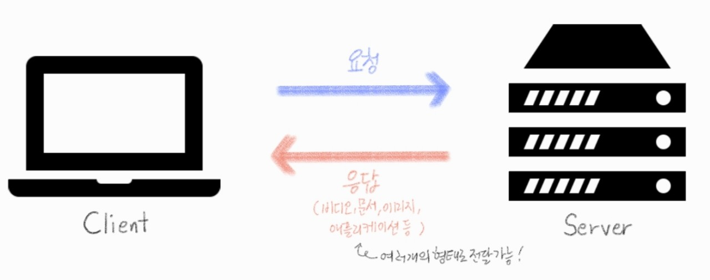

###### 210426_mon

##### Django

###### 오늘의 수업 목차 :flipper:

### REST API

- **REST API**
  - URI
  - HTTP Method
  - Representation

- **Django REST Framework**

 

# 1. REST API

> 차근차근 알아갑시다!!

### API (Application Programming Interface)

- 프로그래밍 언어가 제공하는 기능을 수행할 수 있게 만든 인터페이스
  - **어플리케이션과 프로그래밍으로 소통**하는 방법!!!
- 프로그래밍을 활용해서 할 수 있는 어떤 것! 을 말함
- 다양한 Interface
  - CLI (Command-Line Interface)
    - 명령줄을 통해 소통 (특정 기능 수행)
    - 예) CMD (Windows), Terminal (Mac OS), bash
  - GUI (Graphical User Interface)
    - 그래픽 아이콘 클릭을 통해 기능 수행
    - 바탕화면에서 보이는 다양한 아이콘들...
  - API (Application Programming Interface)
    - (코드 작성해서) 프로그래밍을 통해 소통 (일을 수행)

### Web API

- 웹 어플리케이션 개발에서 **다른 서비스에 `요청`보내고 `응답`을 받기 위해 정의된 일종의 명세**
  - 이전에 사용해본 것 : TMDB API (영화데이터 받거나 하기위해 요청해서 json파일 받음)
- 현재 웹 개발 : 추가로 모든 것을 개발하지 않고 여러 **Open API**를 가져와 활용하는 추세
  - 구글, 카카오 지도 API, 우편번호, 도로명 등등 직접 개발 X API 사용O

### API Server

- 클라이언트 (우리)가 요청을 보내면 어떤 응답을 받는 구조!!
  - 응답은 여러개의 형태로 전달 가능합니다

- 그 동안은 render를 활용해 HTML문서 한장을 받아옴!

- 이제는 JSON 형태를 사용할 것!!!