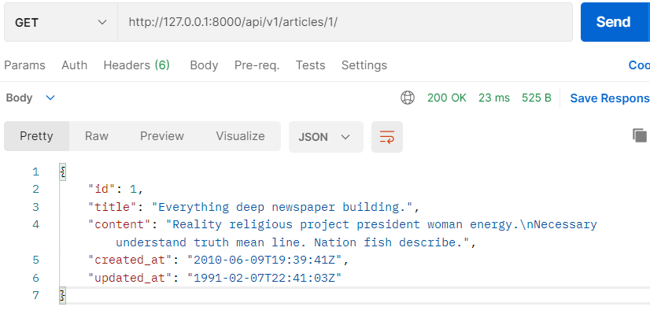

###### 210427_wed

##### Django REST Framework

<hr>

###### 오늘의 목차 :sunflower:

### DFR

- **CURD**
- **1:N Model Relationship**

##### :woman_cartwheeling: DFR 뿌셔뿌셔 :man_cartwheeling:

<hr>
<br>

## 기본 설정

- 가상환경 설정

```shell
$ python -m venv venv
$ source venv/Scripts/activate
```

- 장고 설치

```shell
$ pip install django
```

- 프로젝트 생성
  - (.)현재 위치에 프로젝트 생성

```shell
$ django-admin startproject myapi .
```

- 추가 프로그램 설치
  - django-seed : db에 랜덤으로 임의의 값을 넣음
  - djangorestframework : 이제 배울 것!!
  - django-extensions, ipython : shell plus이용 (라인 할줄 입력하면서 어떤 값 있는지 뽑아내기 편리한 인터페이스 사용 위한 것)

```shell
$ pip install django-seed djangorestframework django-extensions ipython
```
- 설치한 프로그램 저장
```shell
$ pip freeze > requirements.txt
```

- settings.py

```python
INSTALLED_APPS = [
    'django_seed',
    'django_extensions',
    'rest_framework',
    ...
]
```

- app 생성

```shell
$ python manage.py startapp articles
```

```python
INSTALLED_APPS = [
    'articles',
    ...
]
```

<br>

<br>

#### 오늘 할 것!

> 게시글 CRUD를 작성하자!
>
> :thinking: 이전과 뭐가 다를까??
>
> - django만 사용할 때는 HTML문서를 응답으로 보내줬다면!!
> - 이번엔 `Json형식으로 응답`을 보내주자!!!
> - 이때 **REST에 맞게 작성**하자

<br>

#### :cherries: API가 RESTful 하다?!!?! :cherries:

- 실제로 url 구성, 사용하는 method는 개발자 마음대로!!!
- 그치만 너무 다양하면 서버 하나하나 보기가 너무 힘들다
- 보기 편하도록 만들어진 **하나의 표준**이 **REST**
- `사용할 규칙` 
  - url : 자원만 나타내고, 동작은 포함하지 않는다
  - CRUD동작 => GET, POST, PUT, DELETE Method를 사용해서 구현한다
- REST는 가이드일 뿐 필수는 아니라는 사실
- 적당히 알아보기 좋게끔 디자인 하도록 하자

<br>

<br>

# 1. CRUD

#### api/urls.py

- url의 버전을 나누는 이유??
  - 보통 버전이 달라지면 전체적으로 달라짐(프레임워크? 그런 구성하는게 달라짐)
  - url마다 버전을 구분해서 쓰고싶은 것을 쓰도록 함

```python
from django.contrib import admin
from django.urls import path, include

urlpatterns = [
    path('admin/', admin.site.urls),
    path('api/v1/', include('articles.urls')),
]
```

<br>

#### articles/models.py

- 게시글에 해당하는 Article 모델 작성

```python
from django.db import models

class Article(models.Model):
    title = models.CharField(max_length=100)
    content = models.TextField()
    created_at = models.DateTimeField(auto_now_add=True)
    updated_at = models.DateTimeField(auto_now=True)
```

- migrate

```shell
$ python manage.py makemigrations
$ python manage.py migrate
```

<br>

#### articles/serializers.py

- **serializer**
  - model instance를 사용하기 좋게끔 python native type으로 바꿔준다
  - dict, list등 변환 + 유효성 검사
- **ArticleListSerializer**
  - 전체 게시글 리스트를 보여준다
  - id, title만 보이도록 한다

```python
from rest_framework import serializers
from .models import Article

class ArticleListSerializer(serializers.ModelSerializer):

    class Meta:
        model = Article
        fields = ('id', 'title',)
```

<br>

## 1.1 Serializer 확인하기

> 전체 CRUD를 만들기에 앞서 어떻게 생겨먹은건지 알아야하지 않겠어요???
>
> `ArticleListSerializer로 어떤 것이 만들어졌는지` 확인해봅시다!!!

#### DB에 랜덤값 넣기

- seed <app_name> --number=<넣고싶은 데이터 수> 

```shell
$ python manage.py seed articles --number=20
```

#### shell-plus

- 실행

```shell
$ python manage.py shell_plus
```

- import serializer 
  - 자동으로 생성되지 않습니다!!

```shell
from articles.serializers import ArticleListSerializer
```

- serializer instance 생성

```shell
serializer = ArticleListSerializer()

serializer
#out
ArticleListSerializer():
    id = IntegerField(label='ID', read_only=True)  #읽을수만 있음
    title = CharField(max_length=100)
```

- serializer에 article instance 넣기

```python
article = Article.objects.get(pk=1)
serializer = ArticleListSerializer(article)
```

- data 확인
  - 1번 article이 dict형태로 출력됩니다!!
  - 실제 dict는 아니지만, 3번째에서 보이듯이 dict형태로 쓸 수 있습니다

```shell
serializer.data
# out
{'id': 1, 'title': 'Everything deep newspaper building.'}

type(serializer.data)
# out
rest_framework.utils.serializer_helpers.ReturnDict

serializer.data['id']
# out
1
```

##### 그래서 serializer가 뭔데??? 

- 데이터를 serializer에 적용시키면, serializer에 정의된 fields를 가지는 dict와 유사한 형태의 데이터로 변환합니다 (형태는 사용하기에 따라 다름! 여기서는 JSON 사용!)
- 즉, `기존의 데이터`의 `형태를 변환`하는 역할을 합니다 :heavy_check_mark: :heavy_check_mark: 

- 새로운 뭔가를 생성하는게 아니라는거... 헷갈리지 맙시다!

<br>

<br>

## 1.2 CRUD 구현하자 :confetti_ball:

### :radio: READ

#### Main Page

> 모든 article list가 출력되는 부분입니다!!

- **articles/urls.py**

```python
from django.urls import path
from . import views

urlpatterns = [
    path('articles/', views.article_list),
]
```

- **articles/views.py - `article_list`**

  > 이전엔 article을 모두 가져와서 합친 뒤, html로 보여줬습니다
  >
  > 이번엔 합쳐주지 않고, **serializer를 통해 json 데이터**로 응답하겠습니다!!

  - **방식** :heavy_check_mark: 이대로 코드를 작성합시다
    1. `article을 모두 가져온다`
       - Article.objects.all() : 모든 article을 가져오며, 없으면 빈 배열
       - get_list_or_404(Article) : 모든 리스트 가져오며, 없으면 404에러
    2. `json화할 수 있도록 변환`
       - ArticleListSerializer(articles, many=True)
    3. `응답`
       - Response(serializer.date) : JSON (dict와 유사한 형태)으로 들어감
  - api_view(['GET'])
    - rest_framework로 디자인할 때는 어떤 메서드로 받는지 반드시 명시해야 합니다

```python
@api_view(['GET'])  #필수!!!!
def article_list(request):
    articles = get_list_or_404(Article)
    serializer = ArticleListSerializer(articles, many=True)
    return Response(serializer.data)
```

##### :fire: many옵션은 언제 쓰지??

> ArticleListSerializer는 딱 하나의 인스턴스를 변환하도록 설계되어있습니다
>
> 따라서 `쿼리셋을 한번에 넣어줄 때` 사용합니다!
>
> 사용하지 않으면 AttributeError가 발생합니다 ('list' object has no attribute 'title')

- :postbox: **postman** 결과 화면

  

<br>

#### Using postman 

> REST API를 이용한 Json호출 기능 테스트에 유용합니다

- 프로그램 다운로드 후, <u>workspace 생성</u>
- <u>collection 생성</u> (ctrl + s)
- 요청 메서드 선택 (GET, POST 등)
- 테스트할 url 입력
- send => 아래에 응답 화면 출력

###### :cherry_blossom: 필요한 기능만큼 collection을 추가한 뒤, 번갈아서 사용하면 검증이 쉽습니다! :cherry_blossom:

<br>

#### Article Detail

> article 각각의 세부정보가 출력됩니다
>
> article이 가진 `모든 목록`을 보여줍니다

- articles/**serializers.py** - `ArticleSerializer`
  - ArticleListSerializer와 달리, model의 모든 요소를 보여줘야합니다
  - 이런 경우 `serializer를 서로 분리`해야합니다!!
  - 이렇듯 필요에 따라 여러개의 serializer가 생성될 수 있습니다

```python
class ArticleSerializer(serializers.ModelSerializer):

    class Meta:
        model = Article
        fields = '__all__'
```

- articles/**urls.py**
  - detail이므로 article을 식별할 수 있는 값이 필요합니다

```python
urlpatterns = [
    ...
    path('articles/<int:article_pk>/', views.article_detail),
]
```

- articles/**views.py** - `article_detail`
  - pk에 맞는 모델 인스턴스를 가져온 뒤, 변환하고 응답합니다

```python
@api_view(['GET'])
def article_detail(request, article_pk):
    article = get_object_or_404(Article, pk=article_pk)
    serializer = ArticleSerializer(article)
    return Response(serializer.data)
```

- :postbox: **postman** 결과 화면

  

<br>

### :camera_flash: Create

#### Article Create

> main page에서 GET이면 전체 리스트가 보이고, POST면 새로운 정보가 추가됩니다!
>
> 그러므로 여기서는 POST 기능을 추가해봅시다!

- articles/urls.py
  - main page url과 동일
  
- **articles/views.py - `article_list`**

  - 요청이 GET인지, POST인지 구분하여 동작합니다

  - **POST**

    - `요청한 데이터 (request.data)`를 ArticleSerializer의 인자로 하여, `serializer 인스턴스`를 생성합니다

    - serializer 검증

      검증 `성공` : data를 저장하고, 응답 + 201 status code (데이터 정상적으로 생성됨을 안내)

      검증 `실패`: 400 bad request 

```python
from rest_framework import status

@api_view(['GET', 'POST'])
def article_list(request):
    if request.method == 'GET':
        articles = get_list_or_404(Article)
        serializer = ArticleListSerializer(articles, many=True)
        return Response(serializer.data)
    else:
        serializer = ArticleSerializer(data=request.data)
        if serializer.is_valid():
            serializer.save()
            return Response(serializer.data, status=status.HTTP_201_CREATED)
        return Response(serializer.errors, status=status.HTTP_400_BAD_REQUEST)
```

##### :cherries: 검증 실패 시 400 status code 띄우는 2가지 방법

```python
serializer.is_valid(raise_exception=True)  #is_valid 옵션 활용, 검증 실패시 status code 띄움
```

```python
return Response(serializer.errors, status=status.HTTP_400_BAD_REQUEST)
```

- :postbox: **postman** 결과 화면

  

<br>

### :hourglass_flowing_sand: Update

> 하나의 article에 대해서 update를 할 수 있겠죠???
>
> article_detail에 추가합시다!

- articles/views.py - `article_detail`
  - **PUT**
    - 기존 model instance와 요청한 데이터 (request.data)를 통해 serializer를 생성합니다
    - 검증하고, 성공한다면 저장한 뒤 응답합니다

```python
@api_view(['GET', 'PUT'])
def article_detail(request, article_pk):
    article = get_object_or_404(Article, pk=article_pk)  //모든 경우에 instance가 필요하므로 가장 먼저 생성
    if request.method == 'GET':
        // 생략
    elif request.method == 'PUT':
        serializer = ArticleSerializer(instance=article, data=request.data)
        if serializer.is_valid(raise_exception=True):
            serializer.save()
            return Response(serializer.data)
```

- :postbox: **postman** 결과 화면

  

<br>

###### + Update method

> update를 위한 요청 method는 2가지가 있습니다
>
> - PUT
>   - serializer에 포함된 모든 fields의 정보를 넘겨줘야합니다
> - PATCH
>   - 포함된 값 중, 수정한 것을 제외한 나머지는 원래 값을 사용합니다
>
> :v: 현재는 수정 안한 값도 입력되어야 검증을 통과하므로, PUT을 사용합시다!!!

<br>

### :scissors: Delete

> update와 마찬가지로 하나의 article을 삭제합니다!
>
> 역시 article_detail에 기능을 추가합시다

- articles/views.py - `article_detail`
  - 해당 article을 삭제합니다
  - Response를 위해서는 data가 필요하므로, 삭제되었음을 알리는 데이터를 전달합시다

```python
@api_view(['GET', 'PUT', 'DELETE'])
def article_detail(request, article_pk):
    article = get_object_or_404(Article, pk=article_pk)
    if request.method == 'GET':
        //생략
    elif request.method == 'PUT':
        //생략
    elif request.method == 'DELETE':
        article.delete()
        data = {
            'data': f'article { article_pk }가 삭제되었습니다.',
        }
        return Response(data, status=status.HTTP_204_NO_CONTENT)
```

- :postbox: **postman** 결과 화면

  

<br>

###### 참고

> DRF에서 요청을 보내는 url 마지막 /는 꽤나 중요합니다!
>
> - 만약 마지막에 /를 붙이지 않고, 요청을 보낸다면??
>   - /를 붙인 뒤, redirect를 수행 => 즉, GET 요청
> - 위의 delete 요청을 마지막 /없이 보낸다면
>   - GET요청을 보낸 것이 되므로 값이 출력됩니다

<br>

<br>

# 2. 1:N Model Relationship

#### article과 comment

- 하나의 article에 여러개의 comment가 달릴 수 있습니다
- `article (1) : comment (N)` 의 관계 성립

######  :woman_cartwheeling: comment를 만들어봅시다​!!!

<br>

## 2.1 Model & Serializer

#### articles/models.py

- article을 ForeignKey로 참조합니다

```python
class Comment(models.Model):
    article = models.ForeignKey(Article, on_delete=models.CASCADE)
    content = models.CharField(max_length=200)
    created_at = models.DateTimeField(auto_now_add=True)
    updated_at = models.DateTimeField(auto_now=True)
```

- migration
  - 기존 DB와 migration을 모두 삭제한 뒤 진행합니다
  - DB에 10개의 랜덤 데이터를 넣어줍니다

#### articles/serilaizers.py

- **CommentListSerializer**
  - 전체 comment List를 보여주는 역할
  - id, content을 보여주며, comment가 달린 article의 id, title을 보여줍니다

```python
class CommentListSerializer(serializers.ModelSerializer):
    article_title = serializers.CharField(source='article.title', read_only=True)
    
    class Meta:
        model = Comment
        fields = ('id', 'content', 'article', 'article_title',)
```

- **CommentSerilaizer**
  - 한 comment의 detail을 보여주는 역할
  - 모든 정보 + article의 title
  - 수정 시, article 정보를 수정할 수 없도록 read_only로 지정합니다.

```python
class CommentSerilaizer(serializers.ModelSerializer):
    article_title = serializers.CharField(source='article.title', read_only=True)

    class Meta:
        model = Comment
        fields = '__all__'
        read_only_fields = ('article',)
```

<br>

<br>

## 2.2 CRUD

### Comment Create

> 보통 하나의 article에서 새로운 댓글을 작성합니다
>
> Article Detail에서 댓글을 작성할 수 있도록 create를 구현합시다!

- **articles/urls.py**

```python
from django.urls import path
from . import views

urlpatterns = [
    ...
    path('articles/<int:article_pk>/comment/', views.comment_create),
]
```

- articles/views.py - `comment_create`
  - `요청한 데이터 (request.data)`를 CommentSerializer의 인자로 하여, `serializer 인스턴스`를 생성합니다
  - article **read_only**
    - read_only를 지정했으므로, request.data에 article 정보를 포함하지 않습니다
    - 따라서 article 정보를 별도로 넣어 저장해야합니다

```python
@api_view(['POST'])
def comment_create(request, article_pk):
    article = get_list_or_404(Article, pk=article_pk)
    serializer = CommentSerilaizer(data = request.data)
    if serializer.is_valid(raise_exception=True):
        serializer.save(article=article)
        return Response(serializer.data)
```

- :postbox: **postman** 결과 화면

  

<br>

##### serializer.save(article=article) :heavy_check_mark:

> 기존에 form을 사용할 때의 `commit option과 같은 역할` 입니다
>
> - 상황
>   - CommentSerializer의 fields = '\_\_all\_\_' 이므로 comment의 모든 column에 해당하는 정보가 필요합니다
>   - read_only를 사용해, comment를 작성시 article을 임의로 선택하지 않도록 합니다
>   - 이 경우 request.data에는 article 정보를 포함하지 않습니다
>
> :fire: save()의 문제점
>
> - article 정보가 없으므로, 모든 fields에 대한 정보가 없어 저장할 수 없습니다 
>   - read_only : 해당 field는 알아서 할테니까 검증에서 제외, 조회할때만 값을 줘라!!!
> - Error : `This field is required.`
>
> :four_leaf_clover: 해결
>
> - 해당 article의 instance를 미리 생성한 뒤
> - save시에 article 정보를 포함하여 저장해줍니다
> - save(article=article)

<br>

### Comment List

> 전체 comment List를 보여줍니다

- **articles/urls.py**

```python
from django.urls import path
from . import views

urlpatterns = [
    ...
    path('comments/', views.comment_list),
]
```

- articles/views.py - `comment_list`
  - 모든 comment를 가져온 뒤, serializer를 사용해 변환합니다

```python
@api_view(['GET'])
def comment_list(request):
    comments = get_list_or_404(Comment)
    serializer = CommentListSerializer(comments, many=True)
    return Response(serializer.data)
```

- :postbox: **postman** 결과 화면

  

<br>

### Comment Detail

> 한 comment의 detail을 보여주는 `GET`
>
> 해당 comment를 수정하기위한 `PUT`
>
> 댓글을 삭제하기 위한 `DELETE`

- **articles/urls.py**

```python
from django.urls import path
from . import views

urlpatterns = [
    ...
    path('comments/<int:comment_pk>/', views.comment_detail),
]
```

- articles/views.py - `comment_detail`

  - **GET**
    - serializer data를 응답으로 제공합니다

  ```python
  @api_view(['GET', 'PUT', 'DELETE'])
  def comment_detail(request, comment_pk):
      comment = get_object_or_404(Comment, pk=comment_pk)
      if request.method == 'GET':
          serializer = CommentSerilaizer(comment)
          return Response(serializer.data)
      elif request.method == 'PUT':
          ...
      elif request.method == 'DELETE':
          ...
  ```

  - **PUT**
    - 기존 comment를 인스턴스로 요청한 데이터를 받아옵니다
    - 검증이 통과하면 저장한 뒤, 응답합니다
    - 이때, request.data에 article의 정보가 없지만, `comment에 이미 포함`되어 있으므로 따로 추가하지 않습니다

  ```python
  @api_view(['GET', 'PUT', 'DELETE'])
  def comment_detail(request, comment_pk):
      comment = get_object_or_404(Comment, pk=comment_pk)
      if request.method == 'GET':
          ...
      elif request.method == 'PUT':
          serializer = CommentSerilaizer(comment, data=request.data)
          if serializer.is_valid(raise_exception=True):
              serializer.save()
              return Response(serializer.data)
      elif request.method == 'DELETE':
          ...
  ```

  - **DELETE**
    - comment를 삭제하고, 안내 메세지를 data로 응답합니다

  ```python
  @api_view(['GET', 'PUT', 'DELETE'])
  def comment_detail(request, comment_pk):
      comment = get_object_or_404(Comment, pk=comment_pk)
      if request.method == 'GET':
          ...
      elif request.method == 'PUT':
          ...
      elif request.method == 'DELETE':
          comment.delete()
          data = {
              'delete': f'comment { comment_pk }이 삭제되었습니다.'
          }
          return Response(data, status=status.HTTP_204_NO_CONTENT)
  ```

- :postbox: **postman** 결과 화면

  - **GET**

    

  - **PUT**

    

  - **DELETE**

    

<br>

<br>

## 2.3 역참조 활용

> comment에서 article을 참조했다면! 
>
> article에서는 comment를 역참조할 수 있습니다
>
> :cherries: `article에서 comment 정보를 확인할 수 있도록 구성해봅시다!` 

#### 단순 역참조

- Article List에서 comment 정보를 보여주기 위해 **ArticleListSerializer**에 comment_set (역참조 매니저)을 추가합니다!

```python
class ArticleListSerializer(serializers.ModelSerializer):

    class Meta:
        model = Article
        fields = ('id', 'title', 'comment_set')
```

- :postbox: **postman** 결과 화면

  - comment의 id를 가지는 comment_set 정보가 추가됩니다

  

<br>

#### Comment 세부정보 역참조

- Article Detail에서 comment의 세부 정보를 보여주기위해 **ArticleSerializer**에 serializer로 변환한 comment_set 정보를 추가합니다
- comment List에서 보이는 comment정보를 가져오기위해 **CommentListSerializer**를 활용합니다 (원하는 데이터 형태에 따라 선택 사용)
- 이때, ArticleSerializer보다 먼저 CommentListSerializer가 정의되어있어야 합니다

```python
class ArticleSerializer(serializers.ModelSerializer):
    comment_set = CommentListSerializer(many=True, read_only=True)

    class Meta:
        model = Article
        fields = '__all__'
```

- :postbox: **postman** 결과 화면

  - comment_set 정보를 확인할 수 있습니다

  

<br>

#### Comment의 개수를 출력하자

> `object.count() ` 이런식으로 count()사용한 것 기억하나요??
>
> 이러한 기능이 있기에 똑간티 사용할 수 있습니다

- Article Detail에서 comment의 개수를 출력하겠습니다
- comment_count는 숫자이므로, **IntegetField**를 사용하여 추가합니다

```python
class ArticleSerializer(serializers.ModelSerializer):
    comment_set = CommentListSerializer(many=True, read_only=True)
    comment_count = serializers.IntegerField(
        source='comment_set.count',
        read_only=True
    )

    class Meta:
        model = Article
        fields = '__all__'
```

- :postbox: **postman** 결과 화면

  - 표시된 부분에 개수가 추가된 것을 확인할 수 있습니다

  


<br>

<br>

##### :dizzy_face: 이것으로 DRF는 끝!!!

- 다음에 vue를 학습하면서 함께 활용하겠습니다