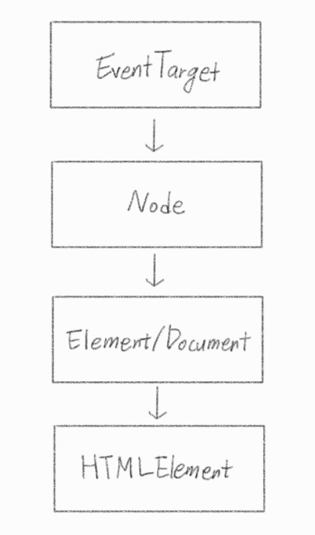
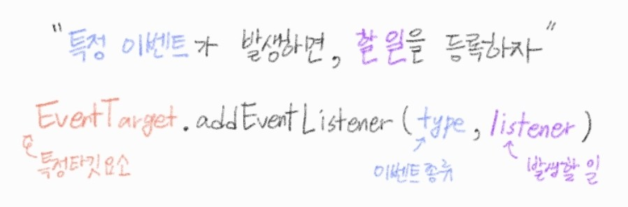

###### 210428_wed

##### JavaScript

<hr>


###### 오늘의 목차 :rainbow:

### JavaScript

- Intro to JavaScript
- DOM
- Event Listener

##### :running: 4일 만에 JS 끝내기!!! 

<hr>
<br>

# 1. JavaScript Intro

### why learn???


## 1.1 history


<br>

<br>

##### 본격 JS 시작!!

# 2. DOM

> JS : 브라우저를 조작하는 언어

#### 브라우저에서 할 수 있는 일

- **DOM 조작**
  - 문서(HTML) 조작 (Document조작)

- **BOM 조작**
  - Browser 조작
  - navigator, screen, location, frames, history, XHR
- **JavaScript Core (EXMAScript)**
  - JS 언어로서 동작하는 것
  - Data Structure(Object, Array), Conditional Expression, Iteration

##### 하나씩 알아보자

<br>

### DOM (Documet Object Model)

> 문서를 조작하는 행위!!!

- 브라우저의 윈도우객체 안에 Document  == 우리가 보는 웹페이지 화면
- 개발자도구 - console에서 명령어를 이용해 브라우저를 수정할 수 있음!

```javascript
window.document.title  //해당 document에서 title을 출력해줌
```


### BOM (Browser Object Model)

> 문서가 아닌 브라우저 자체를 조작하는 것!


<br>

<br>

# 3. DOM 조작

> DOM을 조작해봅시다!!

#### 개념

- Document는 문서 한 장(HTML)에 해당하고, 이를 조작한다

- **DOM 조작 순서** :cherries: :cherries: :cherries: 2가지만 기억!!
  1. 선택 (select)
  2. 변경 (manupulation)

#### Document 위치


#### DOM 관련 객체 상속 구조



- EventTarget
  - Event Listner를 가질 수 있는 객체가 구현하는 DOM 인터페이스
- Node
  - 여러 가지 DOm 타입들이 상속하는 인터페이스
- Element
  - Document 안의 모든 객체가 상속하는 가장 범용적인 기반 클래스
  - 부모인 Node와 그 부모인 EventTarget의 속성을 상속
- Document
  - 브라우저가 불러온 웹 페이지를 나타냄
  - DOM 트리의 진입점(entry point) 역할을 수행
- HTMLElement
  - 모든 종류의 HTML 요소
  - 부모인 element의 속성 상속

<br>

### 잠깐!!! CSS Selector... 기억하니..? :scream:

> selector를 사용해서 선택, 변경 해줘야하기때문에!!! 이를 정리하고 갑시다

- **class** selector
  - `마침표(.)`로 시작!
  - .class_name
- **id** selector
  - `#`문자로 시작, 문서당 한 번만 사용할 수 있다
  - #id_name
- **자손** 결합자
  - selectorA `공백` selectorB
  - selectorA의 후손 요소(level n, 아래에 있는 모든) 중 selectorB와 일치하는 요소 선택!!
- **자식** 결합자
  - selectorA `>` selectorB
  - selectorA의 모든 자식 요소(level 1, 바로 아래) 중 selectorB와 일치하는 요소 택
- **tag**
  - h1, div등 HTML tag

<br>

## 3.1 DOM 선택

### 선택 관련 메서드

> 선택을 어떻게 할까요??
>
> 여러가지가 있지만 체크해둔 `2가지`만 알아도 될 듯합니다!!!
>
> 가장 많이 쓰고, `모든 경우(id, class, tag)에 사용 가능`!! 구체적이고 유연한 선택이 가능합니다

- Document.**querySelector()** :heavy_check_mark:
  - 앞의 문서에서 제공한 선택자(()안에 인자로 전달)와 일치하는 `element 하나 선택`
  - 제공한 CSS selector를 `만족하는 첫번째 element 객체`를 반환 (없다면 null)

##### 예시

```html
<body>
    <h1 id="header">Header</h1>
    <h2 id="sub-header">SubHeader</h2>
    <h2 id="mini-header">MiniHeader</h2>
    <script>
    	const mainHeader = document.querySelector('h1')
        const subHeader = document.querySelector('#sub-header')
        const miniHeader = document.querySelector('#mini-header')
    </script>
</body>
```

```html
<body>
    <ul>
        <li class='frame'>frame1</li>
        <li class='frame'>frame2</li>
        <li class='frame'>frame3</li>
    </ul>
    <script>
    	const selectDescendant = document.querySelector('body li')  //body 아래의 모든 li (자손)
        const selectChild = document.querySelector('body > ul')  //body 바로 아래 ul (자식)
    </script>
</body>
```


- Document.**querySelectorAll()** :heavy_check_mark:
  - 앞의 문서에서 제공한 선택자와 일치하는 `여러 element를 선택`
  - 매칭할 하나 이상의 셀렉터를 포함하는 유효한 CSS selector를 인자(문자열)로 받음(예) 'div > li')
  - 지정된 selector에 일치하는 `NodeList`를 반환
    - 다중 객체를 NodeList라는 이름의 객체로 반환
    - objects.all()해서 QuerySet 받는것과 유사!

##### 예시

```html
<body>
    <ul>
        <li class='frame'>frame1</li>
        <li class='frame'>frame2</li>
        <li class='frame'>frame3</li>
    </ul>
    <script>
    	const frameLi = document.querySelectorAll('.frame')  //3개 li태그
        const frameOne = document.querySelector('.frame')  //첫번째 li 선택
    </script>
</body>
```


- getElementById() => HTML id를 사용해서 선택
- getElementsByTagName() => tag 사용해서 선택
- getElementsByClassName() => class 사용해서 선택

```js

```


<br>

### 선택 메서드별 반환 타입

- **단일 element**
  - getElementById()
    - id는 하나만 존재하기때문!
  - querySelector()
    - 여러개인 경우 가장 앞의 것 출력

- **HTMLCollection**
  - getElementsByTagName()
  - getElementsByClassName()
- **NodeList**
  - querySelectorAll()

<br>

### HTMLCollection & NodeList

> 여러 element를 반환하는데... type이 다르다구..???

- 둘 다 배열과 같이 각 항목을 접근하기 위한 `인덱스를 제공`(유사 배열)
- **HTMLCollection**
  - name, id, 인덱스 속성으로 각 항목들에 접근 가능
- **NodeList**
  - `인덱스 번호로만` 각 항목들에 접근 가능
  - 단, HTMLCollection과 달리 배열에서 사용하는 for each 함수 및 `다양한 메서드 사용 가능`(좀 더 유연하게 사용 가능)

- 둘 다 **Live Collection**으로 DOM의 변경 사항을 실시간으로 반영!!!
- BUT **querySelectorAll()**에 의해 반환되는 NodeList는 **Static Collection**

###### :see_no_evil: 새로운 개념이 계속.... 그치만 알아야합니다...ㅜ

<br>

### Collection

- **Live Collection**
  - 문서가 바뀔 때 `실시간으로 업데이트`
  - DOM의 변경사항을 실시간으로 collection에 반영
  - 예) HTMLCollection, NodeList

```html
//글씨를 빨간색으로 바꾸는 'red'라는 class가 style에 지정되어있습니다
<body>
    <div>
        <p class="live">I'm Live</p>
        <p class="live">I'm Live</p>
        <p class="live">I'm Live</p>
    </div>
    <script>
		const liveNodes = document.getElementsByClassName('live')
        
        for (let i = 0; i < liveNodes.length; i++) {
            liveNodes[i].className = 'red'
        }
	</script>	
</body>

//결과
I'm Live (red 적용)
I'm Live
I'm Live (red 적용)
```

- **Static Collection (non-live)**
  - DOM이 변경되어도 `collection 내용에는 영향 X`
  - querySelectorAll()의 반환 NodeList만 static

```html
//글씨를 파란색으로 바꾸는 'blue'라는 class가 style에 지정되어있습니다
<body>
    <div>
        <p class="non-live">I'm Non-Live</p>
        <p class="non-live">I'm Non-Live</p>
        <p class="non-live">I'm Non-Live</p>
    </div>
    <script>
		const noneliveNodes = document.querySelectorAll('.non-live')
        
        for (let i = 0; i < nonliveNodes.length; i++) {
            liveNodes[i].className = 'blue'
        }
	</script>	
</body>

//결과
I'm Non-Live (blue 적용)
I'm Non-Live (blue 적용)
I'm Non-Live (blue 적용)
```

##### :thinking: 무슨 차이일까..?

- **Live**
  - for문을 수행하기 전 : liveNodes => class 'live'인 3개의 p태그 존재
  - for문 `1회` 수행
    - 첫번째 p태그의 class가 'red'로 변경된다
    - liveNodes => class 'live'인 2개의 p태그 존재 
    - `liveNodes.length == 2`로 변화하고,`i는 1`이 된다
  - 2회 for문의 동작
    - 2개의 liveNodes중 i=1로 마지막 p태그를 가르킨다
    - 따라서 `마지막 p 태그`의 class가 `'red'로 변화`한다
    - i = 2가 되고, liveNodes.length == 1이 되므로 for문이 종료된다
- **static**
  - nonliveNodes의 값이 처음 3개로 고정된다
  - 따라서 class가 변경되어도, nonliveNodes는 변하지 않으므로 모든 p태그의 class를 변경할 수 있다

###### :fire: Live를 쓰면 원하는 대로 동작하지 않을 가능성이 높습니다! static을 사용합시다! :fire:

<br>

<br>

## 3.2 DOM 변경

> 선택했다면 조작해야합니다!

### 변경 관련 메서드

#### create

- Document.**createElement()**
  - 주어진 태그명을 사용해 HTML요소를 만들어 반환
  - 예) createElement('h1') => h1 tag 생성

##### 예시

```javascript
const ul = document.createElement('ul')  //ul tag 생성
const li1 = document.createElement('li')  //li tag 생성
const li2 = document.createElement('li')
const li3 = document.createElement('li')
```

<br>

#### add

- ParentNode.**append()**
  - 특정 부모 노드의 자식 노드 리스트 중 **마지막 자식 다음**에 `Node 객체 나 DOMString` 삽입 (반환값 없음)
  - **`여러 개`**의 Node 객체, DOMString 추가 가능
  - 예) ul tag안에 li태그 존재 => ul.append('li') 하면 마지막에 li추가
- Node.**appendChild()**
  - **`한 노드`**를 특정 부모 노드의 자식 노드 리스트 중 **마지막 자식**으로 삽입 (Node만 추가, 즉 문자열 객체만 넣을 수 있다)
  - (참고) 만약 주어진 노드가 이미 문서에 존재하는 다른 노드를 참조한다면 새로운 위치로 이동

##### 예시

```js
const body = document.querySelector('body')
body.appendChild(ul)  //body의 자식으로 ul태크 넣음(하나만 넣는)
ul.append(li1, li2, li3)  //ul태그 아래에 3개의 li 태그 넣음(여러개 넣는)
```

<br>

#### delete

- childNode.**remove()**
  - 이를 포함하는 트리로부터 특정 객체 제거
  - 예) li.remove()
- Node.**removeChild()**
  - DOM에서 자식 노드를 제거하고, 제거된 `노드를 반환` (변수로 사용 가능)
  - Node는 인자로 들어가는 자식 노드의 부모 노드
  - 예) ul.removeChild('li')

##### 예시

```js
ul.removeChild(li1)  //ul의 자식인 li1 태그 삭제
ul.remove()  //ul 태그 직접 삭제
```

<br>

#### element create & read

- Element.**setAttribute(name, value)**
  - 지정된 요소의 값을 설정 (생성)
  - 속성이 이미 존재하면 값을 업데이트, 그렇지 않으면 지정된 이름과 값으로 새 속성 추가
  - 예) \<h1 name="value"\>Hello\</h1\> : 태그 안에 들어가는게 속성!!!
- Element.**getAttribute()**
  - 해당 요소의 지정된 값(문자열)을 반환 (속성을 조회!)
  - 인자는 값을 얻고자 하는 속성의 이름 (위의 메서드에서 name에 해당)

<br>

### 변경 관령 속성 (property)

> 이제까지 본 건 메서드!! 

- Node.**innerText**

  - 노드와 그 자손의 `텍스트 컨텐츠`(DOMString)를 표현 

    - 해당 요소 내부의 raw text (예) \<h1\>Hi\</h1\> 에서 Hi를 의미)

    - 사람이 읽을 수 있는 요소만 남김
  - 즉, 줄 바꿈을 인식하고 숨겨진 내용을 무시하는 등 최종적으로 스타일링이 적용된 모습으로 표현


```js
li1.innerText = 'First'
```


- Element.**innerHTML**
  - 요소(element) 내에 포함된 HTML 마크업을 반환
  - XSS공격에 취약점이 있으므로 사용시 주의
  
  > **XSS (Cross-site scripting)**
  >
  > - 공격자가 웹 사이트 클라이언트 측 코드에 악성 스크립트를 삽입해  공격하는 방법
  > - 이 코드의 실행은 피해자가하며(공격자가 직접 공격 X) 공격자가 엑세스 제어를 우회하고 사용자를 가장 할 수 있도록 함 (csrf 공격과 유사)
  > - 예)
  >   - 게시판, 메일 등 악성 자바스크립트 코드를 삽입 해 개발자가 고려하지 않는 기능이나 공격이 작동
  >   - 공격에 성공하면 사용자의 쿠키나ㅏ 세션 등 민감한 정보를 탈취

```javascript
//2개의 작성 결과를 비교해보세요!
li2.innerText = '<strong>Second<strong>'  //<strong>Second<strong>, 문자열로 인식
li3.innerText = '<strong>Third<strong>'  // Third, 마크업 반환
```

<br>

##### 여기까지는 DOM조작의 완전 기본!! 

##### JS로만 할 수 있는걸 배워봅시다 :golfing_man:

<br>

<br>

# 4. Event :gift:

> 동적으로 변하는 화면을 구성하고 싶다구요??
>
> Event... 잘만 쓰면 정말 멋지게 만들수 있습니다!!!

### Event

- `네트워크 활동` 혹은 `사용자와의 상호작용` 같은 **사건의 발생**을 알리기 위한 객체
- 이벤트의 발생
  - 마우스 클릭, 키보드 누름 등 사용자 행동에 의해 발생
  - 특정 메서드를 호출(HTMLElement.clikc()) 하여 프로그래밍적으로도 만들어낼 수 있음
- 이벤트 처리기 (Event-handlers)
  - **EventTarget.addEventListener()**
  - 해당 메서드를 통해 다양한 요소에서 이벤트를 붙일 수 있다
  - removeEventListener()를 통해 이벤트 제거 가능

### Event 기반 인터페이스

- AnimationEvent, ClipboardEvent, DragEvent 등 이벤트의 종슈, 객체가 여러개
- 그 중 `UIEvent`
  - 간단한 사용자 인터페이스 이벤트
  - Event(최상위)의 상속을 받음
  - MouseEvent, KeyboardEvent, InputEvent, FocusEvent 등의 부모 객체 역할
  - [UIEvent MDN](https://developer.mozilla.org/en-US/docs/Web/API/UIEvent) :point_left:공식문서 참고

 ​

##### 이벤트... 왜 필요한데??? :open_mouth:

- 웹페이지에서 검색을 한다던지... 클릭을 한다던지... 뭔가 동작을 했을때, 하는 행동에 맞춰 대응이 필요합니다

- 즉, 클라이언트가 하는 하나하나의 이벤트를 캐치할 필요가 있습니다!!

  **Event** 란??

  - <u>ㅁㅁ하면</u> oo한다 :heavy_check_mark:밑줄에 해당하는게 이벤트
  - <u>특정 이벤트가 발생 하면</u> 할 일을 **등록**한다! :heavy_check_mark: 등록은?? 이벤트 핸들러!!

<br>

### Event Handler

- EventTarget.**addEventListener()**

- 지정한 이벤트가 대상에 전달될 때마다 `호출할 함수를 설정` 합니다

- `이벤트를 지원하는 모든 객체`(Element, Document, Window 등)를 대상으로 지정 가능합니다

- target.addEventListener(type, listener[, options])
  - `type` : 반응할 이벤트 유형 (대소문자 구분 문자열)
  - `listener` : 지정된 타입의 이벤트가 발생 했을 때 알림을 받는 객체 (어떤 함수로 동작할 것인지)
    - targer을 대상으로 지정한 type의 event가 인자로 들어갑니다
  
- EventTarget이 DOM 상속 구조 가장 상다넹 위치하기 때문에 **모든 객체를 대상**으로 addEventListener를 작성할 수 있습니다

  