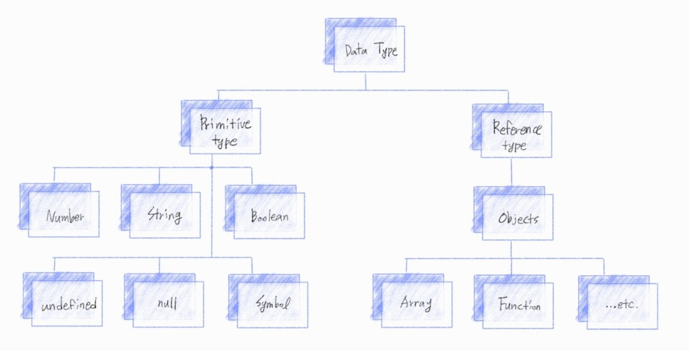

###### 210429_thu

##### ECMAScript6

###### 오늘의 목차 :tada:

### 타입과 연산자

- 데이터 타입
- 연산자

##### :zap: 빠르게 넘어갑시다!!!

 

# 1. 타입과 연산자

## 1.1 데이터 타입 (Data Type)

### 종류

- Javascript의 모든 값은 특정한 데이터 타입을 가진다
- 크게 원시타입과 참조타입으로 분류된다

|         원시 타입 (Primitive type)          |          참조 타입 (Reference type)           |
| :-----------------------------------------: | :-------------------------------------------: |
|      **객체(object)가 아닌** 기본 타입      |        **객체(object) 타입**의 자료형         |
|      변수에 **해당 타입의 값**이 담김       | 변수에 해당 **객체의 참조 값**(주소값)이 담김 |
| 다른 변수에 복사할 때 **실제 값이 복사** 됨 |  다른 변수에 복사할 때 **참조 값이 복사**됨   |

 

### 원시 타입 (Primitive type)

- **숫자 (Number) 타입**
- **문자열 (String) 타입**
- **undefined**
- **null**
- **불리언 (Boolean) 타입**

### 참조 타입 (Reference type)

- 함수 (Functions)

- 배열 (Arrays)

- 객체 (Objects)

 

 

## 1.2 연산자 (Operators)

### 할당 연산자

- 오른쪽에 있는 피연산자의 평가 결과를 왼쪽 피연산자에 할당하는 연산자

### 비교 연산자

- 피연산자들 (숫자, 문자, Boolean 등)을 비교하고, 비교의 결과값을 불리언으로 반환하는 연산자

### 동등 비교 연산자(==)

- 두 피연산자가 같은 값으로 평가죄는지 비교 후 불리언 값을 반환
- 암묵적 타입 변환을 통해 타입을 일치시킨 후 같은 값인지 비교

### 일치 비교 연산자 (===)

- 두 피연산자가 같은 값으로 평가되는지 비교 후 불리언 값을 반환
- **엄격한 비교**가 이뤄지며, 암묵적 타입 변환이 발생하지 않음
  - 엄격한 비교 : 두 비교 대상의 타입과 갑 모두 같은지 비교하는 방식

### 논리 연산자

- 세 가지 논리 연산자로 구성
  - and 연산 : &&
  - or 연산 : ||
  - not 연산 :  !

### 삼항 연산자 (Ternary Operator)

- 세 개의 피연산자를 사용하여 조건에 따라 값을 반환하는 연산자