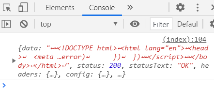
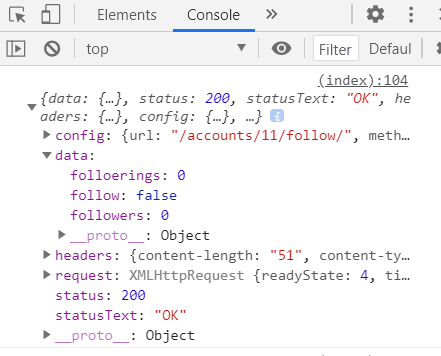

###### 210504_tue

##### JavaScript Advanced

<hr>


###### 오늘의 목차 :swimmer:

### JavaScript Application

- Like
- Follow

##### :icecream: 드디어 바꾸고 싶던 것!!

<hr>
<br>


## 오늘 하려고 하는 것

- 이전 django에서는 뭔가 동작을 하면 페이지가 reload 됐습니다

  ##### 이때의 문제점 :fire:

  - 내가 어떤 글에 **좋아요**를 누른다면 페이지가 reload돼어 **index 페이지의 처음 위치를 보여줍니다**

  ##### 하고싶은 것 :watermelon:

  - 버튼을 눌러도 제자리에 있고 싶습니다!!!

###### 페이지의 일부분만 reload!! 이젠 할 수 있습니다 :raised_hands: 

<br>

# 1. Like :two_hearts:


<br>

<br>

# 2. Follow :couple_with_heart:

#### 기본 설정

- 가상환경

```shell
$ python -m venv venv
$ source venv/Scripts/activate
```

- 프로그램 설치

```shell
$ pip install -r requirements.txt
```

- migrate

```shell
$ python manage.py migrate
```

- 임의의 데이터 삽입

```shell
$ python manage.py seed articles --number=15
```

- 서버 확인

```shell
$ python manage.py runserver
```

<br>

### :heavy_check_mark: 해야할 것

1. 페이지 - accounts/profile.html
   - 팔로우 버튼을 누르면 새로고침이 일어나지 않는고
   - 버튼이 토글된다
   - 팔로워, 팔로잉 수가 변경된다
2. 서버 - accounts/views.py - follow
   - 팔로우 버튼 종류에대한 정보를 객체로 전달한다
   - 팔로워, 팔로잉 수 정보를 객체로 전달한다
     - 기존에는 profile에서 보내는 person정보를 활용
     - 이를 follow에서 넘겨주는 데이터로 대체해야한다

<br>

<br>

#### 기본 수정

> JavaScript를 사용할 수 있도록 하자!

- crud/templates/**base.html**
  - script를 위한 block를 추가하자
  - JavaScript CDN을 가져오자

```html
<body>
  ...
  <script src="https://cdn.jsdelivr.net/npm/axios/dist/axios.min.js"></script>
  
  
</body>
```

<br>

### 페이지 수정

> 버튼을 누르면 서버로 요청을 보내도록 만들어보자

- **form 태그에 이벤트리스너 설정**
  1. form tag를 선택한다
     - class를 follow-form으로 지정한다
  2. 요청에 필요한 URL & csrf-token을 저장한다
  3. submit 이벤트가 발생하면 요청을 보낸다
  4. 이때 기존 form의 동작은 제거한다

```html


  <div>
    <div>
      팔로잉 : {{ followings|length }} / 팔로워 : {{ followers|length }}
    </div>
    
      <div>
        <!-- form 수정 -->
        <form class="follow-form" data-user-id="{{person.pk}}">
          
          
            <button>언팔로우</button>
          
            <button>팔로우</button>
          
        </form>
      </div>
    
  </div>


```

```html

<script>
  const followForm = document.querySelector('.follow-form')
  const userId = followForm.dataset.userId
  
  const URL = `accounts/${userId}/follow/`

  followForm.addEventListener('submit', (event)=>{
    event.preventDefault()
    console.log(event)
  })

</script>

```

<br>

- event 발생 시  **axios로 요청 보내기**
  - POST 요청 & csrf token 필요
  - 응답을 정상적으로 받는 경우 => then
    - 이 경우 받아온 응답을 가지고 follow를 변경해줄 것!
  - 응답을 받지 못하는 경우 => catch
    - error 출력

```javascript
  followForm.addEventListener('submit', (event)=>{
    event.preventDefault()
    axios({
      method: 'POST',
      url: URL,
      headers: {
        'X-CSRFToken': csrfToken
      }
    })
      .then((response)=>{
        console.log(response)
      })
      .catch((error)=>{
        console.log(error)
      })
  })
```

- **console.log(response)**를 확인하면??

  - HTML 문서를 받아오고 있습니다!
  - 이는 서버에서 profile로 redirect하고, 이로인해 profile에서 html을 rendering하고 있기 때문!!!!
  - 우리가 필요한 데이터만 객체로 받아올 필요가 있습니다!

  

<br>

<br>

### 서버 수정

> 필요한 데이터만 객체로 전달해봅시다

- 필요한 정보
  - 팔로우를 누른건지, 팔로우 취소를 누른건지
  - 그래서 팔로우, 팔로잉 수가 어떻게 변했는지

- accounts/views.py - **follow**
  - 팔로우 유무
    - False면 Follow 취소, True이면 Follow를 한 것으로 표시합니다
  - 팔로워/팔로잉
    - 함수에서 각각의 정보를 찾은 뒤, 객체로 전달해주겠습니다

```python
from django.http import JsonResponse

@require_POST
def follow(request, user_pk):
    context = {}
    if request.user.is_authenticated:
        # 팔로우 받는 사람
        you = get_object_or_404(get_user_model(), pk=user_pk)
        me = request.user

        # 나 자신은 팔로우 할 수 없다.
        if you != me:
            if you.followers.filter(pk=me.pk).exists():
                # 팔로우 끊음
                you.followers.remove(me)
                context['follow'] = False
            else:
                # 팔로우 신청
                you.followers.add(me)
                context['follow'] = True
                
            # 팔로워, 팔로잉 수
            context['followers'] = you.followers.count()
            context['folloerings'] = you.followings.count()

    return JsonResponse(context)  # 데이터 전달
```

- **console.log(response)**

  - 이렇게 데이터가 객체 형태로 들어오는 것을 확인할 수 있습니다!!

  

<br>

<br>

### 페이지 수정

> 버튼을 토글하고 팔로우 수 변경을 반영시켜봅시다

- 버튼 토글
  - 팔로우 버튼을 선택합니다
    - 팔로우와 팔로우취소 버튼 중 하나가 나타나므로, 2개의 id를 통일시켜 사용합니다
- 팔로워, 팔로잉 수 변경
  - 각각을 span 태그를 넣어
  - innerText를 사용해 정보를 넣어줍니다

```javascript
 followForm.addEventListener('submit', (event)=>{
    event.preventDefault()
    axios({
      method: 'POST',
      url: URL,
      headers: {
        'X-CSRFToken': csrfToken
      }
    })
      .then((response)=>{
        const { follow, followers, followings } = response.data
        const followButton = document.querySelector('#follow-btn')
        const followingsCount = document.querySelector('#followings-count')
        const followersCount = document.querySelector('#followers-count')
        followingsCount.innerText = followings
        followersCount.innerText = followers

        if (follow) {
          followButton.innerText = '언팔로우'
        }else {
          followButton.innerText = '팔로우'
        }
      })
      .catch((error)=>{
        console.log(error)
      })
  })
```

<br>

<br>

#### 다 한 줄 알았는데...

- 내 프로필로 이동하면 **dataset**이 없다는 에러메세지가..?
- 내 프로필에서는 form이 보이지 않기 때문입니다!!!
- 이건...어떤 방식으로 해결하는게 좋을까??

#### 교수님 답변 :man_teacher:

1. 스크립트 자체를 같지 않은 경우에만 수행되도록 한다

```html

<script>
...
</script>

```

2. **sessionid**에서 **user정보를 받아오는 방법**이 django에 있을 것!!
   - 이는 필요하다면 찾아보자

<br>