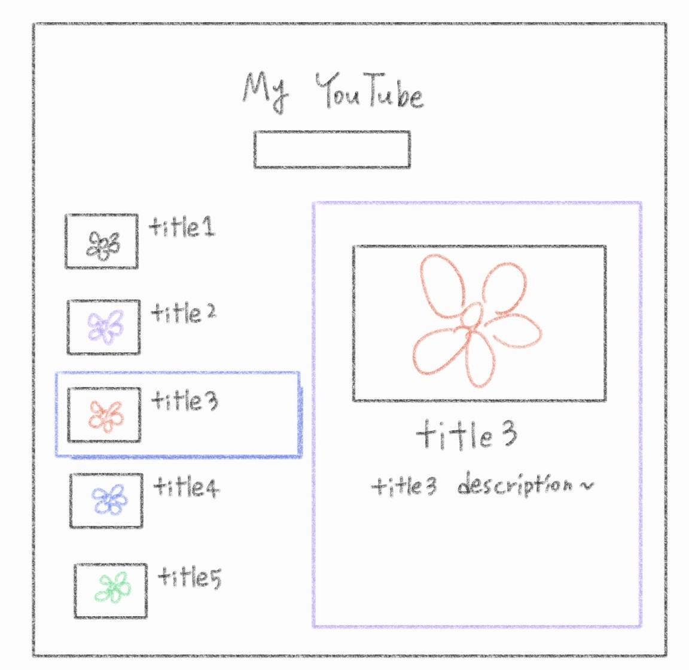
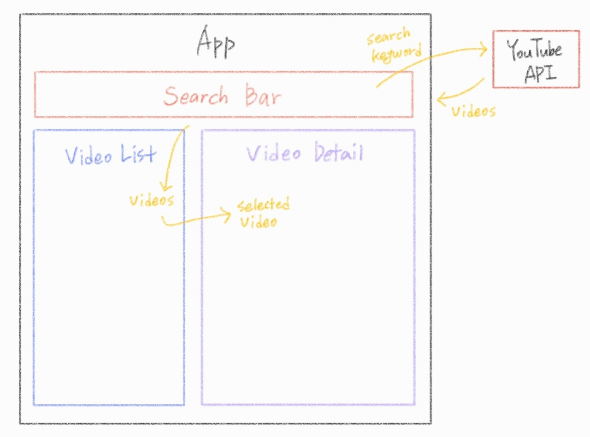

###### 210511_tue

##### Vue

<hr>


###### 오늘의 주제 :vertical_traffic_light:

### Create My YouTube App

- Component를 나눠 기능별로 화면을 구성하자
- YouTube API로 데이터를!!!
- UX를 고려한 추가적인 스타일링??

##### :car: Vue 배운걸 활용해보자!

<hr>


<br>

# 1. 구성

### 화면 구성



- 제목
- 검색창
- 동영상 재생부분 (영상 디테일)
  - 영상
  - 제목, 설명
  - 구분갈 수 있게 네모칸
- 영상 리스트
  - 왼쪽에 배치
  - 영상 선택하면 커서, 그림자
  - 선택한 경우 네모칸으로 선택표시?? (클래스 없애고 만들고 하면 될 듯?? 이건 생각좀..)

### Component 구성

> 각각 파일을 만들어둔 뒤, 에러가 발생하지 않도록 template에 div로 뭐라도 적어두자!

- **App.vue**
  - 전체 화면
- **SearchBar.vue**
  - 검색창
- **VideoDetail.vue**
  - 영상 재생
- **VideoList.vue**
  - 검색한 영상 리스트
- **VideoListItem.vue**
  - 영상 리스트를 이루는 요소 하나하나

<br>

<br>

# 2. 구현

### 프로젝트 생성

```shell
$ vue create se-youtube
$ code se-youtube
```

:heavy_plus_sign: **절대경로 자동완성** (필요한 경우 추가)

- 프로젝트 최상단에 `jsconfig.json`생성
- 아래 코드 붙여넣기 (`@/`를 `./src/`로 지정한다는 의미)

```json
{
  "compilerOptions": {
    "baseUrl": ".",
    "paths": {
      "@/*": ["./src/*"]
    }
  }
}
```

<br>

### component 등록

- **App.vue**
  - SearchBar, VideoDetail, VideoList

```vue
<template>
  <div id="app">
    <h1>My YouTube</h1>
    <!-- 3. 사용 -->
    <!-- <search-bar /> 이런 형태도 잘 된다는 것! -->
    <search-bar />
    <SearchBar />
    <VideoDetail />
    <VideoList />
  </div>
</template>

<script>
// 1. 불러오기
import SearchBar from './components/SearchBar.vue'
import VideoDetail from './components/VideoDetail.vue'
import VideoList from './components/VideoList.vue'

export default {
  name: 'App',
  // 2. 등록
  components: {
    SearchBar,
    VideoDetail,
    VideoList,
  }
}
</script>
```


- **VideoList**
  - VideoListItem

```vue
<template>
  <div>
    <VideoListItem  />
  </div>
</template>

<script>
import VideoListItem from './VideoListItem.vue'

export default {
  components: {
    VideoListItem,
  },
}
</script>
```


<br>

## 2.1. Template 구성하기

> 페이지를 만들때는 눈에 보이는 화면 (template) 구성을 먼저 작성하는 걸 추천합니다!!!
>
> 뭐가 보이는지를 알아야 어떤 데이터를 추가할 지 명확히 알 수 있겠죠??

### SearchBar

- 검색창에 해당하는 input을 추가합니다

```vue
<template>
  <div>
    <input type="text">
  </div>
</template>
```


### VideoDetail

- 영상, 그 아래 영상 제목, 제목아래 세부 설명

```vue
<template>
  <div>
    <h2>영상 자리</h2>
    <div>
      <h3>video title</h3>
      <p>video description</p>
    </div>
  </div>
</template>
```


### VideoList

- ul태그 아래 여러개의 ListItem이 존재합니다
- 이를 위해 v-for로 각각을 받아줍니다!
- 동일한 ListItem이 여러개면 구분이 어려우므로, 구분할 수 있도록 **반드시 key**를 잘아줍니다(unique한 값!!!)

```vue
<template>
  <div>
    <ul>
      <VideoListItem  v-for="video in ['v1', 'v2', 'v3']" :key="video"/>
    </ul>
  </div>
</template>
```


### VideoListItem

- 각각을 li 태그로 구성합니다
- 영상이 썸네일(thumbnail)과 제목을 보여줍니다

```vue
<template>
  <div>
    <li>
      
      <span>title</span>
    </li>
  </div>
</template>
```

<br>

<br>

## 2.2. 데이터 가져오기

> 어디에 어떤 데이터가 필요한지 명확히 정해야 적절한 위치에 선언할 수 있습니다!
>
> :fire: **두개 이상의 component에서 사용하는 데이터라면??**:fire:
>
> - 두 component의 :family_woman_girl_girl:**공통 부모**에 선언합니다 
>
>   - 형제라면 공통부모에, 부모-자식이라면 부모의 부모에!!!
>
>   (두 component를 아우르는 곳에 넣기)

### 구성



- SearchBar에서 입력된 searchKeyword로 YouTube API에 데이터 요청
- API로부터 검색 결과로 videos 받음
- videos를 VideoList에 뿌려줌
- 이 중 선택된 selectedVideo를 VideoDetail에 뿌려줌

#### 데이터의 선언 위치는??? :thinking:

- **videos** & **selectedVideo**
  - searchKeyword로부터 생성되어 `VideoList`에 뿌려진다
  - videos의 일부인 selectedVideo는 `VideoDetail`에 사용된다
  - 여러 component에서 필요한 데이터 이므로, 공통 부모인 **App**에 선언한다
- **searchKeyword**
  - `SearchBar`에서 사용되지만, API로 전달되어 `videos를 변경하는 역할`을 한다
  - App에 선언된 videos는 App에서만 변경할 수 있으므로, `App`에서 searchKeyword를 활용해 API에 요청을 보낸다
  - 따라서 **App**에 선언된다

<br>

#### App.vue

- 필요한 data를 선언합니다
- :star: **함수의 반환값**으로 지정합니다!! (다른 component에서 참조할 수 없도록 하기 위함!)

```vue
<script>
...

export default {
  ...
  data () {
    return {
      searchKeyword: '',
      videos: [],
      selectedVideo: null,
    }
  },
}
</script>
```

<br>

<br>

### 2.2.1. searchKeyword :old_key:

> SearchBar에서 검색어를 입력하면, 이벤트를 통해 이를 App에 전달한 뒤
>
> YouTube API로 데이터를 받아와야합니다!

- **SearchBar**

  - 검색어를 입력하면 `change`이벤트가 발생, `onChange`메서드를 수행합니다

    :heavy_check_mark:`change event`

    - input event와 달리 value가 변할 때 항상 발생하지 않습니다

    - element에 따라 동작이 달라집니다

    - `input type="text"` 

      value가 변경된 후 포커스를 잃었지만(커서가 검색창을 벗어나거나 엔터를 치는 등) commit되지 않은 경우~~(저장?전달?)~~에 발생

  - onChange에서는 emit을 통해 부모 컴포넌트로 이벤트의 발생을 알립니다(키워드도 전달)

    :heavy_check_mark: `emit`('부모가 알아들을 이벤트 이름', payload)

    - 이벤트 이름은 kabab-case로 작성!!!
    - payload : 추가 데이터, 여러개를 보낼 수 있음(받을 때 순서대로만 받아주자)
  
  ###### template
  
  ```vue
  <template>
    <div>
      <input 
        type="text" 
        @change="onChange"
      >
    </div>
  </template>
  ```
  
  ###### script
  
  ```vue
  <script>
  export default {
    methods: {
      onChange (event) {
        this.$emit('input-change', event.target.value)
      },
    },
  }
  </script>
  ```

- **App.vue**
  
  - `input-change` 이벤트를 인지하면, `onInputChange` 메서드를 실행합니다
  - `onInputChange`
    - 인자로 event.target.value를 inputValue라는 이름으로 받습니다 (이름은 설정하기 나름! 도중에 바꾸지만 않으면 OK)
    - searchKeyword에 inputValue 대입
    - `getVideos()`를 실행합니다 (videos)
  
  ###### template
  
  ```vue
  <template>
    <div id="app">
      ...
      <SearchBar @input-change="onInputChange"/>
      ...
    </div>
  </template>
  ```
  
  ###### script
  
  ```vue
  <script>
  ...
  
  export default {
    ...
    methods: {
      onInputChange (inputValue) {
        this.searchKeyword = inputValue
        this.getVideos()
      },
    },
  }
  </script>
  ```

<br>

### 2.2.2. videos

> API로부터 받은 데이터를 App에서 내려받은 뒤, 이를 하나하나 VideoListItem에 뿌려줍니다!
>
> VideoListItem에서 필요한 데이터를 저장해줘야겠죠??

<br>

#### YouTube API 데이터 받아오기

> App.vue에서 searchKeyword를 query로 하여 API에 요청을 보내고, 응답으로 영상 데이터를 받아옵니다!
>
> 요청과 응답... **axios**가 필요하겠죠???

- axios 설치

```shell
$ npm i axios
```


- App.vue - **getVideos()**

  - axios를 사용해 요청을 보내고 응답을 받습니다

    :heavy_check_mark: **YouTube API**에 **search 요청** 보내기

    - API_URL = '~/youtube/v3/`search`' (요청 종류에 따라 변화)

    - parameter

      `key` : 발급받은 API 키

      `part` : 세부 내용 포함을 위한 부분, id와 snippet 중 snippet을 사용해야함

      `type`: 해당 타입의 결과만 가져옵니다! 우리는 video

      `maxResults` : 가져올 영상 개수를 택할 수 있습니다! default는 5개

      `q` : 검색어! searchKeyword가 들어가야할 부분!

  ###### script

  ```vue
  <script>
  import axios from 'axios'
  ...
  
  const API_URL = 'https://www.googleapis.com/youtube/v3/search'
  const API_KEY = '나의 API Key'
  
  export default {
    ...
    methods: {
      ...
      getVideos () {
        // 필요한 parameter
        const params = {
          key: API_KEY,
          part: 'snippet',
          type: 'video',
          maxResults: 10,
          q: this.searchKeyword,
        }
        //axios 요청
        axios({
          method: 'GET',
          url: API_URL,
          params,
        })
          //call back함수는 arrow function으로!!
          .then((response)=>{
            console.log(response)
          })
          .catch((error)=>{
            console.log(error)
          })
      },
    },
  }
  </script>
  ```

  

  - 응답을 제대로 받았다!!!
    - 그러면 videos에 저장하고, 이를 VideoList로 내려줍니다!! (data binding)
    - 필요한 데이터는 response의 data아래 items에 있습니다

  ###### script

  ```vue
  <script>
  ...
  
  export default {
    ...
    methods: {
      ...
      getVideos () {
        const params = {
          ...
        }
        axios({
          ...
        })
          .then((response)=>{
            this.videos = response.data.items
          })
          ...
      },
    },
  }
  </script>
  ```

  ###### template

  ```vue
  <template>
    <div id="app">
      ...
      <VideoList :videos="videos"/>
    </div>
  </template>
  ```

<br>

- **VideoList**

  - `props`로 videos를 받아줍니다!
  - VideoListItem으로 videos 데이터를 하나씩 전달합니다
    - v-for="video in videos" : v-for을 이용해 video로 하나씩 분리
    - key : unigue한 값인 video.id.videoId 사용
    - video 데이터 넘겨주기

  ###### script

  ```vue
  <script>
  ...
  export default {
    props: {
      videos: {
        tyep: Array,
      },
    },
    ...
  }
  </script>
  ```

  ###### template

  ```vue
  <template>
    <div>
      <ul>
        <VideoListItem  
          v-for="video in videos" 
          :key="video.id.videoId"
          :video="video"
        />
      </ul>
    </div>
  </template>
  ```

<br>

- **VideoListItem**

  - props를 통해 video를 받아옵니다
  - video 정보를 출력합니다
    - thumnail : video.snippet.thumbnails.medium.url (height 180, width 320)
    - title : video.snippet.title

  ###### script

  ```vue
  <script>
  export default {
    props: {
      video: {
        type: Object,
      },
    },
  }
  </script>
  ```

  ###### template

  ```vue
  <template>
    <div>
      <li>
        
        <span>{{ video.snippet.title }}</span>
      </li>
    </div>
  </template>
  ```

  ##### :fire: template가 더 깔끔했으면 좋겠다구여???

  - `computed`
    - component에 존재하는 모든 값에 대해 무언가 계산된 값을 만들 때 사용 가능! (변경이 일어난 경우 발생)
    - url과 title을 return해줘서 간단하게 써봅시다

  ###### script

  ```vue
  <script>
  export default {
    ...
    computed: {
      thumbnailUrl () {
        return this.video.snippet.thumbnails.medium.url
      },
      title () {
        return this.video.snippet.title
      },
    },
  }
  </script>
  ```

  

  ###### template

  ```vue
  <template>
    <div>
      <li>
        
        <span>{{ title }}</span>
      </li>
    </div>
  </template>
  ```

<br>

### 2.2.3. selectedVideo

> VIdeoListItem을 하나 선택하면, 정보가 selectedVideo에 담겨 전달되며 VideoDetail에 영상과 세부정보가 보여집니다
>
> selectedVideo는 App에 선언되어있습니다!!!
>
> App까지 이벤트 발생을 알리며 데이터를 전달한 뒤, App에서 selectedVideo를 수정하여 VideoDetail에 내려줘야합니다!

- **VideoListItem**

  - video에 `click`이벤트가 발생하면 `onClick`메서드를 수행합니다
  - `emit`
    - 이벤트 발생을 VideoList에 알리고, 선택된 video를 전달합니다

  ###### template

  ```vue
  <template>
    <div>
      <li @click="onClick">
        ...
      </li>
    </div>
  </template>
  ```

  ###### script

  ```vue
  <script>
  export default {
    ...
    methods: {
      onClick () {
        this.$emit('select-video', this.video)
      },
    },
  }
  </script>
  ```

- **VideoList**
  - `select-video`이벤트가 발생하면 `onSelectVideo` 메서드를 수행합니다
  - `emit`
    - 이벤트 발생을 App에 알리고, video를 전달합니다

  ###### template

  ```vue
  <template>
    <div>
      <ul>
        <VideoListItem 
          ...
          @select-video="onSelectVideo"
        />
      </ul>
    </div>
  </template>
  ```

  ###### script

  ```vue
  <script>
  ...
  
  export default {
    ...
    methods: {
      onSelectVideo (video) {
        this.$emit('select-video', video)
      },
    },
  }
  </script>
  ```

- **App.vue**
  
  - VideoList에서 `select-video`를 감지하면 `onSelectVideo`메서드를 수행합니다
  - `onSelectVideo`
    - 선택된 비디오 정보를 VIdeoDetail로 전달해줘야한다!!!
  
    - **selectedVideo**에 담아 전달합니다
  
  ###### template
  
  ```vue
  <template>
    <div id="app">
      ...
      <VideoDetail :video="selectedVideo"/>
      <VideoList 
      :videos="videos"
      @select-video="onSelectVideo"
      />
    </div>
  </template>
  ```
  
  
  
  ###### script
  
  ```vue
  <script>
  ...
  export default {
    ...
    data () {
      return {
        ...
        selectedVideo: null,
      }
    },
    methods: {
      ...
      onSelectVideo (video) {
        this.selectedVideo = video
      },
    },
  }
  </script>
  ```
  
  

- **VideoDetail**

  - `props`
    - App.vue로부터 video 데이터를 받아옵니다!
    - title, description을 출력합니다

  ###### script

  ```vue
  <script>
  export default {
    props: {
      video: {
        type: Object,
      },
    },
  }
  </script>
  ```

  

  ###### template

  ```vue
  <template>
    <div>
      <h2>영상 자리</h2>
      <div>
        <h3>{{ video.snippet.title }}</h3>
        <p>{{ video.snippet.description }}</p>
      </div>
    </div>
  </template>
  ```

  ##### :fire: 만약 선택된 비디오가 없다면...????

  - console을 확인하면, 처음에는 비디오를 선택하지 않아 데이터가 없기 때문에
  - 제목과 설명을 띄우는데, 에러가 발생합니다!!!

  ##### :four_leaf_clover: 해결법 2가지

  1. `computed`사용
     - title, description을 만듭니다
     - video데이터가 없으면 비디오를 선택해달라는 메세지를 출력합니다
     - video 데이터가 있다면, title과 description을 출력합니다

  ###### script

  ```vue
  <script>
  export default {
    ...
    computed: {
      title () {
        if (this.video == null) {
          return '어떤 비디오가 좋은가요?'
        }else {
          return this.video.snippet.title
        }
      },
      description () {
        if (this.video == null) {
          return '보고싶은 비디오를 선택해주세요:D'
        }else {
          return this.video.snippet.description
        }
      },
    },
  }
  </script>
  ```

  

  ###### template

  ```vue
  <template>
    <div>
      <h2>영상 자리</h2>
      <div>
        <h3>{{ title }}</h3>
        <p>{{ description }}</p>
      </div>
    </div>
  </template>
  ```

  

  2. `v-if`사용 :heavy_check_mark: 택
     - title과 description을 감싸는 div 태그에 v-if를 추가합니다
     - 데이터가 있어 true가 되는 경우에만 데이터를 출력합니다

  ###### template

  ```vue
  <template>
    <div v-if="video">
      <h2>영상 자리</h2>
      <div>
        <h3>{{ video.snippet.title }}</h3>
        <p>{{ video.snippet.description }}</p>
      </div>
    </div>
  </template>
  ```

  ###### script

  ```vue
  <script>
  export default {
    props: {
      video: {
        type: Object,
      },
    },
  }
  </script>
  ```

  

### 2.2.4 video삽입하기

> 비디오를 선택했을 때, 해당 영상을 재생시킬 수 있도록 보여주고 싶다!!!!
>
> 아주아주 쉽게 할 수 있습니다!!!

##### VideoDetail

- `iframe`
  - YouTube 접속 - 아무 영상이나 클릭
  - [공유] - [퍼가기]
  - iframe 복사, 원하는 위치에 붙여넣기
  - **src부분**만 모든 영상이 가능하도록 수정하면 됩니다
    - 구조 : `https://www.youtube.com/embed/` + `video.id`

- `videoUrl`
  - 가져온 영상의 src 구조
  - **computed**를 사용합니다
  - BaseUrl을 두고, 여기에 video.id를 붙여서 반환합니다

###### script

```vue
<script>
export default {
  props: {
    video: {
      type: Object,
    },
  },
  computed: {
    videoUrl () {
      const baseUrl = "https://www.youtube.com/embed/"
      return baseUrl + this.video.id.videoId
    },
  },
}
</script>
```

###### template

```vue
<template>
  <div v-if="video">
    <iframe 
      width="560" 
      height="315" 
      :src="videoUrl"
      title="YouTube video player" 
      frameborder="0" 
      allow="accelerometer; autoplay; clipboard-write; encrypted-media; gyroscope; picture-in-picture" 
      allowfullscreen
    ></iframe>
    ...
  </div>
</template>
```

<br>

<br>

# 3. 추가사항

