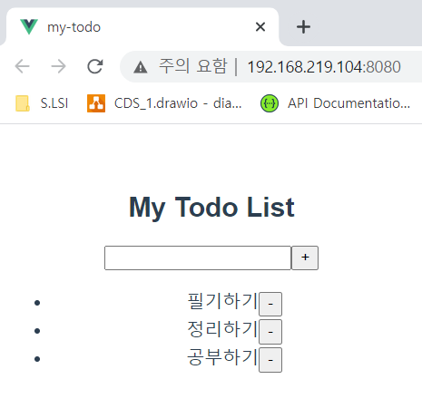

###### 210513_thu

##### Vue & Vuex

<hr>


###### 오늘의 주제 :gift:

### Create ToDo

- Vue CLI로 ToDo 페이지를 만들어보자
- Vuex를 적용해서 수정해보자

##### :birthday: Vue로 구성할 수 있는게 일단 중요!!! 나중을 위해 Vuex도 익혀보자

<hr>


<br>

# 1. 구성

### 화면 구성

- 제목
- 입력창
- 입력한 todolist
- 각 todolist
  - 삭제버튼
  - 누르면 완료표시(취소선)

### Component 구성

> 가장 먼저 구조를 나누고, 필요한 component를 구성합시다

- **App.vue**
  - 전체 화면
- **TodoForm**
  - todo 입력하는 form 부분
- **TodoList**
  - 모든 todo 리스트
- **TodoListItem**
  - 각 todo요소

<br>

# 2. 구현

> 우선은 나중을 위해서 vuex도 만들어두고 갑시다!!!

### 프로젝트 생성

```shell
$ vue create my-todo
$ code my-todo/
```

- vuex 추가

```shell
$ vue add vuex
```

- 절대경로 자동완성 
  - 프로젝트 최상단에 `jsconfig.json`생성

```json
{
  "compilerOptions": {
    "baseUrl": ".",
    "paths": {
      "@/*": ["./src/*"]
    }
  }
}
```

- 서버 켜기

```shell
$ npm run serve
```

<br>

### component 등록

- **App.vue**
  - TodoForm, TodoList

```vue
<template>
  <div id="app">
    <h2>My Todo List</h2>
    <TodoForm />
    <TodoList />
  </div>
</template>

<script>
import TodoForm from '@/components/TodoForm.vue'
import TodoList from '@/components/TodoList.vue'

export default {
  name: 'App',
  components: {
    TodoForm,
    TodoList,
  },
}
</script>
```


- **TodoList**
  - TodoListItem

```vue
<template>
  <div>
    <TodoListItem />
  </div>
</template>

<script>
import TodoListItem from '@/components/TodoListItem.vue'

export default {
  components: {
    TodoListItem,
  },
}
</script>
```


<br>

##### 우선 vue로 구현해볼까요~ :musical_note:

## 2.1. Template 구성하기

> 눈에 보이는 부분!! 뭐가 필요한지 파악하고 추가해봅시다

### TodoForm

- Form 태그를 사용합니다
- input, button도 추가합니다

```vue
<template>
  <div>
    <form>
      <input type="text">
      <button>+</button>
    </form>
  </div>
</template>
```


### TodoList

- ul태그 아래 TodoListItem이 존재합니다
- 여러번 가져와야하므로 v-for를 사용합니다! (일단은 임으로 여러 값을 넣어봅시다)

```vue
<template>
  <div>
    <ul>
      <TodoListItem 
        v-for="todo in ['td1', 'td2', 'td3']" 
        :key="todo"
      />
    </ul>
  </div>
</template>
```


### TodoListItem

- 각각이 li 태그로 되어있습니다
- Todo가 있고, 그 옆에 취소 버튼을 넣어줍니다

```vue
<template>
  <div>
    <li>
      <span>TodoItem</span>
      <button>-</button>
    </li>
  </div>
</template>
```

<br>

<br>

## 2.2. Data 구성하기

> 무슨 데이터가 필요할까요?? 어떤 데이터를 어디에 정의해볼까요??

### 구성

- **todos**
  - 작성한 todo list에 해당하는 배열!!
  - `TodoForm`에서 작성한 뒤, `TodoList`에 뿌려줘야한다!
  - 따라서 **App**에 선언하자

<br>

#### App.vue

- todos 선언!
- 함수의 반환값으로 지정하자!!
- 초기값도 넣어주자

```vue
<script>
...
export default {
  ...
  data () {
    return {
      todos: [
        {
          id: 1,
          content: '필기하기',
          completed: false,
        },
        {
          id: 2,
          content: '정리하기',
          completed: false,
        },
      ],
    }
  },
}
</script>
```

<br>

### 2.2.1 todos :page_with_curl:

> TodoFrom에서 작성하면, 이를 App에 전달합니다
>
> 그 뒤, 이를 VideoList에 뿌려줘야합니다

#### TodoForm

- form에서 `submit`이벤트가 발생하면, `onSubmit`메서드를 수행합니다

  :heavy_check_mark: form의 기존 이벤트 막는 2가지 방법

  ```js
  //메서드 내부에
  event.preventDefault()
  ```

  ```js
  //template의 이벤트 발생과 함께
  @submit.prevent
  ```

- `onSubmit`

  - **emit**을 통해 부모 component에 이벤트의 발생을 알립니다
  - payload로 **input value를 전달**해야합니다

  :fire: **input value는 어떻게 가져오지??** :fire:
  > :point_up: ​ input value에 event를 다는 경우 (ex. keyup.enter)
  >
  > => event.target.value로 가져올 수 있음
  >
  > :v: **버튼, form을 통해 이벤트 발생**할 경우
  >
  > => 내부 input 데이터를 활용하고, component 내의 data에도 작성해야한다
  >
  > => 양방향 binding을 위한 :four_leaf_clover: **v-model** 사용

###### template

```vue
<template>
  <div>
    <form @submit.prevent="onSubmit">
      <input type="text" v-model="todoInput">
      <button>+</button>
    </form>
  </div>
</template>
```

###### script

```vue
<script>
export default {
  data () {
    return {
      todoInput: '',
    }
  },
  methods: {
    onSubmit () {
      this.$emit('new-todo', this.todoInput)
      //전달한 뒤 초기화
      this.todoInput = ''
    },
  },
}
</script>
```

<br>

#### App.vue

- TodoForm으로부터 `new-todo`이벤트가 발생하면 `onNewTodo`메서드를 수행합니다

  - 새로운 todo를 생성한 뒤, todos에 추가합니다.

  - todoInput이 빈 경우, 별도의 동작없이 return합니다

    (TodoForm에서 :cherries:v-model.trim()도 방법입니다)

- todos를 TodoList로 전달합니다

###### template

```vue
<template>
  <div id="app">
    <h2>My Todo List</h2>
    <TodoForm @new-todo="onNewTodo"/>
    <TodoList :todos="todos"/>
  </div>
</template>
```

###### script

```vue
<script>
...
export default {
  ...
  methods: {
    onNewTodo (todoInput) {
      // 값이 비어있는경우 패스 
      //(양쪽 공백 제거해도 빈 값인 경우?)
      if (!todoInput.trim()) {
        return
      }
      const newTodo = {
        // unique한 값
        id: Date.now(),  
        content: todoInput,
        completed: false,
      }
      this.todos.push(newTodo)
    },
  },
}
</script>
```

<br>

#### TodoList

- `props`로 `todos`데이터를 받아옵니다!
- TodoListItem에 하나씩 뿌려줍시다!!
  - v-for을 사용해서 todo를 하나씩 전달
  - 각 요소를 구분할 수 있도록 하는 **key**값필수!!! unique한 값인 **todo.id**를 사용합니다
  - binding으로 todo를 넘겨줍니다

###### script

```vue
<script>
...
export default {
  ...
  props: {
    todos: {
      type: Array,
    },
  },
}
</script>
```

###### template

```vue
<template>
  <div>
    <ul>
      <TodoListItem 
        v-for="todo in todos" 
        :key="todo.id"
        :todo="todo"
      />
    </ul>
  </div>
</template>
```

<br>

#### TodoListItem

- `props`를 이용해 `todo`  를 받아옵니다
- todo.content를 출력해줍니다

###### script

```vue
<script>
export default {
  props: {
    todo: {
      type: Object,
    },
  },
}
</script>
```

###### template

```vue
<template>
  <div>
    <li>
      <span>{{ todo.content }}</span>
      <button>-</button>
    </li>
  </div>
</template>
```

<br>

#### 여기까지의 화면!!!

- 데이터 추가까지! 확인했습니다



<br>

<br>

## 2.3. 추가기능! :popcorn:

> TodoList를 삭제하는 기능!
>
> TodoList를 체크해서 완료표시하는 기능!!!

### 완료표시하자

- `complated`
  - true인 경우 완료표시를 해야합니다!!