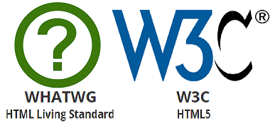

###### 210201_mon

오늘부터는 드디어 web에대해 배우게 됩니다!!!

그 중에서도 HTML와 CSS를 배워보겠습니다

걱정반 기대반...그치만 재밌을 것 같아요:dancer:

# Web

> 이제부터 web에 대한 학습을 시작합니다!!

## why?

> 왜 web을 배우는 것일까요?

- 웹 어플리케이션 개발을 위해
- SW 개발 방법 및 학습 과정 익히기 위해
  - SW의 가장 기본이 되는 근간 이기때문에 web은 아주 훌륭한 학습도구입니다!

## Web의 표준

- W3C(World Wide Web Consortium)
  - 기존에 웹표준을 제작하던 단체
- WHATWG(Web Hypertext Application Technology Working Group)
  - 주류 브라우저 개발업체 Apple, Google, Microsoft, Mozilla
  - W3C가 따라오지 못할 정도로 빠른 웹 개발 속도
  - 승인없이 자체적인 브라우저 기능들을 추가
  - 2019년 웹표준 주도권 싸운에서 승리해 웹의 기준을 제작!!!

## Browser

> 브라우저는 매우 다양한 존재가 있습니다!
>
> 그 중 웹표준을 얼마나 잘 지키느냐에 따라 점수를 나눴는데요
>
> Chrome이 가장 높은 점수라고 합니다@
>
> 더 궁금하면 직접 찾아봅시당

## Can I use

> 이거는 해당 브라우저에서 새로운 기능을 사용할 수 있는지 확인할 수 있는 사이트 라고 합니다!
>
> 초록은 가능, 연두는 일부가능, 레드는 불가 하고 하네요
>
> 이것도 혹시 필요하면 나중에 확인해보길 바라요ㅎㅎ

여기까지는 그냥 본격적인 수업에 앞서 web에 대한 간단한 인트로 였습니다!!

이건 사실 중요한게 아니에여...

이제 본격적으로 HTML을 정리해봅시다아ㅏ!!!

#### 

