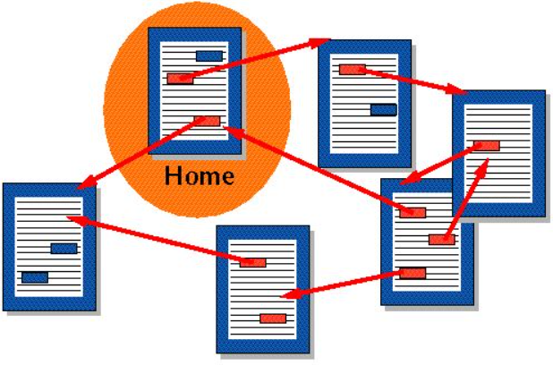
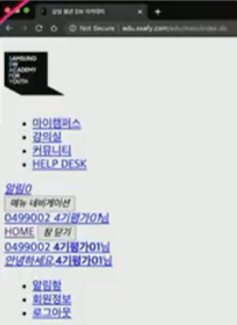
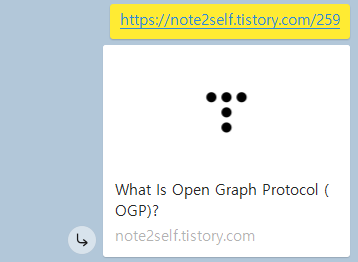
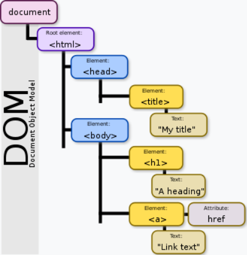
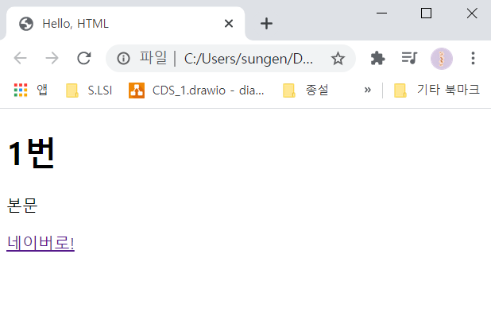

###### 210201_mon

###### #1


이제 진짜로 본격적으로 배운걸 정리해봅시다!!!

아아...나는 정리가 왜이렇게 느린걸까흐규

오늘 배운건 아직 크게 어렵진 않은 것 같은데 익숙하지 않아서 기억이 잘 안나여...

어쨌든 정신 차리고 시작합니다아ㅏ


# HTML

> naver 웹사이트를 생각해보세요! 굉장히 예쁘게 디자인이 되어있죠? 이는 HTML로 이뤄진 웹사이트에 CSS를 입혀 다양한 디자인을 입힌 것입니다! 
>
> HTML로만 이뤄져 있는 웹사이트를 보면 글씨 크기랑 굵기가 다른 정도?? (가끔 에러나면 글씨들만 가득한 그 화면!!!)
>
> 하지만 완벽한 웹사이트를 만들기 위해서는 HTML이 기본이 됩니다! 그래서 지금부터 HTML을 배워보겠습니다.

# 1. Hyper Text Markup Language

- ### Hyper Text

  

  - __참조__(하이퍼링크)를 통해 한 문서에서 __다른 문서로 즉시 이동__할 수 있는 텍스트
  - 동일선상에 있는게 아니라 다중으로 연결된 상태
  - 하이퍼 텍스트가 주요하게 쓰인 기능 : HTML, http


- ### Markup

  - 단순 텍스트를 __구조화하는 과정__
    - 대주제 형성으로 문단의 구조가 잡힘
    - 넘버링까지 더해 대주제, 서브주제를 한눈에 확인 가능

:pencil2: HTML을 사용해 태그들로 문자를 구조화할 수 있고, 이를 markup의 과정 이라고 합니다


- ### Markup language

  - 태그를 이용해 문서나 데이터의 __구조를 명시하는 언어__
  
    ex) h1 tag : 글자 커짐 + 의미론적으로 해당 페이지에서 가장 핵심 주제를 나타냄
  
  - 단순히 데이터를 표현하기만 함
    
    - 프로그래밍 언어처럼 조건을 걸거나 하는 것 불가
    
  - 대표적 : HTML, Markdown


- ### HTML :crossed_swords:

  - 웹 페이지를 작성하기 위한(구조를 잡기위한)언어
  - __웹 컨텐츠의 의미와 구조를 정의__하는데 사용!!
  - .html 파일 형식

스타일 시트인 CSS를 제거하면 다음 처럼 텍스트 정보만 남게 됩니다 :point_right:


# 2. HTML 기본 구조

> HTML의 기본 구조는 다음과 같습니다!
>
> vscode에서 ! + tap을 누르면 자동완성이 되서 매우 편리합니다!

```html
<!DOCTYPE html>
<html lang="ko">----------------{html요소}
<head>			-------------[head요소]
	<meta charset="UTF-8">
	<title>Document</title>
</head>			-------------[head요소]
<body>			-------------(body요소)

</body>			-------------(body요소)
</html>			----------------{html요소}
```

### html요소

- HTML문서의 __최상위 요소(root)__
- head와 body로 구분


### head 요소

- 해당 문서 정보를 담고 있음
  - 문서 제목, 문자코드(인코딩)
- __브라우저에 나타나지 않습니다!__
- CSS선언 or 외부 로딩 파일 지정 등도 작성


### body 요소

- 브라우저 화면에 나타나는 정보
- 웹에 직접 보이는 __실제 내용__에 해당 


###### 이건 head에서 추가적으로 알면 좋은 것!

#### :four_leaf_clover: Plus

#### Open Graph Protocol

> > 메타데이터를 표현하는 새로운 규약
>
> 카톡에 링크를 보내면, 그 아래에 이미지와 타이틀 등이 정리되어 같이 보내지는 걸 본적이 있을 거에요!!
>
> 
>
> 이것은 head 태그의 메타데이터를 분석하여 정리한 결과입니다!
>
> 즉, HTML문서의 메타 데이터를 통해 문서의 정보를 전달한 것이죠!!
>
> 페이스북에서 만든 것으로, 메타정보에 해당하는 제목, 성명등을 쓸 수 있도록 정의한 것입니다.
>
> 어쨌든 메타 데이터를 표현하는 규약 중 하나라고 알고 넘어가면 되겠습니다!


## 2.1 DOM(Document Object Model) 트리

> HTML은 DOM구조를 가집니다!
>
> DOM구조랑 문서를 객체 지향으로 생각한 것이라고 합니다. 알듯 말 듯한데요...! 좀더 특징들을 정리해봅시다.

### 문서 객체 모델(Document Object Model)

- 웹 페이지의 객체 지향 모델로써 __문서의 구조화된 표현(structured representation)을 제공__
  - 문서 내의 모든 요소를 객체(object)로 만들고, 트리구조로 구성한 것
- HTML, XML문서의 __프로그래밍 interface__
  - 프로그래밍 언어가 DOM구조에 접근할 수 있는 방법을 제공하여 문서 구조, 스타일, 내용 들을 변경할 수 있게 도움
- 태그들간의 __부모/자식관계, 형제관계를 가지는 구조__
  - `들여쓰기`로 구분 :star:


#### :male_detective: 아래 DOM구조를 통해 살펴봅시다!

> 웹 페이지는 일종의 __문서(document)__입니다! 이 문서는 웹 브라우저를 통해 내용이 해석되어 웹 브라우저 화면에 나타나거나 HTML소스 자체로 나타나기도 합니다.
>
> document아래에는 문서의 모든 요소(element), 속성(attribute) 들이 트리를 이루고 있습니다.
>
> html의 자식 태그로는 head, body가 있고, 들여쓰기로 구분됩니다.
>
> 또한 body 태그는 h1, ul의 부모태그가 되는 형식입니다.
>
> 이렇게 __태그들 끼리 부모와 자식관계(또는 형제관계)__를 가지는 구조가 DOM구조입니다!!!




### 요소(Element)

- __시작태그, 종료태그__ 그리고 태그 사이에 위치한 __내용__으로 구성
  - 태그(element, 요소)는 컨텐츠(내용)감싸서 일반적인 __정보에 성격과 의미 부여__
- 내용이 없는 태그도 존재
  - 닫는 태그 없음
  - br(줄바꿈), hr(구분선), img(이미지첨부), input(외부입력), link(외부파일과 연결), meta(인코딩정보)
- 요소는 중첩(nested)될 수 있음
  - 이러한 __중첩__(여러 요소들의 집합)으로 __하나의 문서 완성__
  - 열고 닫는 __태그의 쌍__ 맞는지 확인 필수!!
  - HTML은 오류가 발생하지 않고 레이아웃이 깨짐! 따라서 디버깅이 어렵기 때문에 꼼꼼한 확인 필수!


### 속성(Attribute)

- 속성(Attribute)은 __태그의 부가적인 정보__가 들어옴
- __요소는 속성을 가질 수 있__으며, 요소에 추가적인 정보(이미지 파일의 경로, 크기 등)를 제공
  - 태그(요소)별로 사용할 수 있는 속성이 모두 다름
- 요소의 __시작태그에 위치__함
- __이름과 값의 쌍__을 이룸

```html
<!---a의 속성 예시--->
<a href="https://www.naver.com">네이버로 이동!!</a>
  속성명="값" --> 공백없이 =""를 바로사용!!! (스타일 가이드)
```

- html global attribute : 태그와 상관없이 사용 가능한 속성
  - 어떤 태그에는 아무런 효과가 없을수도 있음
  - 대표적 : class


## 2.2 HTML 기본 구조 작성하기

> 기본구조를 한번 작성해봅시다!!!
>
> 전체 파일은 00_first.html 을 참고하세용 (github에는 안올릴거지만....)

### 기본 구조

```html
<!DOCTYPE html>		<!-- 문서가 HTML임을 명시해줌(doctype 소문자도 상관 없음)-->
<html lang="en">	<!-- 언어지정/스크린리더가 읽는데 도움 주는 키워드-->
<head>				<!-- 보통 head, body는 들여쓰기 NO-->
    <meta charset="UTF-8">	<!-- 인코딩 지정(meta의 속성 작성)-->
    <title>Hello, HTML</title>	<!-- 웹페이지 접속 시, 탭에 적히는 이름-->
</head>
<body>		<!-- 페이지에 보이는 부분-->
    <h1>1번</h1>		<!-- 헤드-->
    <p>본문</p> 	   <!-- 본문-->
    <a href="https://www.naver.com">네이버로!</a>	<!--하이퍼텍스트제공/컨텐츠(네이버로!)작성하면 웹페이지에 링크 나타남-->
</body>
</html>
```

- `Art + b` : 웹페이지 실행
- `Ctrl + r` : 새로고침

- 저장한 뒤 실행한 결과 화면입니다.



- `<div>` 태그
  - __단순히 구역을 나누기 위한 것__으로 의미를 가지지 않음
  - 가장 많이 사용되는 태그 중 하나!
  - CSS로 스타일을 지정하기 전까지 내용이나 레이아웃에 영향을 미치지 않습니다.


# 3. 시맨틱 태그(semantic tag)

> HTML이 웹 컨텐츠의 의미와 구조를 정의하는 데 사용한다고 했죠?? 
>
> 사실 원래는 구조상의 필요에 의해 __div__를 사용했습니다. 그렇지만 의미는 없기 때문에 div의 구조만 봐서는 전체를 이해하긴 어렵습니다!
>
> 그래서 구조적이면서도 의미가 더 명확한 태그들이 만들어졌습니다!! 
>
> 바로바로 HTML5에서 등장한 시맨틱 태그로, __의미론적인 요소를 담은 태그__입니다! 이를 좀더 알아볼까요?

- 브라우저, 검색엔진, 개발자 모두에게 __콘텐츠의 의미를 명확히 설명하는 태그__

### 대표적인 태그

- header : 문서 전체나 섹션의 헤더(머릿말 부분)
- nav : 내비게이션
  - 웹 페이지에서 HOME, FAQ이런 메뉴가 있는 부분을 말합니다.
- aside : 사이드에 위치한 공간, 메인 콘텐츠와 관련성이 적은 콘텐츠
- section : 문서의 일반적인 구분, 컨텐츠의 그룹을 표현
- article : 문서, 페이지, 사이트 안에서 독립적으로 구분되는 영역
- footer : 문서 전체나 섹션의 푸터(마지막 부분)
  - 사이트에서 회사에대한 정보, 연락처가 작성되는 부분

### 장점

- 읽기 쉽다. (개발자)
  - 구역 정도만 확인할 수 있는 div와 달리 개발자가 의도한 요소의 의미가 명확함
  - 코드의 가독성을 높이고 유지보수를 쉽게 함
- 접근성이 좋아진다.(검색엔진 및 보조기술 → 시력장애용 스크린리더 → 더 나은 경험 제공)
  - HTML문서는 html언어 + 사람이 읽을 수 있는 content의 조합으로, 검색엔진은 HTML 코드만 잘 읽음.
  - 따라서 시맨틱 태그를 사용하면, 검색엔진이 내용을 이해하고 해석해서 메인정보와 함께 다양한 세부정보를 전달할 수 있음 (검색엔진의 효율 높임)
  - 스크린 리더의 효율도 올라가 더 나은 사용자 경험 제공 가능

### 시맨틱 태그 정리

- 단순히 구역을 나누는 것 뿐만 아니라 `의미`를 가지는 태그들을 활용하기 위한 노력!
  - div가 가장 많이 쓰일 수 밖에 없지만, 굵직한 요소는 시멘틱을 활용하자는 것!
- Non semantic : div, span
- semantic : table, h1(단순글자 크게뿐 아니라 대제목 의미!)
- 검색엔진최적화(SEO)를 위해 메타태그, 시맨틱 태그 들을 통한 마크업을 효과적으로 할 필요가 있다

##### 시맨틱 웹

- 웹에 존재하는 수많은 웹페이지들에 메타데이터를 부여하여, 기본의 단순한 데이터 집합이었던 웹페이지를 의미와 관련성을 가지는 거대한 데이터 베이스로 구축하고자 하는 발상


그러면 이제 다음으로 넘어가서! 본격적으로 구조를 배워봅시다!