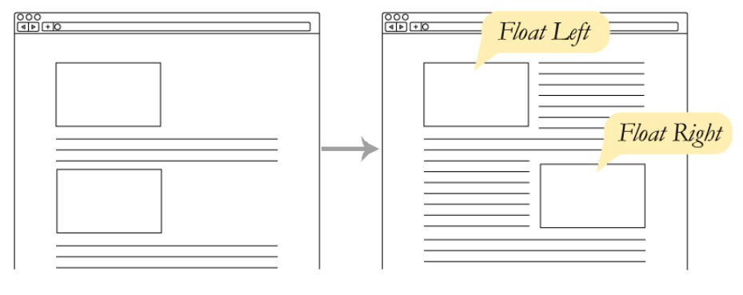
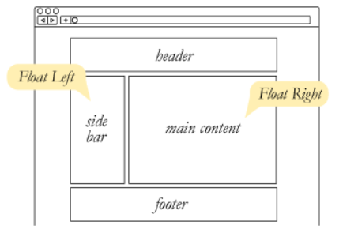
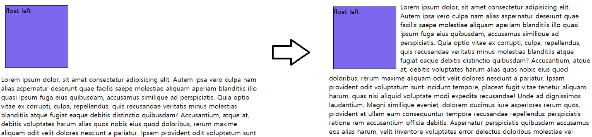
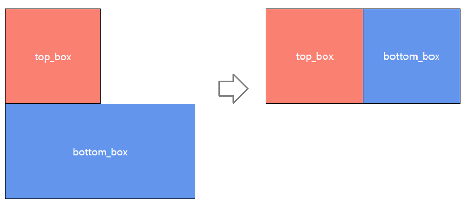
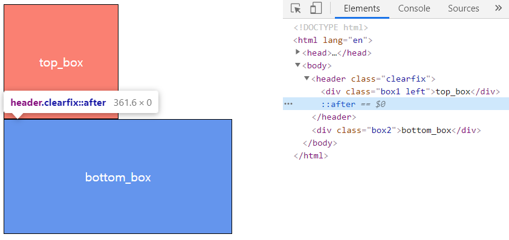

###### 210203_wed


지난 시간까지 CSS에 대해 배웠습니다!!!

이전까지 배운걸로는 원하는 위치에 뭔가를 배치하기가 너무 어려웠죠 :cry:

그치만 오늘 layout을 배운다면!! 이는 한결 쉬워질 것입니다!

#### :dancer: 시작해볼까요?


# CSS layout

- 웹페이지에 포함되는 요소들을 취합하고, 그것들이 __어느 위치에 놓일 것인지를 제어하는 기술__
- CSS page layout techniques
  - DIsplay
  - Position
  - Float
  - Flexbox
  - Grid

##### :mag_right: 아래의 세 가지가 오늘 배울 것 입니다!!


## 1. Float

> Float는 '뜨다' 라는 뜻이 있죠?? 
>
> 말 그대로 이미지를 띄워서 텍스트와 어떻게 배치할 것인가에대한 속성입니다.
>
> 즉,
>
> 위에서 아래로 떨어지는 정상적인 흐름에서 벗어나, 텍스트나 인라인을 감싸는 용도로 사용되는 기술입니다!

- 본래는 __이미지 좌, 우측으로 텍스트를 둘러싸는 레이아웃__을 위해 도입



- 웹페이지 구조를 잡기 시작하면서, 이미지 아닌 다른 요소에도 적용해 __웹 사이트 전체 레이아웃을 만드는데 사용__



### 1.1 속성

- none : 기본값
- left : 요소를 왼쪽으로 띄움
- right : 요소를 오른쪽으로 띄움

#### 예시1) float left

```python
#class 구성
.left {
  #left로 float설정
  float: left;
}
```

```python
#클래스 적용(box는 보기 편하도록 디자인한것)
<div class="box left">float left</div>
```



- 그림처럼 왼쪽에 박스가 뜨고 나머지를 둘러싸는 것을 확인 할 수 있습니다.


### 1.2 Float clear

> float는 흐름을 무시하는 것이기 때문에, 전체 레이아웃이 깨질 수 있습니다.

#### 예시2) float left

```python
<header>
  #left float적용
  <div class="box1 left">top_box</div>
</header>
<div class="box2">bottom_box</div>
```



- top_box에 예시1과 동일하게 left를 성정하면 다음 처럼 변화합니다.
- 이는 float를 줌으로써 __top_box가 뜨게되고, 빈 자리에 bottom_box가 배치__된 것입니다.

:fire: 이처럼 float는 전체 레이아웃을 깨트릴 수 있습니다!!!

#### :four_leaf_clover:  해결법 - clearfix

> float를 clear하는 가장 기본적인 방법을 확인해보겠습니다.

```python
#이름은 전통적으로 동일하게 clearfix로 사용합니다
#clearfix 뒤쪽에(after) 가상의 요소(빈 블럭)를 추가
.clearfix::after {
    content: "";	#빈요소
    display: block;	#올라오지 못하게 해야하므로 블럭 사용
    clear: both;	#왼쪽, 오른쪽 float를 모두 무시
}
```

```python
#부모에 clearfix 설정
<header class="clearfix">
  <div class="box1 left">top_box</div>
</header>
<div class="box2">bottom_box</div>
```

- float를 적용한 것의 __부모에 clear요소__를 줍니다.
- __부모 이후에 가상의 요소__(양쪽 float를 무시하는 내용이 빈 블록)가 생성되어 플로트의 영향을 무시하고 __레이아웃을 유지__할 수 있습니다.
- 실제 아래 그림에서 개발자 도구를 보면, ::after이라는 가상의 요소가 생긴것을 볼 수 있습니다.




- 최근에는 Flexbox와 같은 더 발전된 기술들이 생겨, Float는 처음의 목적(인라인 요소 감싸는)으로 사용하는 경우가 많습니다.
- 간단한 네비게이션 바를 만드는데는 여전히 float를 사용하는 경우도 있습니다.


##### 여기까지 float를 알아봤습니다!

:pencil2: float는 인라인 요소를 둘러싸는 형태를 만들 때 사용한다!! :pencil2:

이정도를 기억하고 필요한 경우에 사용하면 좋겠죠?


다음으로 넘어가서 __Flexbox__를 배워보겠습니다!