###### 210203_wed


이제부터 배울 부분이 __오늘의 핵심__ 입니다!!!

집중집중!! :dizzy_face:


# CSS layout

- CSS page layout techniques
  - DIsplay
  - Position
  - Float
  - `Flexbox`
  - Grid


# 2. CSS Flexible Box Layout

> Flexbox의 실제 이름은 좀 더 길져..?
>
> 여기서는 헷갈리지 않도록 핵심을 꼭 외우고 있어야합니다!!!

- 요고 간 공간 배분과 정렬 기능을 위한 강력한 __1차원(단방향) 레이아웃__
- 상, 하, 좌, 우 중 한방향으로만 정렬 합니다!

### :star: 두가지 핵심 - 요소, 축

- 요소
  - Flex Container (부모 요소)
  - Flex Item (자식 요소)
- 축
  - main axis (메인축)
  - cross axis (교차축)

#### 그림을 기억하세요!

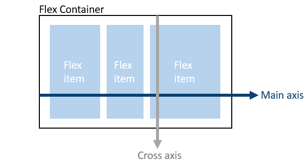

- Container를 정의하면 Flexbox가 만들어지며, 그 안의 요소는 item이 되어 정렬됩니다.

  #### :heavy_check_mark: 즉, Container를 통해 내부 요소의 순서나 축을 조절합니다!!!

- 기본 default값
  - 그림의 main, cross 축 방향
  - row 정렬(left 부터 쌓여감, main 기준 정렬)


## 2.1 Flexbox 시작

- flexbox로 관리하고 싶은 요소의 __부모 요소__에 `display: flex` or `inline-flex`를 작성합니다.

```python
#클래스를 작성한 뒤, 이를 부모요소에 적용합니다
.flex-container {
  display: flex;  #이렇게 하면 block형태의 flexbox가 형성됩니다
}
```


## 2.2 Flex에 적용하는 속성

- 배치 방향 설정 : __축 방향을 정하는 것__
  - flex-direction
- 메인축 방향 정렬 : __정렬을 main축 기준으로 하는 것__
  - justify-content
- 교차축 방향 정렬 : __정렬을 cross축 기준으로 하는 것__
  - align-items, align-self, align-content
- 기타
  - flex-wrap, flex-flow, flex-grow, order

##### :raised_hands: 하나하나 알아봅시다!!


### 2.2.1 flex-direction

> 축의 방향은 항상 __메인을 기준__으로 생각하세요!!

- 축이 바뀐다 == __main-axis 방향이 바뀐다__ (cross-axis는 항상 main의 수직)
  - 메인 축이 가로
    - row (default) : 왼쪽(s, start)에서 오른쪽(e, end)
    - row-reverse : 오른쪽(s)에서 왼쪽(e)
  - 메인축이 세로
    - column : 위(s)에서 아래(e)
    - column-reverse : 아래(s)에서 위(e)
- 단방향 레이아웃이기때문!!!

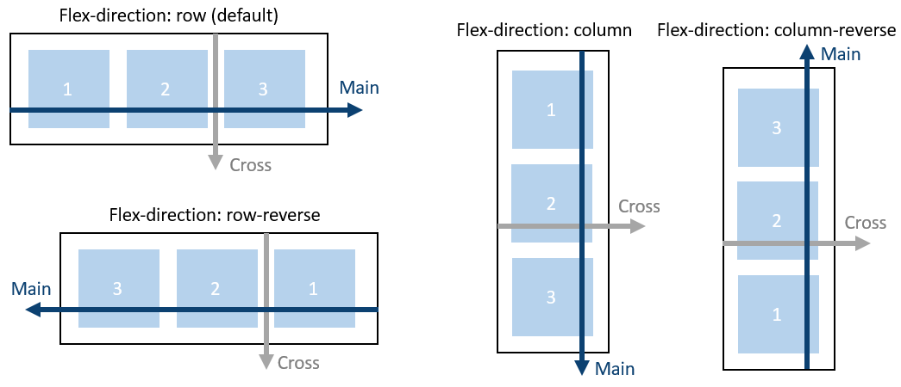


### 2.2.2 justify & align

- justify : 메인축 정렬
  - 메인축이 row라면, 좌우로 이동
  - 메인축이 column이라면, 위아래로 이동
- align : 교차축 정렬
  - 메인축이 row라면, 위아래로 이동
  - 메인축이 column이라면, 좌우로 이동

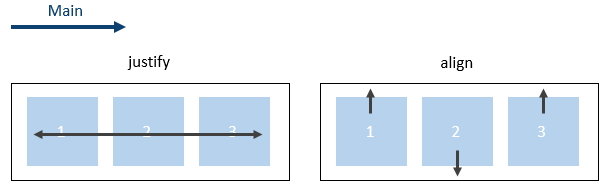


### 2.2.3 content & items & self

#### 정렬 요소 키워드

- content : 여러 줄
- items : 한 줄
- self : flex item 개별 요소
- 대표적인 예시
  - justify-content : 메인축 + 여러 줄 정렬
  - align-items : 교차축 + 한 줄 정렬
  - align-self : 교차축 + 요소 하나 정렬

#### 정렬 방향 키워드

- justify-content
  - flex-start(시작위치, default), flex-end(끝위치), center(중앙)
  - space-around : 아이템간의 내부정렬이 제일 외각과 아이템사이 간격의 두배
  - space-between : 아이템들간의 간격 동일하게 해서 좌우정렬
- align-items
  - flex-start, flex-end, center
  - stretch(교차축을 기준으로 쭉 늘려서 전체를 다 차지하게함, default)
  - baseline (텍스트 폰트에 대해 정렬)
- align-content
  - flex-start, flex-end, center, stretch, space-between, space-around
- align-self
  - auto, flex-start, flex-end, center, baseline, stretch


## 2.2 적용해보기

> 02_flexbox_mine.html을 참고해주세요!!

### 1. flexbox 시작하기

```html
<!-- head에 class선언 -->
<style>
  .flex-container {
    display: flex;
  }
</style>
```

- 해당 클래스 내에서 모든 위치 조작이 일어납니다.

```html
<!-- 조작할 요소의 부모에 컨테이너 지정 -->
<div class="box flex-container">
  <div class="item1">1</div>
  <div class="item2">2</div>
  <div class="item3">3</div>
</div>
```

- 부모에 컨테이너를 지정하면 flexbox로 조작할 수 있습니다.

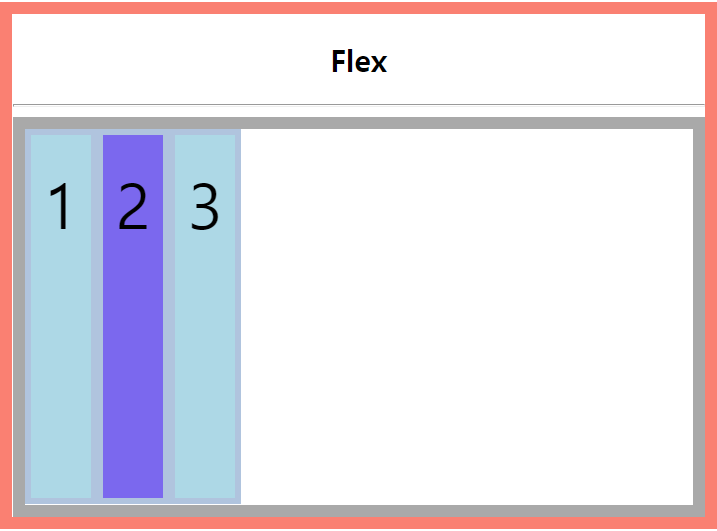

- 기본값은 `flex-direction: row` 로 왼쪽부터 쌓입니다.

### 2. 배치 방향 설정하기 : flex-direction

```css
.flex-container {
  display: flex;
  
  /* 배치 방향 설정 */
  flex-direction: row;				/*좌->우*/
  flex-direction: row-reverse;		/*좌<-우*/
  flex-direction: column;			/*위->아래*/
  flex-direction: column-reverse;	/*위<-아래*/
}
```

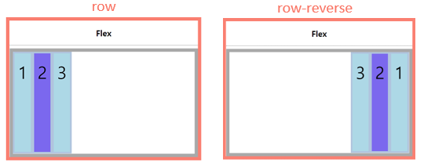

### 3. 메인축으로 정렬하기 : justify-content

```css
.flex-container {
  display: flex;

  /* 메인축 기준으로 정렬*/
  justify-content: flex-start;
  justify-content: flex-end;
  justify-content: center;
  justify-content: space-around;
  justify-content: space-between;
  justify-content: space-evenly;
}
```

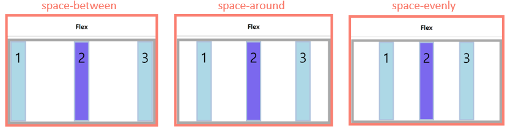

### 4. 교차축으로 정렬하기 : align-items/align-self/align-content

```css
.flex-container {
  display: flex;
  /* 교차축 기준 한줄정렬 */
  align-items: stretch;
  align-items: flex-start;
  align-items: flex-end;
  align-items: center;
  align-items: baseline;
}
```

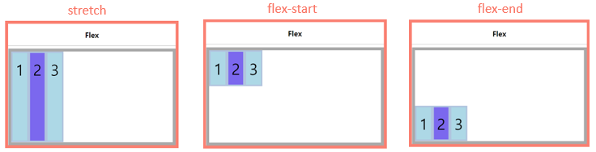

```css
/* 교차축기준 아이템 하나씩 정렬*/
.item1 {
  align-self: flex-start;
}
.item2 {
  align-self: flex-end;
}
.item3 {
  align-self: center;
}
```

- align-items와 정렬 방식은 동일하지만, 각 요소에 따로 적용한다는 점이 다릅니다.

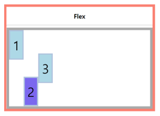

### 5. 기타 : flex-wrap / flex-flow / flex-grow / order

```css
.flex-container {
  display: flex;

  /* 여러줄에 정렬할 것인지 결정 */
  flex-wrap: nowrap;
  flex-wrap: wrap;
}
```

- nowrap : 모든 요소를 한줄에 정렬 (default)
- wrap : 요소를 여러줄에 정렬 (컨테이너 빠져나가 넘치는 걸 밑에 정렬해서 감싸줌)
- wrap-reverse : 요소를 여러줄에 걸쳐 반대로 정렬 (넘치는걸 위로 쌓아줌)

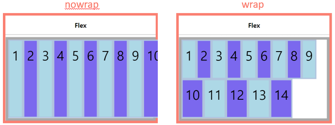

```css
.flex-container {
  display: flex;
  /* flex-direction wrap*/
  flex-flow: column wrap;
}
```

- flex-direction과 wrap를 한번에 적용함

```css
/*남은 공간을 나눠가짐*/
.item1 {
  flex-grow: 1;		/*빈공간을 6으로 나눈것의 1*/
}
.item2 {
  flex-grow: 3;		/*빈공간을 6으로 나눈것의 3*/
}
.item3 {
  flex-grow: 2;		/*빈공간을 6으로 나눈것의 2*/
}
```

- 메인축에서 남은 공간을 각 요소에 분배함
- 숫자는 상대적인 비율을 나타내는 것이 아님, 분배하는 양 의미
- 1번에만 1을 주면 전체를 차지함

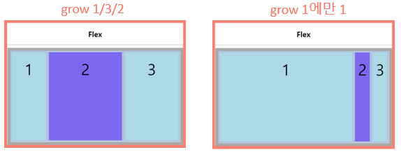

```css
/*순서를 바꿔보자*/
.item1 {
  order: 1;
}
.item3 {
  order: -1;
}
```

- 0이 기본값
- 작은 숫자의 우선순위가 높음

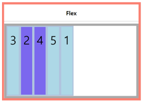


휴...여기까지 플렉스 박스 끝...!!!!

따로 정리는 안해야지..

확실히 정렬하는게 더 쉽져??

잘 보고 활용해봅시다@@