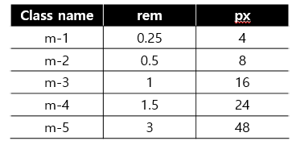
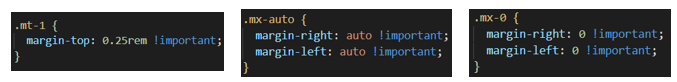
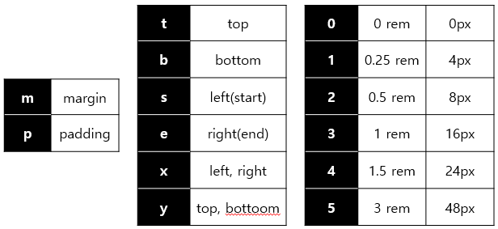
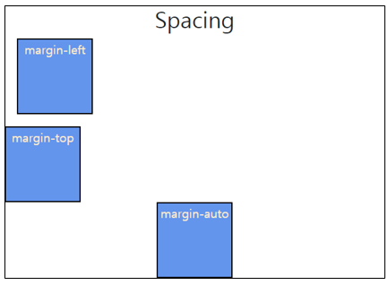
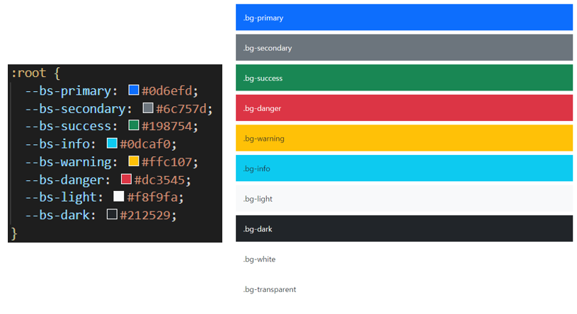
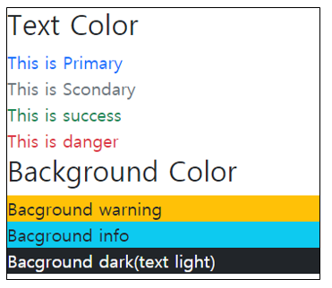
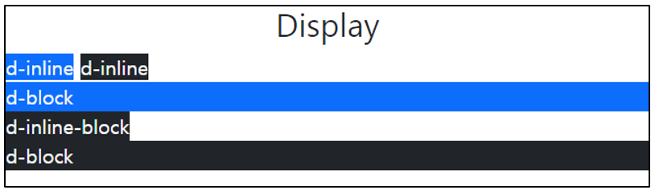
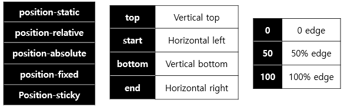
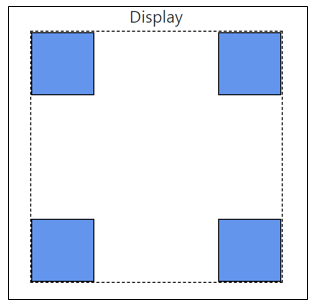
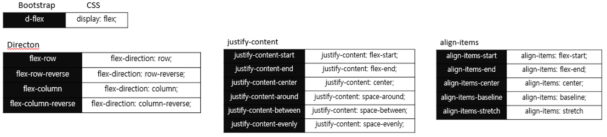

210203_wed

# CSS layout

- CSS page layout techniques
  - DIsplay
  - Position
  - Float
  - Flexbox
  - `Grid`...전에 `Bootstrap`!

<br>

<br>

# 3. Bootstrap

> Bootstrap이란!
>
> 가장 유명한 HTML, CSS, JS 라이브러리 입니다!
>
> 라이브러리인만큼 다양한 기능을 담고있겠죠??

- 트위터에서 시작된 오픈 소스 프론트엔드 라이브러리
- 웹 페이지에서 많이 쓰이는 요소를 거의 전부 내장하고 있습니다!
- 빠른 디자인이 가능합니다.
- 웹브라우저 크기에 따라 자동 정렬되는 __그리드 시스템__을 지원합니다.(responsive grid system)
- 반응형 웹 디자인을 추후합니다. (_one source muli use_)
  - 하나의 디자인으로 다양한 기기를 지원!

:heavy_check_mark: Bootstrap은 지금까지 사용한 HTML과 스타일 요소(마진, 폰트 등등)들이 많이 다릅니다! 따라서 사용에 주의가 필요합니다.

<br>

## 3.1 Bootstrap 준비사항

> Bootstrap은 라이브러리라고 했죠?
>
> 그래서 아무것도 없이는 사용할 수 없습니다!!!
>
> 원활한 사용을 위한 준비를 해봅시다! 둘 중에 뭐가더 좋을까요?

### 파일로 참조하기

- [[Bootstrap 공홈](https://getbootstrap.com/)] - [Download] - [Compiled CSS and JS Download]
- bootstrap.css / bootstrap.bundle.js 외부참조

:heavy_check_mark: 이때, Bootstrap을 적용하면 폰트나 공백이 달라진 걸 볼 수 있습니다!  초기화 시켜주는 코드인 bootstrap_reboot.css의 영향으로, 이를 'CSS초기화'라고 합니다.

<br>

### __CDN(Content Delivery(Distribution) Network)__

>  컨텐츠(CSS, JS, Image, Text 등)을 효율적으로 전달하기 위해 여러 노드에 가진 네트워크에 데이터를 제공하는 시스템

- 온라인 상의 주소를 이용해 참조하는 방법입니다.
- 장점
  - 개별 end-user의 가까운 서버를 통해 빠르게 전달 가능(지리적이점)
  - 외부 서버를 활용함으로써 본인 서버의 부하가 적어짐(한번 불러오면 캐시상으로 남아있어 또다시 시행할 필요가 없습니다.)
- [[Bootstrap 공홈](https://getbootstrap.com/)] - [Docs] - [CSS와 JS Bundle link code에 옮기기]

```html
<!DOCTYPE html>
<html lang="en">
<head>
  <meta charset="UTF-8">
  <meta name="viewport" content="width=device-width, initial-scale=1.0">
  <link href="https://cdn.jsdelivr.net/---">  #CSS
              이하생략
  <script src="https://cdn.jsdelivr.net/---s"></script>  #JS
</body>
</html>
```

- 이렇게 매번 붙여넣어서 사용하면 됩니다!

<br>

###### 추가내용

##### PLUS) CSS 초기화

> 브라우저는 사용자에게 읽기 편리함을 제공하기위해 각자 다른 user agent stylesheet를 가지고 있습니다!
>
> 그림도 흰 도화지에서 그리는게 더 편하죠? 그래서 이러한 기본 스타일을 싹 없애줄 필요가 있습니다!
>
> 이러한 초기화 방법에는 2가지가 있습니다.

- Normalize CSS : gentle solution
  - W3C 표준을 기준으로, 브라우저 중 하나가 불일치 한다면 차이가 있는 브라우저를 수정합니다.
  - 경우에 따라 IE 또는 EDGE는 표준에 따라 수정할 수 없는 경우도 있는데, 이 경우 Normalize 는 IE 또는 EDGE의 스타일을 나머지 브라우저에 적용시킵니다.
  - Bootstrap에서는 normalize.css를 자체적으로 커스텀하여 `bootstrap-tebot.css'라는 이름으로 사용합니다.
- Reset CSS : aggressive solution
  - 브라우저의 기본 스타일이 전혀 필요 없다는 방식으로 접근합니다.
  - 따라서 브라우저의 user agent와 함께 제공되는 모든 스타일을 재설정합니다.
  - Reset CSS의 문제점은 너무나 많은 선택자가 엉켜있고, 불필요한 오버라이드가 많이 발생하며 디버깅 시 제대로 읽을 수 없다는 것입니다.

<br>

<br>

## 3.2 Bootstrap 사용하기

> 다양한 요소를 확인하고 사용해봅시다!
>
> bootstrap을 사용할때는 항상 [공식문서](https://getbootstrap.com/docs/5.0/getting-started/introduction/)를 참고해주세요!

- 우리는 bootstrap.css 내부에 정의된 클래스를 활용할 것입니다!

:raising_hand: 클래스 형태에 익숙해져볼까요?? 잘 들여다보면 알아볼 수 있어요!

### spacing

- __margin__ 으로 확인해봅시다.

  

  - .mt-1 : margin-top이 0.25rem
  - .mx-0 : mrgin-right와 margin-left가 0
  - .mx-auto : margin-right와 margin-left가 auto (수평 중앙 정렬)

  

  - 각각 important가 있어 선언시 최우선으로 적용됩니다!

- __Spacing__ 정리
  
  - 각 글자와 rem에 해당하는 숫자를 알고 활용하면 됩니다!



- 사용해보기

```html
<body>
  <h1 class="text-center">Spacing</h1>
  <div class="box ms-3">margin-left</div>
  <div class="box mt-3">margin-top</div>
  <div class="box mx-auto">margin-auto</div>
</body>
```



<br>

### Color

- 일반적으로 알고있는 RGB 색상과는 조금 다릅니다!!
  - red의 경우 쨍한 빨간색이 아닙니다!
  - 물론 다른 모든 색을 사용할 순 있지만 기본으로 설정된 색을 사용하는게 좋겠죠?
- 세팅된 이름도 달라서 헷갈리지만 자주 쓰는건 외워두면 좋겠습니다!!

##### :cherries: 색이 훨씬 예쁘지 않나요? 웹페이지는 사용자들이 범용적으로 사용할 수 있도록 대중적인 색을 쓰는게 좋기때문에 이런 색을 사용한답니다!



- 사용하기

```html
<body>
  <h2>Text Color</h2>
  <div class="text-primary">This is Primary</div>
  <div class="text-secondary">This is Scondary</div>
  <div class="text-success">This is success</div>
  <div class="text-danger">This is danger</div>
  <h2>Background Color</h2>
  <div class="bg-warning">Bacground warning</div>
  <div class="bg-info">Bacground info</div>
  <div class="bg-dark text-light">Bacground dark(text light)</div>
</body>
```



<br>

### Display

- inline, block, none... 기억하나요? CSS와 동일합니다.
  - inline : 컨텐츠 만큼의 너비를 가집니다.
  - block : 웹 페이지의 전체 너비를 차지합니다.
  - inline-block : 인라인과 블럭의 요소를 모두 가집니다.
  - none : 나타나지 않습니다.
- 사용하기

```html
<body>
  <h2 class="text-center">Display</h2>
  <div class="d-inline bg-primary text-light">d-inline</div>
  <div class="d-inline bg-dark text-light">d-inline</div>
  <div class="d-block bg-primary text-light">d-block</div>
  <div class="d-inline-block bg-dark text-light">d-inline-block</div>
  <div class="d-block bg-dark text-light">d-block</div>
</body>
```



<br>

### Position

- position value & arrange element



```html
<!-- absolute가 relative를 기준으로 위치 결정-->
<body>
  <h2 class="text-center">Display</h2>
  <div class="base position-relative mx-auto">
    <div class="box position-absolute top-0 start-0"></div>
    <div class="box position-absolute top-0 end-0"></div>
    <div class="box position-absolute bottom-0 start-0"></div>
    <div class="box position-absolute bottom-0 end-0"></div>
  </div>
</body>
```



- 위치를 상하단에 고정하는 경우 다음의 명령어를 많이 사용합니다!

```html
<!-- 상하단 고정, 따로 공간을 차지하지 않습니다 -->
<div class="fixed-top">...</div>
<div class="fixed-bottom">...</div>
<!-- 상단 고정, 공간을 차지하여 다른 레이아웃을 침범하지 않습니다 -->
<div class="sticky-top">...</div>
```

<br>

### Flexbox

- 앞서 배운 flex box와 동일하지만, __명령어가 약간 달라__ 주의가 필요합니다.
- Flexbox 시작하기
  - d-flex
- Direction
  - flex-row / flex-row-reverse / flex-column / flex-column-reverse
- justify-content
  - justify-content-start / justify-content-end 등
- align-items / align-self
  - align-items-start / align-items-end / --- / align-self-start /---




## 3.3 Responsive Web

> 반응형 웹? 이게 뭘까요??
>
> 데스크탑, 태블릿 PC, 스마트폰 화면의 크기가 다르죠?
>
> 이러한 디바이스 크기에 따라 같은 컨텐츠의 형태가 달라집니다! 이는 디바이스마다 각기 만든 것이 아니라 하나를 만들고 크기에 맞춰 조정해주기때문에 가능한 것입니다!!
>
> 이런것을 반응형 웹(responsive web)이라고 합니다.

### Responsive Web Design

- 다양한 화면 크기를 가진 디바이스들의 등장! 
  - 이에따라 responsive web design의 개념이 등장했습니다!!
- 별도의 기술 이름이 아닙니다
  - 웹 디자인에 대한 접근 방식
  - 반응형 레이아웃 작성에 도움이 되는 사례들의 모음들을 기술하는데 사용되는 용어
- 예시
  - Media Queries, Flexbox, Bootstrap, Grid System, The viewport meta tag

### Design Considerations

- layout은 방문자의 화면 해상도를 고려해야합니다.
- 모바일 기기(스마트폰, 태블릿)는 화면이 작기때문에 가독성에 신경써야합니다.
  - 보통 웹사이트가 축소되어 가로 스크롤 없이 콘텐츠를 볼 수 있으나, 화면이 너무 작아지기 때문입니다.
- One Source Multi Use의 관점!
  - 데스크탑용, 태블릿용, 모바일용 웹사이드를 별도로 구축할 수 있으나, 올바른 해결책은 아닙니다.
  - 반응형 웹 디자인은 화면의 해상도에 따라 가로폭이나 배치를 변경하여 가독성을 높임으로써 문제를 해결합니다!

##### :heavy_check_mark: 즉, 하나의 웹사이트를 구축하여 다양한 디바이스의 화면 해상도에 최적화된 웹사이트를 제공하는 것이 반응형 웹 디자인(Responsive Web Design)입니다.

<br>

<br>

:man_dancing: 여기까지!! 

bootstrap에 대해 알아봤습니다!!

이제 다음에서는 Bootstrap에서도 __Grid System__을 배우고 활용해보겠습니다!

