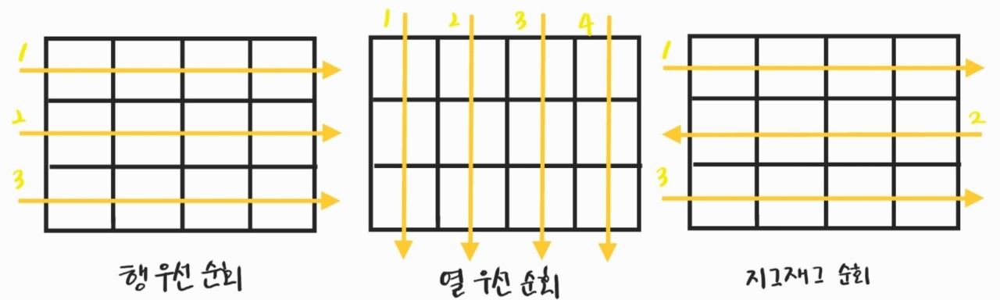
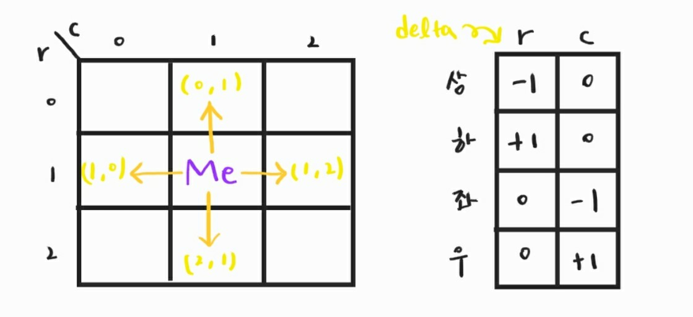

210215_mon

##### APS(Algorithm Problem Solving)

# Array 2

# 1. 2차원 배열

> 어떤 문제를 해결하기 위한 절차

- 1차원 List를 묶어놓은 List
- 2차원 이상의 다차원 List는 차원에 따라 index를 선언

#### 선언

- 세로길이(행(row)의 개수), 가로길이(열(column)의 개수)를 필요로 함

- python에서는 데이터 초기화를 통해 변수 선언과 초기화 가능

  arr = [[0, 1, 2, 3], [4, 5, 6, 7]] : 2행 4열의 2차원 List

<br>

## 1.1 2차원 배열의 접근

- 배열 순회
  - n x m 배열의 n*m개의 모든 원소를 빠짐없이 조사하는 방법

### 행 우선 순회

```python
arr = [[0, 1, 2, 3], [4, 5, 6, 7], [8, 9, 10, 11]]
for r in range(len(arr)):
    for c in range(len(arr[r])):
        arr[r][c]
```

### 열 우선 순회

```python
for c in range(len(arr[0])):
    for r in range(len(arr)):
        arr[r][c]
```

### 지그재그 순회

```python
for r in range(len(arr)):
    for c in range(len(arr[r])):
        arr[r][j + (m-1-2*j) * (i%2)]
        #if문을 써도 됩니다
        if r % 2:
            arr[r][len(arr[r] - 1 - c)]
        else:
            arr[r][c]
```



<br>

### 델타를 이용한 2차원 배열 탐색

- 2차원 배열의 __한 좌표에서 4방향의 인접 배열 요소를 탐색__하는 방법
- 표를 작성해두고 탐색에 활용한다



```python
#5x5 List
arr = [[9, 20, 2, 18, 11],
[19, 1, 25, 3, 21],
[8, 24, 10, 17, 7],
[15, 4, 16, 5, 6],
[12, 13, 22, 23, 14]]

#row, col 길이
N, M = len(arr), len(arr[0])

#delta, 상하좌우
dx = [0, 0, -1, +1]
dy = [-1, +1, 0, 0]

for r in range(N):
    for c in range(M):
        for d in range(len(dx)):
            #이동할 좌표값 설정
            nr, nc = r + dy[d], c + dx[d]
            #범위를 벗어나면 -인덱스로 인해 원하지 않은 값이 나오는 것을 제한
            if 0 <= nr < N and 0 <= nc < M:
                print(arr[nr][nc])
```

<br>

### 전치 행렬

- 대각선을 기준으로 위치를 전부 뒤바꾸는 것!
- 바꾼 걸 바시 바꾸는 일이 없도록 r < c인 경우에만 뒤바꿈

```python
for r in range(len(arr)):
    for c in range(len(arr[0])):
        if r < c:
            arr[r][c], arr[c][r] = arr[c][r], arr[r, c]
```


<br>

<br>

# 2. 부분집합 생성 :star:

- 완전검색 기법으로 부분집합 합 문제를 풀기 위해서는, 우선 집합의 모든 부분집합을 생성한 후 각 부분집합의 합을 계산해야 함

## 2.1 부분집합 생성하기

### 부분집합의 수

- 집합의 원소가 n개일 때, 공집합을 포함한 부분집합의 수: 2<sup>n</sup> 개

- 각 원소를 부분집합에 포함시키거나 포함시키지 않는 2가지 경우를 모든 원소에 적용한 경우의 수와 같다

#### 각 원소가 부분집합에 포함되었는지 loop를 이용해 확인하고 부분집합을 생성하는 방법

```python
bit = [0, 0, 0]
for i in range(2):
    bit[0] = i				#0번째 원소
    for j in range(2):
        bit[1] = j			#1번째 원소
        for k in range(2):
            bit[2] = k		#2번째 원소
            print(bit)		#부분집합 출력
```

### 비트 연산자

- 비트 연산자
  - & : 비트 단위로 AND연산
  - | : 비트 단위로 OR연산
  - << : 피연산자의 비트 열을 왼쪽으로 이동
  - \>\> : 피연산자의 비트 열을 오른쪽으로 이동


##### 두 연산자를 이용해서 부분집합을 생성하자

- << 연산자
  - 1 << n : 2<sup>n</sup> 
    - 원소가 n개일 경우의 모든 부분집합의 수 의미
- & 연산자
  - i & (1<<j)
    - i의 j번째 비트가 1인지 아닌지를 리턴
    - 1101 & (1 << 1) : 1101의 2<sup>1</sup> 자리값이 1인지 0인지 확인 가능

#### 비트 연산자를 이용해 간결하게 부분집합 생성하는 방법

- 인덱스와 j번째 비트를 매치시키는 것
- 예) i = 3
  - 0 0011 & 0 0001 => arr[0]
  - 0 0011 & 0 0010 => arr[1]
  - 0 0011 & 0 0100 => X
  - 0 0011 & 0 1000 => X
  - 0 0011 & 1 0000 => X
  - 따라서 1 2 출력

```python
arr = [1, 2, 3, 4, 5]

n = len(arr)  #원소의 개수

for i in range(1 << n):  #부분집합의 개수만큼 반복
    for j in range(n):  #원소의 수만큼 비트 비교
        if i & (1 << j):  #i의 j번째 비트가 1이면 j번째 원소 출력
            print(arr[j], end=' ')
    print()
```

### 부분집합의 합 구하기


<br>

<br>

# 검색 (Search)

- 저장되어 있는 자료 중에서 원하는 항목을 찾는 작업
- 목적하는 탐색 키를 가진 항목을 찾는 것
  - 탐색 키(search key) : 자료를 구별하여 인식할 수 있는 키
- 검색의 종류
  - 순차 검색 (sequential search)
  - 이진 검색 (binary search)
  - 해쉬(hash)

# 3. 순차 검색 (Sequential Search)

- 가장 간단하고 직관적인 검색 방법
- 배열이나 연결 리스트 등 __순차구조로 구현된 자료구조에서 원하는 항목을 찾을 때 유용__
- 알고리즘이 단순하여 __구현이 쉽__지만, 검색 대상의 수가 많은 경우 __수행 시간이 급격히 증가__하여 비효율적
- 두가지 경우
  - 정렬되어 있지 않은 경우
  - 정렬되어 있는 경우

## 3.1 정렬되어 있지 않은 경우

### 검색 과정

- 첫 번째 원소부터 순서대로 검색 대상와 키 값이 같은 원소가 있는지 비교하며 찾음
- 키 값이 동일한 원소를 찾으면 그 원소의 인덱스를 반환
- 자료구조의 마지막에 이를 때까지 검색 대상을 찾지 못하면 검색 실패

그림 그려 넣습니다ㅏ아아아ㅏ

### 특징

- 찾고자 하는 __원소의 순서에 따라 비교 회수가 결정__됨
  - n번째 원소 찾을 때는 n번 비교
- 정렬되지 않는 자료에서 순차 검색의 평균 비교 회수
  - (1/n)*(1 + 2 + 3 + ... + n) = (n + 1)/2
- 시간 복잡도 : O(n)

### 구현

<br>

## 3.2 정렬되어 있는 경우

### 검색 과정

- 자료가 오름차순으로 정렬된 상태에서 검색을 실시한다고 가정
- 자료를 순차적으로 검색하면서 키 값을 비교하여, __원소의 키 값이 검색 대상의 키 값보다 크면__ 찾는 원소가 없다는 것이므로 더 이상 __검색하지 않고 검색을 종료__

### 특징

- 찾고자 하는 __원소의 순서에 따라 비교 회수가 결정__됨
  - 정렬이 되어 있으므로, 검색 실패를 반환하는 경우 평균 비교 회수가 반으로 줄어듦
- 시간 복잡도 : O(n) (최악의 경우는 어차피 n번 반복해야함)

### 구현


<br>

# 3. 이진 검색(Binary Search)

- 자료의 __가운데 있는 항목의 키 값과 비교__하여 __다음 검색의 위치를 결정__하고 검색을 계속 진행하는 방법
  - 목적 키를 찾을 때까지 이진 검색을 순환적으로 반복 수행 함으로써 검색 범위를 반으로 줄여가며 빠르게 검색을 수행함
- 이진 검색을 하기 위해서는 자료가 __정렬된 상태__여야 한다

### 검색 과정

1. 자료의 중앙에 있는 원소를 고른다
2. 중앙 원소의 값과 찾고자 하는 목표 값을 비교한다
3. 목표 값이 중앙 원소의 값보다 작으면 자료의 왼쪽 반, 크다면 자료의 오른쪽 반에 대해서 새로 검색을 수행한다
4. 찾고자 하는 값을 찾을 때까지 1 ~ 3의 과정을 반복한다

그림 넣을 겁ㄴ디ㅏ....아마도...

### 구현

- 검색 범위의 시작점과 종료점을 이용하여 검색을 반복 수행한다
- 이진 검색의 경우, 자료에 삽입하거나 삭제가 발생했을 때 배열의 상태를 항상 정렬 상태로 유지하는 추가 작업이 필요하다

```python

```

- 재귀 함수 이용

```python

```


<br>

<br>

# 4. 셀렉션 알고리즘(Selection Algorithm)

- 저장되어 있는 자료로부터 k번째로 큰 혹은 작은 원소를 찾는 방법을 셀렉션 알고리즘이라 한다
  - 최소값, 최대값 혹은 중간값을 찾는 알고리즘을 의미하기도 한다

### 선택 과정

1. 정렬 알고리즘을 이용해 자료 정렬
2. 원하는 순서에 있는 원소 가져오기

<br>

<br>

# 5. 선택 정렬(Selection Sort)

- 주어진 자료들 중 가장 작은 값의 원소부터 차례대로 선택하여 위치를 교환하는 방식
  - 셀렉션 알고리즘을 전체 자료에 적용한 것
- 시간 복잡도 : O(n<sup>2</sup>)

### 정렬 과정

- 주어진 리스트 중 최소값을 찾는다
- 그 값을 리스트의 맨 앞에 위치한 값과 교환한다
- 맨 처음 위치를 제외한 나머지 리스트를 대상으로 위의 과정을 반복한다

그림...?

### 구현


<br>

<br>


