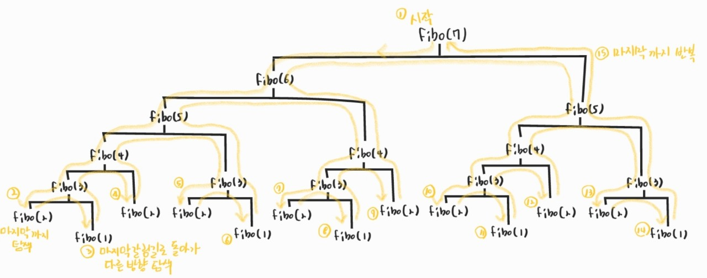
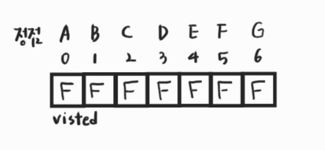
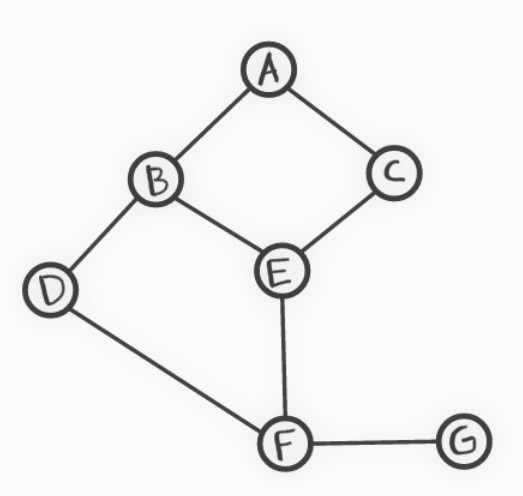
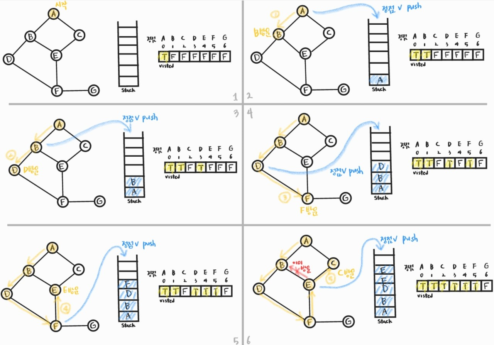
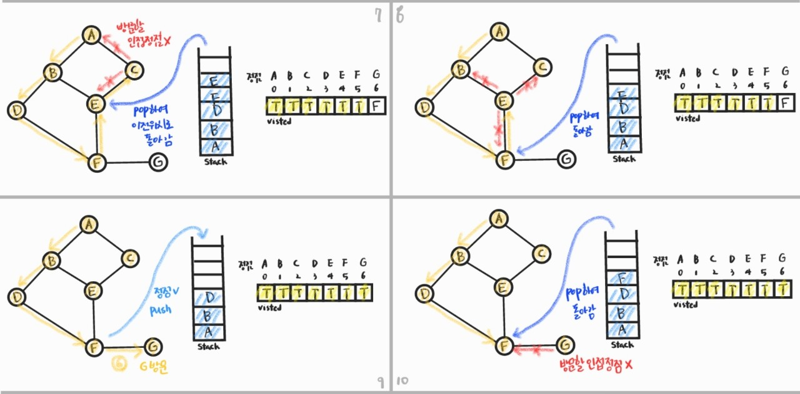
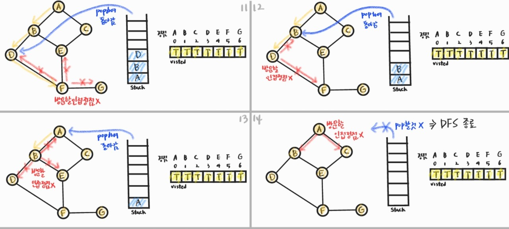
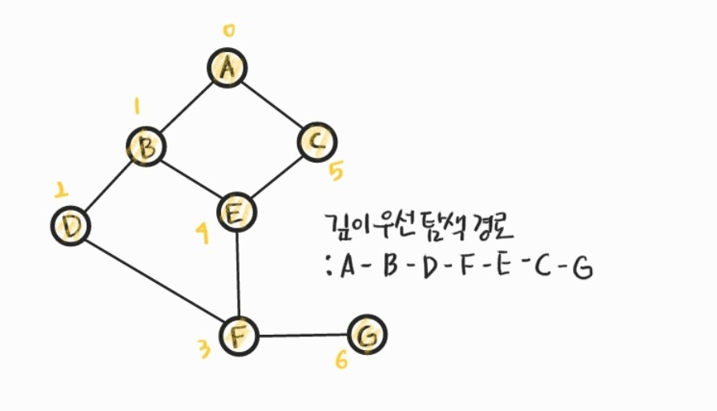

210222_mon

# APS 4

> 중요한 DFS에 대해 알아봅시다!

<br>

# Stack1

> `스택`자료구조

- 스택
- 재귀호출
- Memoization
- DP
- `DFS`:star:

<br>

<br>

# 5. DFS(깊이우선탐색)

> 그래프 구조의 탐색 방법 중 하나인 DFS를 배우고 활용해봅시다!

## 5.1 그래프 구조의 탐색

- 비선형구조인 그래프 구조는 __그래프로 표현된 모든 자료를 빠짐없이 검색하는 것__이 중요

- 두 가지 방법
  - 깊이 우선 탐색(Depth First Search, DFS)
  - 너비 우선 탐색(Breadth First Search, BFS) - Queue와 함께 배울 것!

- DFS 방식

  - 시작 정점의 한 방향으로 __갈 수 있는 경로가 있는 곳까지 깊이 탐색__해 가다가 더 이상 갈 곳이 없게 되면, __가장 마지막에 만났던 갈림길 간선이 있는 정점__으로 되돌아와서 __다른 방향의 정점으로 탐색__을 계속 반복하여 결국 모든 정점을 방문하는 순회 방법

    

  - 후입선출 구조의 스택 사용

    - 가장 마지막에 만났던 갈림길의 정점으로 되돌아가서 다시 깊이 우선 탐색을 반복해야 하기 때문

<br>

## 5.2 DFS 알고리즘

1. 시작 정점 v를 결정하여 방문한다

2. 정점 v에 인접한 정점 중에서

   1) 방문하지 않은 정점 w가 있으면, __정점 v를 스택에 push__(나중에 돌아오기 위함)하고 __정점 w를 방문__한다

   2) 방문하지 않은 정점이 없으면, 탐색의 방향을 바꾸기 위해서 __스택을 pop__하여 받은 __가장 마지막 방문 정점을 v__로 하여 2를 다시 반복한다

3. 스택이 공백이 될 때까지 2를 반복한다

### 그림으로 확인하기

- visited : 해당 정점을 방문했는지 여부를 저장 (동일한 곳 다시 방문 X 위함)

  

- stack : 정점 v를 push, pop하기 위함

- 탐색할 그래프 형태

  

- 갈림길을 만나면 알파벳 순으로 방문한다고 하자(구현 방식에 따라 어딜 먼저 방문할 지 달라짐)







- 최종 탐색 경로



### 구현

```python

```

