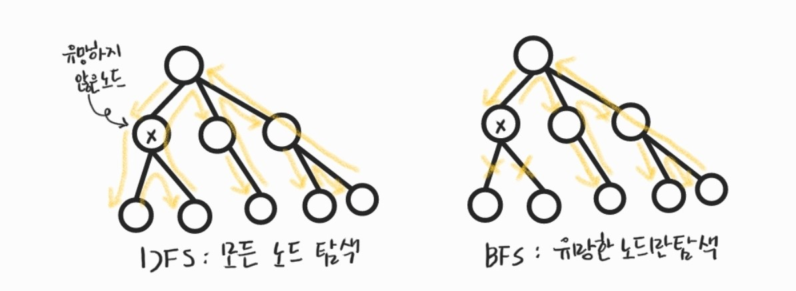

210224_wed

# APS 5

> 힘을 냅시다아ㅏ

<br>

# Stack2

> `스택`자료구조를 좀 더 활용해봅시다@@@

- 계산기
- 백트래킹
- 분할정복

<br>

<br>

# 2. 백트래킹(Backtracking)

- 해를 찾는 도중에 `막히면` (즉, 해가 아니면) __되돌아가서 다시 해를 찾아__ 가는 기법

- 최적화(optimization) 문제와 결정(decision)문제를 해결할 수 있다

#### 결정문제

- 문제의 조건을 만족하는 해가 존재하는지 여부를 yes 또는 no가 답하는 문제
- 예시
  - 미로 찾기 - 탈출구가 있나 없나
  - n-Queen 문제 - NxN배열, N개의 Queen을 공격범위에 들어가지 않게 놓을 수 있는지 없는지
  - Map coloring
  - 부분 집합의 합(Subset Sum)문제

<br>

## 2.1 미로찾기

- 입구와 출구가 주어진 미로에서 __입구부터 출구까지의 경로를 찾는__ 문제
- 이동할 수 있는 방향은 4방향으로 제한(대각선은 연결된게 아님)
- 1은 벽, 0은 길을 의미
- 각 칸을 정점으로 생각하고, 연결되어있나 아닌가를 생각해볼 수 있음!
- 미로의 테두리를 1로 두름(선택)
  - 이렇게하면 4방향 탐색시, 인덱스 범위를 벗어날 걱정은 하지 않아도 됨

그림...!!!

<br>

## 2.2 백트래킹의 특징

### 2.2.1 백트래킹과 깊이우선탐색(DFS)의 차이

- 가지치기(Prunning)
  - 어떤 노드에서 출발하는 경로가 __해결책으로 이어질 것 같지 않으면__ 더 이상 그 경로를 __따라가지 않음__으로써 __시도의 횟수를 줄임__
- 비교
  - DFS : 모든 경로를 추적
    - N!의 너무 많은 경우의 수, 12만되어도 매우 커서 처리 불가능
  - BFS : 불필요한 경로를 조기에 차단
    - 일반적으로 경우의 수가 줄어들긴 하지만 만능은 아님
    - 최악의 경우 지수함수시간을 요하거나 정답마저 걸러내어 처리 불가능
  - 둘 다 기본적으로 완전 탐색이기는 하나, 백트래킹은 답일거라고 생각하는 것만 확인함



### 2.2.2 백트래킹 기법

- 가지치기(pruning) : 유망하지 않은 노드가 포함된 경로는 더이상 고려하지 않음
  - 어떤 노드의 유망성(정답으로 갈 수 있는지 없는지)을 점검한 후, __유망(promising)하지 않다__고 결정되면 그 노드의 __부모노드로 되돌아가(backtracking)__ 다음 자식 노드로 감
- 어떤 노드를 방문했을 때,
  - 유망하다 : 그 노드를 포함한 경로가 해답의 가능성이 있다
  - 유망하지 않다 : 그 노드를 포함한 경로가 해답이 될 수 없다

### 2.2.3 백트래킹 절차

1. 상태 공간 트리의 __깊이 우선 탐색을 실시__한다

2. 각 노드가 유망한지를 점검한다
3. 만일 그 노드가 유망하지 않다면, 그 노드의 부모 노드로 돌아사 검사를 계속한다

#### 일반 백트래킹 알고리즘

- 모든 백트래킹을 이렇게 짤 필요는 없습니다
- 보통 DFS를 재귀로 구현하며, 해당 알고리즘에서 v가 유망한지 확인하는 과정이 추가된 형태입니다

```python
def backtracking(v):  #현재 노드를 입력으로 받음
    if promising(v):  #v가 유망한 경우
        if there is a solution at v:  #v에 답이 있는경우
            print solution
            end
        else:
            for u in child of v:  #v의 자식 노드 확인
                backtraking(v)
```

<br>

<br>

## 2.3 N-Queen

> backtrcking을 이용하여 N-Queen문제를 해결해봅시다!

- Queen : 상하좌우, 대각선으로 이동 가능
- NxN 보드에서 N개의 Queen이 서로의 공격범위에 들지 않도록 배치하는 경우의 수는 몇개일까?

### N = 4인 경우를 생각해보자

#### 완전탐색

- 방식 설명 ~

#### backtracking 적용

- 방식 설명

<br>

<br>

## 2.4 부분집합 구하기

- __powerset__ : 어떤 집합의 공집합과 자기자신을 포함한 모든 부분집합
  - 구하고자 하는 어떤 집합의 원소 개수가 n일 경우 부분집합의 개수는 __2<sup>n</sup>__

### 2.4.1 백트래킹으로 powerset 구하기

- 일반적인 백트래킹 접근 방법을 이용
- 원소가 부분집합의 값인지 아닌지 판단 필요
  - n개의 원소에대해 True 또는 False를 가지는 n개의 배열을 만듦
  - 해당 배열의 i 번째 한목은 i번째 원소가 부분집합의 값인지 아닌지를 나타내는 값

#### 이전에 배운 생성방법 2가지

- 중첩된 for문 사용

```python
N = 4
bit = [0] * N
for i in range(2):  #각 자리는 0, 1 2가지 선택지를 가짐
    bit[0] = i
    for j in range(2):
        bit[1] = j
        for k in range(2):
            bit[2] = k
            for l in range(2):
                bit[3] = l
                print(bit)  #생성된 부분집합 출력
```

```python
#출력
[0, 0, 0, 0]
[0, 0, 0, 1]
[0, 0, 1, 0]
[0, 0, 1, 1]
[0, 1, 0, 0]
[0, 1, 0, 1]
[0, 1, 1, 0]
[0, 1, 1, 1]
[1, 0, 0, 0]
[1, 0, 0, 1]
[1, 0, 1, 0]
[1, 0, 1, 1]
[1, 1, 0, 0]
[1, 1, 0, 1]
[1, 1, 1, 0]
[1, 1, 1, 1]
```

- bit연산자 사용

```python
N = 4
bit = [1, 2, 3, 4]
for i in range(1 << N):  #2^N개의 경우의 수 확인
    for j in range(N):
        if i & (1 << j):  #j번째 원소를 포함하는 경우
            print(bit[j], end = ' ')  #해당 값을 부분집합으로 출력
    print()
```

