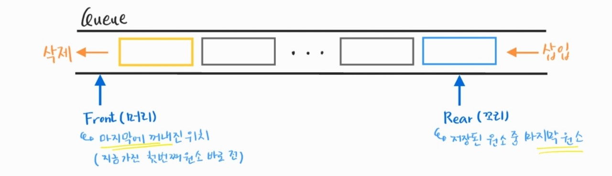

210303_wed

# APS 6

> 이제 기초는 마지막입니다ㅜㅜㅜ

 

# 큐(Queue)

> 중요한 자료구조에대해 배워보겠습니다!!

- 큐
- 우선순위 큐
- BFS :star:

 

 

# 1. 큐(Queue)

> 스택과 비슷하지만 약간의 차이를 가진 자료구조입니다!

#### 스택

- 선형자료구조

- 후입선출구조(LIFO, Last In First Out)

- 구현

  - 고정된 크기의 배열 + top(가장 위, 마지막에 들어온 제이터 가리킴)

  - 리스트

 

##### 어떤 점에서 스택과 큐가 다른지 생각하면서! 큐를 알아봅시다

 

### 1.1 특성

- 스택과 마찬가지로 __삽입과 삭제의 위치__가 __제한적__인 자료구조
  - 삽입 : 큐의 귀
  - 삭제 : 큐의 앞
- 선입선출구조(FIFO, First In First Out)
  - 삽입된 순서대로 원소가 저장
  - 가장 먼저 삽입된 원소는 가장 먼저 삭제된다
  - 예 : 터널, 대기줄

 

### 1.2 큐의 구조 및 기본연산

> 스택은 top을 사용한 것처럼 큐는 front, rear을 사용합니다!

#### 선입선출구조

- Front
  - 마지막에 꺼내진 위치
  - Queue의 앞에서 값을 꺼낼때 사용
- Rear
  - 저장된 원소 중 마지막 원소
  - Queue의 위에서 값을 추가할 때 사용

#### 큐의 기본 연산

- 삽입 : enQueue
- 삭제 : deQueue

### 1.3 주요연산

> 일반적으로 이런 이름을 사용합니다만 필수는 아닙니다!