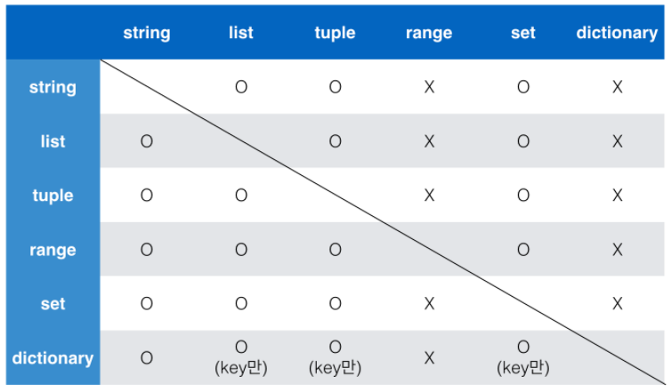

###### Jan_3weeks_Day2_210118(mon)


:facepunch: 오후에는 새로운 데이터 타입을 배워봅시다!!


# 컨테이너(Container)

> 더 많은 데이터를 저장하고 싶다구요?? 이번엔 박스를 더 키워보겠습니다.
>
> 컨테이너는 여러 개의 값을 저장할 수 있는 것~~(객체)~~입니다.
>
> - 시퀀스(Sequence)형: 순서가 있는(ordered)데이터
> - 비 시퀀스(Non-sequence)형: 순서가 없는(unordered) 데이터
>
> 두가지에 대해 알아봅시다!


# 시퀀스(sequence)형 컨테이너

> 데이터가 순서대로 나열된(ordered) 형식을 나타냅니다.
>
> 주의! 순서대로 나열된 것이 `정렬되었다(sorted)`라는 뜻은 아닙니다. (말그대로 값들간의 순서가 있음을 의미합니다.)

## 1. 특징

- 순서를 가질 수 있습니다.
- __특정 위치의 데이터를 가르킬 수 있습니다.__

## 2. 종류

> 기본적인 시퀀스 타입은 다음과 같습니다.

- 리스트(list)

- 튜플(tuple)

- 레인지(range)

- 문자형(string)

- 바이너리(binary)

  위의 4가지가 가장 많이 사용되며, 바이너리는 따로 다루지 않겠습니다.


:laughing: 그럼 각각에 대해 자세히 알아볼까요?

## 3. 리스트(list)

> 하나의 이름으로 여러개의 박스를 이어붙여 데이터를 넣은 형태를 생각하면 쉽습니다. 보통 다른 프로그래밍 언어에선 배열(array)라고 부릅니다. ~~(pythonic하죠?)~~

- 활용법

  [value1, value2, value3]

  - `[]` (대괄호) 및 `list()`를 통해 만들 수 있습니다.
  - `list_name[idx]`를 통해 값에 대해 접근할 수 있습니다.
    - 인덱스는 0부터 시작한다는 것! 잊지마세요

```python
#빈 리스트 생성
my_list = []  
another_list = list()
print(my_list, type(my_list))  #[] <class 'list'>
print(another_list, type(another_list))  #[] <class 'list'>
```

```python
#원소를 포함한 리스트 생성
lunch = ['sandwitch', 'pizza']
fruit = list(('apple', 'banana'))
print(luncn, fruit)  #['제육볶음', '미역국'] ['apple', 'banana']
```

```python
#첫번째 값에 접근해볼까요?
fruit[0]  #'apple'
```


## 4. 튜플(tuple)

> 리스트와 유사하지만 `가장 큰 차이점`이 있습니다.
>
> 바로 리스트와 달리 한번 만들면 수정 불가능(불변, immutable)하고, 읽을 수밖에 없다는 것입니다.
>
> 그래서  직접 사용하기 보다는 파이썬 내부에서 다양한 용도로 활용되고 있어 간접적으로 사용하게 될 것입니다.

- 활용법

  - `()`(소괄호) 로 묶어서 표현합니다.
  - __수정 불가능(불변, immutable)합니다.__

```python
 #빈 튜플 생성
empty_tuple = ()
```

```python
#원소를 포함한 튜플
my_tuple = (1, 2)
another_tuple = 1, 2  #소괄호를 생략하는 경우도 튜플입니다.
print(my_tuple, type(my_tuple))  #(1, 2) <class 'tuple'>
print(another_tuple, type(another_tuple))  #(1, 2) <class 'tuple'>
```

```python
#python 내부에서의 활용
x, y = 1, 2  #이게 튜플로 처리됩니다.
print(x, y)  #1 2
```

```python
#변수의 값을 swap하는 경우
x = 1
y = 100
x, y = y, x
print(x, y)  #100 1
```

```python
#하나의 값을 갖는 튜플
single_tuple = ('hello',)  #콤마를 함께 표현합니다.
```

```python
#리스트와 튜플의 차이점
my_list = [1, 2]
my_list[0] = '첫번째'  #변경가능합니다.
my_tuple = (1, 2)
my_tuple[0] = '첫번째'  #변경 불가하므로 에러가 발생합니다.
print(my_list, my_tuple)  #['첫번째', 2] (1, 2)
print(my_list[0], my_tuple[0])  #첫번째 1, 읽는것은 가능합니다.
```

우리는 주로 리스트를 사용하겠습니다.


## 5. range()

> 숫자의 시퀀스를 나타내기 위해 사용됩니다. 즉, 숫자 자체로만 어떤 범위를 만들 때 사용합니다.

- 기본형 `range(n)`

  - 0 ~ n-1까지 값을 갖습니다.

- 범위 지정 `range(n, m)`

  - n ~ m-1 까지 값을 갖습니다.

- 범위 및 스텝지정 `range(n, m, s)`

  - n ~ m-1 까지 +s만큼 증가합니다.

```python
range(3)  #range(0, 3)
list(range(3))  #[0, 1, 2], range에 담긴 값을 list로 바꿔서 확인합니다.
list(range(4, 9))  #[4, 5, 6, 7, 8]
list(range(0, -10, -1))  #[0, -1, -2, -3, -4, -5, -6, -7, -8, -9]
```

```python
#리스트로 변환
[range(3)]  #[range(0, 3)], 리스트의 원소로 하나의 range를 넣겠다.
list(range(3))  #[0, 1, 2], 리스트로 형변환 하겠다.
```

  


## 6. 시퀀스에 활용할 수 있는 연산자/함수

| operation  | 설명                    |   operation    | 설명              |
| :--------: | ----------------------- | :------------: | ----------------- |
|   x in s   | containment test        | s[ i : j : k ] | k간격으로 slicing |
| x not in s | containment test        |     len(s)     | 길이              |
|  s1 + s2   | concatenation           |     min(s)     | 최소값            |
|   s * n    | n번만큼 반복하여 더하기 |     max(s)     | 최대값            |
|   s[ i ]   | indexing                |   s.count(x)   | x의 개수          |
| s[ i : j ] | slicing                 |                |                   |

```python
#containment test
s = 'string'
print('a' in s)  #False
```

```python
#concatenation(연결, 연쇄)
print('안녕,' + '반가워.')  #안녕,반가워.
print((1, 2) + (5, 6))  #(1, 2, 5, 6), )+(가 사라지고 ,로 붙는다고 생각하면 쉽습니다.
print([1, 2] + [5, 6])  #[1, 2, 5, 6]
```

```python
#숫자 0이 6개 있는 list
my_list = [0, 0, 0, 0, 0, 0]
another_list = [0] * 6  #[0, 0, 0, 0, 0, 0]
#[1, 2]를 3번 반복해서 concatenation
num_list = [1, 2] * 3  #[1, 2, 1, 2, 1, 2]
```

```python
#indexing & slicing
location = ['서울', '대전', '구미', '광주']
location[1]  #'대전'
location[1:3]  #['대전', '구미'], 두번째 인덱스는 포함X
```

```python
#0~30까지 숫자를 3씩 증가시킨 리스트 만들기
#[0, 3, 6, 9, 12, 15, 18, 21, 24, 27, 30]

#slicing 활용
sample_list = list(range(0, 31))
sample_list[0:len(sample_list):3]  #0~30까이 요소를 3씩 슬라이싱
sample_list[::3]  #전체를 3씩 증가시킨 리스트
#range활용
list(range(0,31,3))  
```

```python
len([])  #0
len([1, 2])  #2
```

```python
a = [1, 3, 2, 6, 4, 2]
min(a)  #1
max(a)  #6
a.count(2)  #2
```


# 비 시퀀스형(Non-sequence) 컨테이너

> 순서가 없는 데이터에대해 알아보겠습니다.

- 셋(set)
- 딕셔너리(dictionary)

## 1. Set

> 순서가 없는 자료구조입니다. 수학에서의 `집합`과 동일하게 처리됩니다. 

- 활용법

  {value1, value2, value3}

  - {}(중괄호)를 통해 만들며, __순서와 중복된 값이 없습니다.__
  - 빈 집합을 만들려면 `set()`을 사용해야 합니다.({} 사용 불가)

- 다음의 집합 연산이 가능합니다.

```python
set_a = {1, 3, 6}
set_b = {3, 5, 9}

print(set_a, set_b)  #{1, 3, 6} {9, 3, 5}, 순서 개념이 없어 출력의 순서가 다를 수 있습니다.
print(set_a - set_b)  #{1, 6}, 차집합(-)
print(set_a | set_b)  #{1, 3, 5, 6, 9}. 합집합(|, 파이프)
print(set_a & set_b)  #{3}, 교집합
```

- 중복된 값이 있을 수 없습니다.

```python
print({1, 3, 2, 4, 2, 4, 2})  #{1, 2, 3, 4}
```

- set을 이용하여 list의 중복된 값을 쉽게 없앨 수 있습니다.

```python
list_a = [2, 1, 4, 2, 1, 1, 2, 1]
list(set(list_a))  #[1, 2, 4], set으로 변환되며 중복값이 사라진 뒤 list로 변환됩니다.(역시 순서는 보장X)
```


## 2. dictionary

> `key`와 `value`가 쌍으로 이뤄져있으며, 궁극의 자료구조 입니다.
>
> 다른 언어에서는 hash라고도 하며, 하나의 이름으로 이어붙여진 박스들에 각각 이름표가 붙어있다고 생각하면 쉽습니다.

- 활용법

  {key1: value1, key2: value2, key2: value3, ...}

  - `{}`를 통해 만들며, `dict()`로 만들수도 있습니다.
  - `key`는 __변경 불가능(immutable)한 데이터__만 가능합니다. (immutable: string, integer, float, boolean, tuple, range)
  - `value`는 __list, dictionary를 포함한 모든 것__이 가능합니다.

```python
#빈 dictionary만들기
dict_a = {}
dict_b = dict()
print(dict_a, type(dict_a))  #{} <class 'dict'>
print(dict_b, type(dict_b))  #{} <class 'dict'>
```

- 중복된 key는 존재할 수 없습니다.

```python
{'A': 1, 'A': 2, 'A': 3, 'B': 4}  #{'A': 3, 'B': 4}, 가장 마지막에 실행된게 덮어버림
```

- key를 이용한 데이터 접근 및 다양한 활용

```python
#학생의 이름과 나이정보
students = {
    'kim': 23,
    'lee': 20,
}
print(students, type(studnets))  #{'kim': 23, 'lee': 20} <class 'dict'>
```

```python
#key로 접근
students['lee']  #20
```

```python
#메서드의 활용
#.keys() - dictionary의 key확인
keys = students.keys()
print(keys, type(keys))  #dict_keys(['kim', 'lee']) <class 'dict_keys'>

#.values - dictionary의 value확인
valuse = students.values()
print(values, type(values))  #dict_values([23, 20]) <class 'dict_values'>
```

```python
#.items() - dictionary의 key, value 확인
items = students.items()
print(items, type(items))  #dict_items([('kim', 23), ('lee', 20)]) <class 'dict_items'>

#유사 리스트로, 리스트로 변경해 사용가능/ key:value는 tuple로 묶임
print(items[0])  #Error
print(list(items)[0], type(list(items)[0]))  #('kim', 23) <class 'tuple'>
```


## 컨테이너 정리

- sequence - 순서 정해짐
  - list : [] / a = [1, 2, 3] / a[0] == 1
  - tuple : () / t = (4, 5) / t[0] == 4 /값수정불가
  - range : 숫자의 묶음 / n ~ n-1, step만큼 변화
  - string : ' '/ 개별 요소의 연속된 집합

- non-sequence - 순서 없음
  - set: {} / {1, 2, 3, 1} / 순서없음, 그래서 중복허용X
  - dictionary : {} / {key: value} / key통해 value에 접근 가능


## 3. 컨테이너형 형변환

> 컨테이너간의 형변환이 가능합니다. 



- 이때 어떤 자료구조도 __range나 dictionary로 변경 불가능__합니다.
- 


## 4. 데이터의 분류


