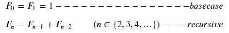

###### Jan_3weeks_Day3_210120_wed


# 함수(function)2

> 함수의 스코프와 재귀함수에 대해 학습하겠습니다.


# 1.함수와 스코프(scope)

> 함수는 코드 내부에 공간(scope)를 생성합니다. 함수로 생성된 공간은 __지역스코프(local scope)__라고 불리며, 그 외의 공간인 __전역 스코프(global scope)__와 구분됩니다. 이에따라 함수의 내부와 외부에 정의된 변수를 다르게 부릅니다.

- 전역 스코프(global scope) : 코드가 어디있든 참고할 수 있는 공간
- 지역 스코프(local scope) : 함수가 만든 스코프, 함수 내부에서만 참조할 수 있는 공간

- 전역 변수(global variable) : 전역 스코프에 정의된 변수
- 지역 변수(local variable) : 로컬 스코프에 정의된 변수 

```python
#전역 스코프입니다.
x = 1  #전역 변수입니다.

def func(y):
    #지역 스코프입니다.
    z = 3  #지역변수 입니다.
    print(x)  #1
    print(y)  #2
    print(z)  #3

func(2)
print(x)  #1
print(y)  #error, not defined
print(z)  #error, not defined
```

- 지역 스코프: 지역 변수, 전역 변수 모두 호출 가능
- 전역 스코프: 전역변수만 호출 가능


## 1.1 이름 검색(resolution) 규칙

> 그렇다면 지역 스코프와 전역 스코프에 같은 이름의 변수가 있다면 무엇이 호출될까요? 이는 이름 검색 규칙을 알면 확인할 수 있습니다.
>
> 파이썬에서 사용되는 이름(식별자)들은 이름공간(namespace)에 저장되어 있습니다.
>
>  __LEGB Rule__을 따라 아래와 같은 순서로 이름을 찾아갑니다.
>
> > - `L`ocla scope: 정의된 함수 내부
> > - `E`nclosed scope: 상위 함수(함수 밖의 함수)
> > - `G`lobal scope: 함수 밖의 변수 혹은 import된 모듈
> > - `B`uilt-in scope: 파이썬안에 내장되어 있는 함수 또는 속성
>
> 즉, Local에서 먼저 찾은 뒤 없으면 E, G, B를 하나하나 탐색하는 방식으로, 더 넓은 지역으로 탐색하는 과정입니다.

```python
#Global scope
a = 1
def func_enclosed():
    #Enclosed scope(func_local 입장)
    a = 2
    b = 2
    def func_local():
        #local scope
        c = 3
        print(a, b, c)  #2, 2, 3
    func_local()
    print(a, b)  #2, 2
    print(c)  #NameError
func_enclosed()
```

- 전역 스코프와 지역스코프에 동일한 이름의 변수가 있는 경우

```python
#전역 스코프(G)
x = 1  

def func(y):
    #지역 스코프(L)
    z = 3 
    x = 4
    print(x)  #4, L을 가장 먼저 탐색하며 이때 x가 존재하면 탐색을 종료합니다.  

func(2)
```

- 내장함수의 식별자를 변수 이름으로 사용할 수 없는 이유도 설명할 수 있습니다.

```python
print('hi')  #Built-in
print = 'hello'  #Global scope에서 정의
print('hola')  #Error, print의 이름을 G에서 찾으면 탐색을 중지하므로 B에 정의된 함수를 호출할 수 없습니다.
```

- 스코프는 __함수__를 기준으로 만들어집니다. (for, if 등은 scope를 만들지 않습니다.)
- 지역 스코프에서 전역 변수를 변경할 수 있습니다.
  - 이때 local에 동일한 이름의 변수는 없어야합니다.

```python
a = 1
def func():
    global a  #이 다음부터 나오는 a는 전역 변수인 a입니다.
    a = 3
func()  #함수가 실행되면
print(a)  #3
```

- global의 사용은 권장하지 않습니다.
  - 예기치 못한 오류가 발생할 수 있습니다.
  - 각 변수는 수명주기가 있고, 이에 맞게 코딩하는 것을 권장합니다.


### 1.1.1 변수의 수명주기(lifecycle)

> 우리가 정의한 변수는 언제까지 유효할까요?
>
> 실제로 변수의 이름은 각자의 __수명주기(lifecycle)__가 있습니다.
>
> > - 빌트인 스코프(`built-in scope`) : 파이썬이 __실행된 이후부터 영원히__ 유지
> > - 전역 스코프(`global scope`) : __모듈이 호출된 시점 이후__ or 이름 __선언된 이후부터 인터프리터가 끝날때__ 까지 유지
> > - 지역 스코프(`local scope`) : __함수가 호출될 때 생성되고, 함수가 종료될 때__까지 유지
> >   - 함수내에서 처리되지 않는 예외를 일으킬 때 삭제됩니다. (오류발생하는 상황/어쨌든 함수가 종료되면 사라집니다.)


# 2. 재귀 함수(recursive function)

> 재귀, 포인터, opp/class를 프로그래민 3대장이라고 할 수 있습니다. 추상적이라 처음 접한다면 많이 헷갈리는 부분입니다. 이 중 재귀에 대해 알아봅시다.
>
> 재귀 함수는 __함수 내부에서 자기 자신을 호출하는 함수__를 뜻합니다. ~~(실제로 구글에 검색하면 재귀함수를 직접 경험할 수 있습니다ㅎㅎ)~~
>
> 이는 알고리즘 설계 및 구현에 유용하게 활용됩니다. 
>
> 직접 그림을 그려보면 보다 더 빠르게 이해할 수 있습니다. 또한 활용이 어려운 편이니 관련된 알고리즘을 접하면서 연습을 거듭해야할 것입니다. 

## 2.1 팩토리얼 계산

> 팩토리얼은 1부터 n 까지 양의 정수를 차례대로 곱한 값이며 `!` 기호로 표기합니다. 예를 들어 3!은 3 * 2 * 1이며 결과는 6 입니다.
>
> `팩토리얼(factorial)`을 계산하는 함수 `fact(n)`를 작성하세요.
>
> n은 1보다 큰 정수라고 가정하고, 팩토리얼을 계산한 값을 반환합니다.
>
> 
>
> 예시) fact(5)  #=>120

### 2.1.1반복문을 사용한 팩토리얼 계산

> n을 입력으로 받아서 1이 될때까지 줄여가며 곱하면 됩니다. 이를 위해 while 문을 사용하겠습니다.

```python
def factorial(n):
    fact = 1
    while n > 1:  #2까지만 곱하면 종료
        fact *= n
        n -= 1  #n을 줄여갑니다.
    return fact
```


### 2.1.2 재귀를 이용한 팩토리얼 계산

> 재귀는 함수내부에서 __자신을 호출하는 부분__과 무한히 재귀를 반복하지 않도록 하는 적절한 __base case__가 필요합니다.
>
> `3!`의 계산 과정을 살펴볼까요?
>
> > 3! = 1 * 2 * 3 = `2!` * 3
> >
> > 2! = 1 * 2 = `1!` * 2
> >
> > 1! = 1
>
> 이렇게 n = 3이면 계산결과는 `3 * 2!`로 `(3 - 1)!`이 필요한 것을 알 수 있습니다. 또한 `2!`은 계산과정에서 `(2 - 1)!`을 필요로 하며, `1!`은 1을 반환합니다. 이렇게 1이 반환되면 2!, 3!이 순차적으로 계산되는 형태입니다.
>
> 여기서 보면 `n!`을 수행했을 때, 그 결과는 `n * (n - 1)!`입니다. 이는 `n - 1`을 인자로 __factorial함수를 재귀__한것과 같습니다.
>
> 그리고 마지막에 1을 인자로 전달하면 1이 반환되고, 팩토리얼이 순차적으로 계산됩니다. 여기서 __1이 반환된 것을 base case__로 볼 수 있습니다.
>
> 이를 바탕으로 코드를 작성하면 다음과 같습니다.

```python
def factorial(n):
    if n == 1:  #base case
        return 1
    else:  #compute factorial - recursive
        return n * factorial(n - 1)
```


## 2.2 반복문과 재귀함수

> 위 코드의 factorial 계산 과정은 다음과 같습니다.
>
> > factorial(3)
> > 3 * factorial(2)
> > 3 * 2 * factorial(1)
> > 3 * 2 * `1` ---------------> base case, 값의 return
> > 3 * 2
> > 6
>
> factorial(n)이 n * factorial(n - 1) 로 반복해서 쪼개지다가 base case(n == 1)를 만나면 재귀(rcursive)를 중단하고 값을 반환하면서 하나의 값을 반환하는 형태입니다.
>
> 반복문과 재귀함수 모두 이와 같은 원리입니다.

<반복문 코드>

- n > 1인경우 반복문을 수행하며, n은 1씩 감소합니다.
- 마지막 n이 1이면 더 이상 반복문을 수행하지 않습니다.

<재귀 함수 코드>

- 재귀함수를 호출하며, n은 1씩 감소합니다.
- 마지막 n이 1이면 더 이상 함수를 호출하지 않습니다.

<둘의 차이점>

- 반복문은 factorial의 식을 그대로 표현한 형태입니다. (n! = 1 * 2 * ... * n)
- 재귀함수는 factorial의 점화식 그 자체 입니다. ( n! = 1 if n == 0 else n * (n - 1)! )
- 이에따라 __점화식으로 표현되는__ 어떤 것은 __재귀로 표현할 때 코드가 더 간결__해집니다.


### 2.2.1 재귀 함수 특징

> 핵심 ) 정상적인 재귀함수는 __base case__를 가지며, __자기 자신을 호출__하는 형태를 가집니다.

- 반복문과 기본적으로는 같은 문제이지만 점점 범위가 줄어드는 문제를 풀게 됩니다.
- 반드시 base case가 존재해야 합니다.
  - 점점 범위가 줄어들어 반복되지 않는 , 최종적으로 달하는 곳을 말합니다.
  - factorial의 경우 n == 1일 때로, 함수가 아닌 정수를 반환합니다.
- 실제 알고리즘 구현에 많이 사용됩니다.
- 코드가 더 직관적이고 이해하기 쉽습니다.
- 문제점
  - 함수가 호출될 때마다 메모리공간에 쌓입니다.
  - 너무 많은 함수가 호출될 경우(재귀가 깊은 경우) 메모리 스택이 넘치는 Stack overflow가 발생하거나, 프로그램 실행속도가 늘어집니다.
  - python에서는 이를 방지하기위해 3,000번이 넘어가면 더이상 함수를 호출하지 않고 종료합니다.(RecursionError, 최대 재귀 깊이)


### 2.2.2 최대 재귀 깊이(maximum recursion depth)

> 함수는 호출될 때마가 메모리 공간을 차지합니다. 따라서 재귀 함수의 경우, 재귀를 진행할 수록 차지하는 메모리 공간이 늘어납니다. 
>
> 다른 언어에서는 재귀가 너무 깊으면 메모리가 넘치는 Stack Overflow가 발생합니다. 그러나 python은 재귀가 일정 수준을 뚫고 가지 못하도록 __최대 재귀 깊이__를 정해두었습니다. 
>
> 이에의해 메모리가 끝까지 가기전에 깊이가 넘으면 RecursionError가 발생합니다.


## 2.3 피보나치 수열

> 첫째 및 둘째 항이 1이며 그 뒤의 모든 합은 바로 앞의 두 항의 합인 수열입니다.
>
> (0), 1, 1, 2, 3, 5, 8, 13, ---
>
> > 피보나치 수열의 점화식
> >
> > 
>
> 예시)  fib(10)  #=> 89 (10번째 피보나치 수)

<반복문 코드>

```python
def fib(n):  #n번째 피보나치 수
    f0, f1 = 1, 1
    while n > 1:  #n = 2까지 수행
        f0, f1 = f1, f0 + f1  #f1은 다음 턴 연산을 위해 f0에 저장, f0+f1은 f1에 저장
        n -= 1
    return f1
```

<재귀 함수 코드>

```python
def fib(n):
    if n < 2 :  #base case
        return 1
    return fib(n - 1) + fib(n - 2)  #recursive
```

> fib(5)의 계산 과정, 아래처럼 양쪽으로 가지를 뻗어 내려갑니다.
>
> > ​				           fib(5)
> > ​    			           fib(3) + fib(4)
> > ​			 fib(2) + fib(1)     fib(2) + fib(3)
> > fib(1) + fib(0)	 fib(1) + fib(0)    fib(1) + fib(2)
> > ​											                       fib(1) + fib(0)
>
> 두 코드의 동작 방식은 동일하나 재귀가 더 직관적입니다.


## 2.4 반복문과 재귀 함수의 차이

- 알고리즘 자체가 재귀적인 표현이 자연스러운 경우 재귀함수를 사용합니다.
  - 즉, 점화식은 재귀로 표현하는 경우 가독성이 좋습니다.
- 재귀 호출은 `변수 사용`을 줄일 수 있습니다.
- 재귀자체는 큰수가 들어가면 속도가 더 느립니다.
  - 피보나치수열의 경우, 숫자가 하나 늘어날 때마다 가지가 승수로 늘어나 더 많은 연산을 필요로 합니다.


# 정리

- 함수와 스코프
  - 전역변수와 지역변수
  - LEGB Rule : 좁은 지역에서 넓은 지역으로
- 재귀 함수
  - base case
  - 자기자신 호출
  - 대표적인 예 - factorial, fibonacci


:smiley: 함수는 이것으로 마칩니다. 알고리즘 작성에 있어 함수는 기본이 되므로 꼭 익숙해지길 바랍니다!!