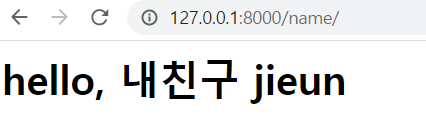

###### 210308_mon

# Django_start

<br>

# 3. Template

> 데이터 표현을 제어하는 도구이자 표현에 관련된 로직!!!
>
> [template](https://docs.djangoproject.com/en/3.1/topics/templates/#module-django.template) 공식문서를 확인하여 필요한 동작을 사용하세요!

### Django Template

- 데이터 표현을 제어하는 도구이자 표현에 관련된 로직
- 사용하는 built-in-system
  - Django template language

## 3.1 Django template language(DTL)

> 보여지는데 사용하는 장고를 위한 언어!!
>
> python과 기본 문법은 유사하지만, python언어로 사용되는 것은 아닙니다!

- django template에서 사용하는 built-in template system
- 조건, 반복, 변수, 치환, 필터 등의 기능을 제공
- 단순히 python이 HTML에 포한된 것이 아님 
  - 프로그래밍적 로직이 아니라 `프레젠테이션을 표현`하기 위한 것!!
- python처럼 일부 프로그래민 구조(if, for 등) 사용 가능
  - 해당 python 코드로 실행되는 것이 아님에 주의하기

<br>

### 3.1.1 DTL Syntax

> 4가지 큰 문법을 배워봅시다

#### 1. variables

- `{{ variables }}`
- 변수명은 영, 숫자와 언더바(_)의 조합으로 구성될 수 있다 (언더바로 시작 X)
- 변수명에 공백, 구두점 문자 사용 불가
- `dot(.)` 를 사용하여 변수 속성에 접근

##### 사용하기

- mypjt/urls.py

```python
from django.contrib import admin
from django.urls import path
from articles import views

urlpatterns = [
    path('admin/', admin.site.urls),
    path('name/', views.name),
]
```

- articles/views.py
  - 변수는 key, value쌍(dict 형태)을 이뤄 template으로 전달됩니다(render의 3번째 인자로)

```python
from django.shortcuts import render

def name(request):
    #variable
    names = ['jieun', 'hyunji', 'mina']
    hi = 'hello'
    #dict형태
    context = {  
        'names': names,
        'hi': hi,
    }
    return render(request, 'name.html', context)
```

- articles/templates/name.html

```python
<h1>{{ hi }}, 내친구 {{ name.0 }}</h1>
```

- 결과



<br>

#### 2. Filters

- `{{ variable|filter }}`
- 표시할 변수를 수정
- 파이프(|)를 사용하여 적용

##### 예시

- {{ name|lower }} : name변수를 모두 소문자로 출력
- {{ name|length }} : name변수의 길이 출력 

<br>

#### 3. Tags

- `{}`
- 출력 테스트를 만들거나 반복 또는 논리를 수행하여 __제어 흐름__을 만드는 등 보다 복잡한 일들을 수행

- 일부 태그는 시작과 종료 태그 필요 (```{}` ...내용... `{}`)

##### 예시

```html
<!-- articles/templates/name.html -->
<ul>
    
    	<li>{{ name }}</li>
    
</ul>
```

<br>

#### 4. Comments

- `{# lorem #}`
- 한 줄의 주성을 표현하기 위해 사용
- 여러줄 주석
  -  ...내용... 

<br>

<br>

## 3.2 Template inheritance

> 부모가 가진것을 기본으로 자식이 자신만의 스타일을 적용하기 위해 사용합니다!
>
> [문서!](https://docs.python.org/ko/3.9/library/pathlib.html#module-pathlib) 

- 템플릿 상속은 기본적으로 코드의 __재사용성__에 초점을 맞춤
- 템플릿 상속을 사용하면 사이트의 모든 공통 요소를 포함
- 하위 템플릿이 재정의(override) 할 수 있는 블록을 정의하는 기본 "skeleton" 템플릿을 만들 수 있음

##### mypjt/template/base.html 작성한 경우

- 기본 경로인 `app_name/templates` 디렉토리 외 추가 경로 설정
- BASE_DIR : project, app을 모두 포함하는 상위 폴더 경로
- 이 뒤에 추가할 경로를 작성

```python
# settings.py

TEMPLATES = [
    {
        ...,
        'DIRS': [BASE_DIR / 'mypjt' / 'templates'],
...
]
```

<br>

### 3.2.1 tags

> 반복되는 부분이 많을 때!! 다음의 두가지 tag를 활용합니다

#### extends tag

- `{}`
- 자식(하위)템플릿이 부모 템플릿을 확장한다는 것을 알림
- 반드시 __템플릿 최상단__에 작성 되어야 함
- path : 부모 템플릿의 경로를 작성합니다 
  - html에서 사용 시, templates까지는 장고가 읽으므로 그 하위 경로만 적어주면 됩니다 (base.html)

#### block tag

- `{}` ... `{}`

- 하위 템플릿에서 __재지정(override)__할 수 있는 블록을 정의
- 즉, 하위 템플릿이 채울 수 있는 공간
- block을 단독으로 쓰는 경우, endblock는 생략할 수 있습니다
- 가독성을 높이기 위해 선택적으로 `` 태그에 이름 지정

<br>

### 3.2.2 Django template system

> django의 설계 철학에 따라 프레임워크가 어떻게 만들어졌는지 알아봅시다!!

1. "표현과 로직(view)을 분리"
   - 템플릿 시스템 : 표현을 제어하는 도구 & 표현에 관련된 로직
   - 이러한 기본 목표를 넘어서는 기능을 지원하지 말아야 한다
   - 나머지 필요한 처리는 view에서 담당

2. "중복을 배제" :star:
   - 