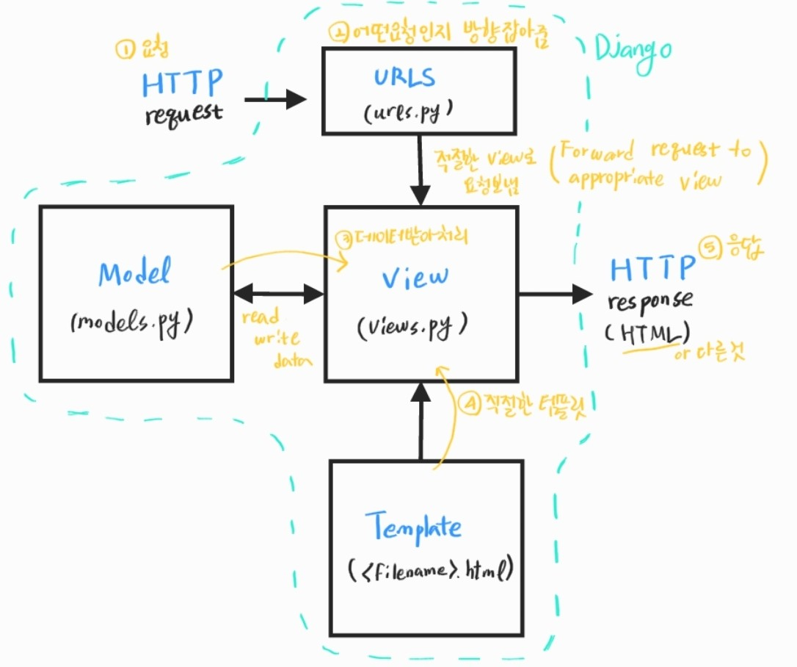

###### 210308_mon

# Django_Intro

> Django를 The Web framework for perfectionists with deadlines라고 소개하고 있습니다. 왜 그렇게 말했을까요?
>
> Django에 대해 배워보도록 합시다!!

 

 

# 1. Django

> Dynamic Web Application Program
>
> Dynamic web이 무엇이져..?

#### Static web VS Dynamic web

- Static web
  - 미리 저장된 정적파일(HTML, CSS, JS)을 제공 (client-side)
  - 사용자에게 보여줄 데이터가 서버에 저장되어있고, 요청이 오면 미리 준비된 것을 보여주는 web
- Dynamic web
  - 클라이언트의 요청에 따라 서버에서 데이터를 가공하여 원하는 데이터를 제공
  - server-side에서 JSP, SQL, PHP등을 이용해 여러 작업을 수행함
- 웹의 프로토콜
  - client가 Server에 요청(request)
  - Server가 Client에게 응답(response)

#### Django

- 우리는 요청을 받아 응답을 보내는 서버를 만들기 위해 Django라는 프레임 워트를 사용하겠습니다

 

## 1.1 Django

> Python Web Framework

### Web Framework

- 동적인 웹페이지나 웹 애플리케이션, 웹서비스 개발 보조용으로 만들어지는 애플리케이션 프레임워크의 일종
- __웹페이지를 개발하는 과정에서 겼는 어려움을 줄이는 것이 주 목적__

### Django

- 카페를 연다 : 프랜차이즈면 홍보, 인테리어 등등 자잘한 업무 알아서 해줌
- 프레임워크를 사용한다 : 본질적인 웹 개발에 집중할 수 있도록, 필요하지만 자잘한 것들은 알아서 해줌

##### 즉, 기본 구조, 필요한 코드를 제공하며 좋은 웹 서비스 개발에 집중할 수 있도록 도움

 

### 1.1.1 Why Django

> 왜 django를 사용할까?

- 다양한 tech 기업에서django 서버를 사용
  - 대규모 서버에서도 잘 돌아가는 웹프레임워크
- 오래된만큼 큰 생태계를 가지고 있어 대부분의 문제를 구글링으로 해결 가능
- ㅇㅎ로

### 1.1.2 How Django

> 어떻게 동작할까?

- 파이썬으로 작성된 오픈소스 웹 어플리케이션 프레임워크
- 기본적으로는 MVC 패턴을 따르나 MTV 패턴을 사용함

#### MVC (Model-View-Controller)

- 소프트웨어 공학에 사용되는 소프트웨어 디자인 패턴

- 프레임 워크 각각의 디자인 패턴이 존재하는데, 기본족으로 MVC를 벗어나지 않음
- Model (데이터), View(사용자 인터페이스 요소), Controller(데이터와 비즈니스 로직 사이의 상호동작 관리)

#### MTV (Model-Template-View)

- Model : 데이터베이스 관리
- Template : 레이아웃(화면, 보여지는 것)
- View : 중심 컨트롤러(심장, 중간의 관리자 역할)

 

### 1.1.3 Djago의 흐름

> 전체적인 흐름을 알고있는 것이 중요합니다

