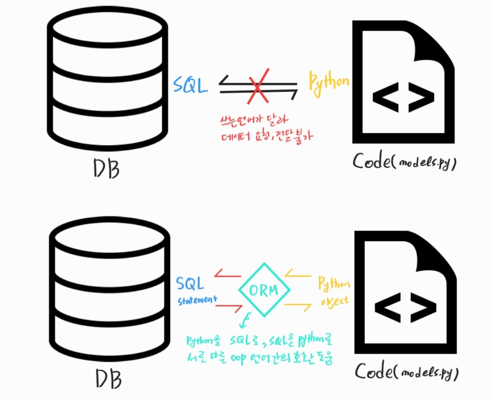

###### 210310_wed

# Django_Model

 

# 1. Django model

## 1.1 Model

> 웹 어플리케이션의 데이터를 구조화하고 조작하기 위한 도구

##### 즉, 데이터를 구조화하고 db만들고 수정하고 삭제하는 도구가 모델!!!

#### 개념

- 단일한 데이터에 대한 정보를 가짐
  - 사용자가 저장하는 데이터들의 필수적인 필드들과 동작들을 포함
- __저장된 데이터 베이스의 구조__ (layout)를 의미
  - model != database (db보다 조금 더 큰 개념!!)
- djange는 __model을 통해 데이터에 접속__하고 관리
- 일반적으로 각각의 model은 하나의 데이터베이스 테이블에 매핑
  - 일대일 매핑된다

 

### 1.1.1 Database (DB)

> 체계화된 데이터의 모임(집합)

#### 쿼리(Query)

- 데이터를 조회하기위한 명령어
- (주로 테이블형 자료구조에서) 조건에 맞는 데이터를 추출하거나 조작하는 명령어
- 쿼리를 날린다 == DB에 조작하는 명령을 내린다

 

#### 기본구조

- `스키마(Schema)` -> 뼈대(Structure)
  - DB에서 자료의 구조, 표현방법, 관계 등을 정의한 구조
  - 데이터베이스 관리 시스템(DBMS)
    - 주어진 설정에 따라 db 스키마를 생성
    - db사용자가 자료를 저장, 조회, 삭제, 변경할 때 DBMS는 자신이 생성한 db스키마를 참조하여 명령 수행
- `테이블(Table)` -> 관계(Relation) -> 엑셀의 sheet
  - 필드(field) : 속성, 컬럼(Column)
    - 모델 안에 정의한 클래스에서 클래스 변수가 필드가 됨
  - 레코드(record) : 튜플, 행(row)
    - ORM을 통해 해당하는 필드에 넣은 데이터(값)

다음에 표를 그려서 넣어야겠어ㅓ

 

 

# 2. ORM

> Object-Relational-Mapping

#### 개념

- 객체 지향 프로그래밍 언어를 사용하여 __호환되지 않는 유형의 시스템간에(Django - SQL) 데이터를 변환__하는 프로그래밍 기술
- 프로그래밍 언어에서 사용할 수 있는 '가상 객체 데이터베이스'를 만들어 사용

#### 장/단점

- 장점
  - SQL을 몰라도 DB조작 가능
  - SQL의 절차적 접근이 아닌 객체 지향적 접근으로 인한 높은 `생산성`
    - 현대 웹 프레임워크의 요점은 웹 개발 속도를 높이는 것!!! 그래서 사용함
  - ORM은 독립적으로 작성되어있고, 해당 객체들을 재활용할 수 있음
    - 모델에서 가공된 데이터를 컨트롤러(view)에 의해 뷰(template)와 합쳐지는 형태로 디자인 패턴을 견고하게 다지는 데 유리
- 단점
  - ORM만으로 완전한 서비스를 구현하기 어려운 경우가 있다 (상황에 따라 SQL도 써야함)
  - 프로젝트의 복잡성이 터질 경우 설계 난이도 상승할 수 있다

#### 정리

- 객체 지향 프로그래밍에서 DB를 편리하게 관리하기 위해 ORM 프레임워크를 도입
- **우리는 DB를 객체(object)로 조작하기 위해 ORM을 사용한다 **
  - 객체로 DB를 조작한다는 것!!

 

 

## 2.1 Project 만들기

